<!-- Generated by aug spec. Edit the August source, then regenerate. -->

# client/login.aug diagrams

[Project overview](../.aug-spec/diagrams/index.md) · [Compiled explanation](login.aug.md)

## Class interactions

### loginCallback

#### View 1 of 3

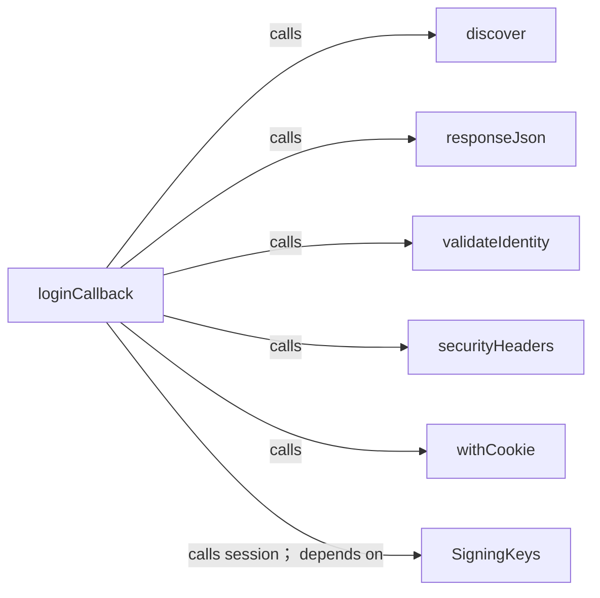

#### View 2 of 3

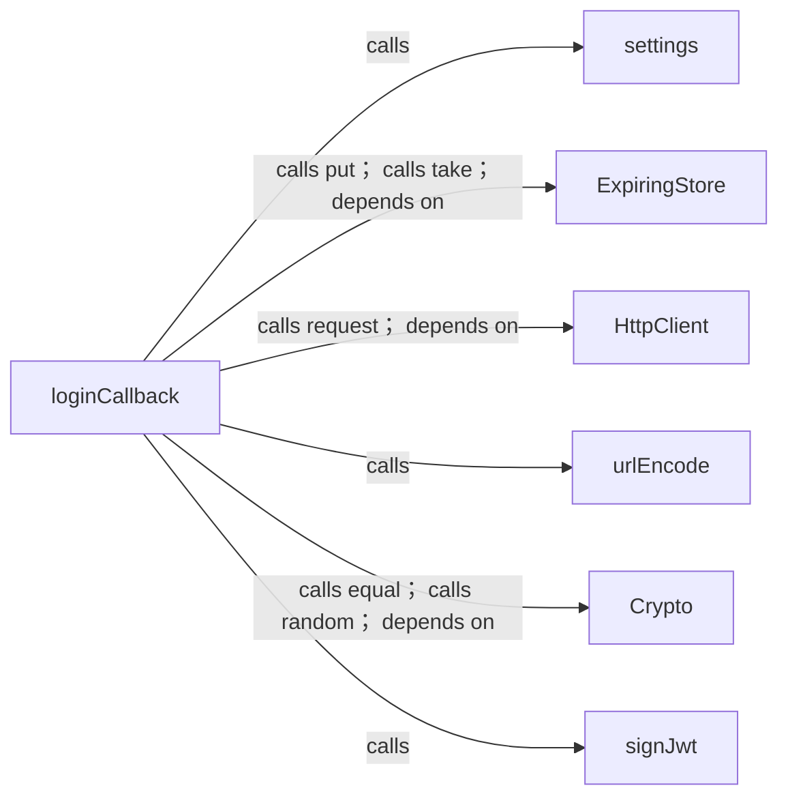

#### View 3 of 3

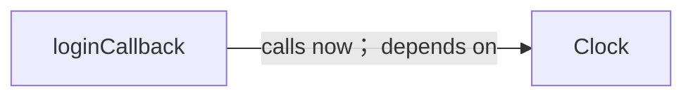

### startLogin

#### View 1 of 2

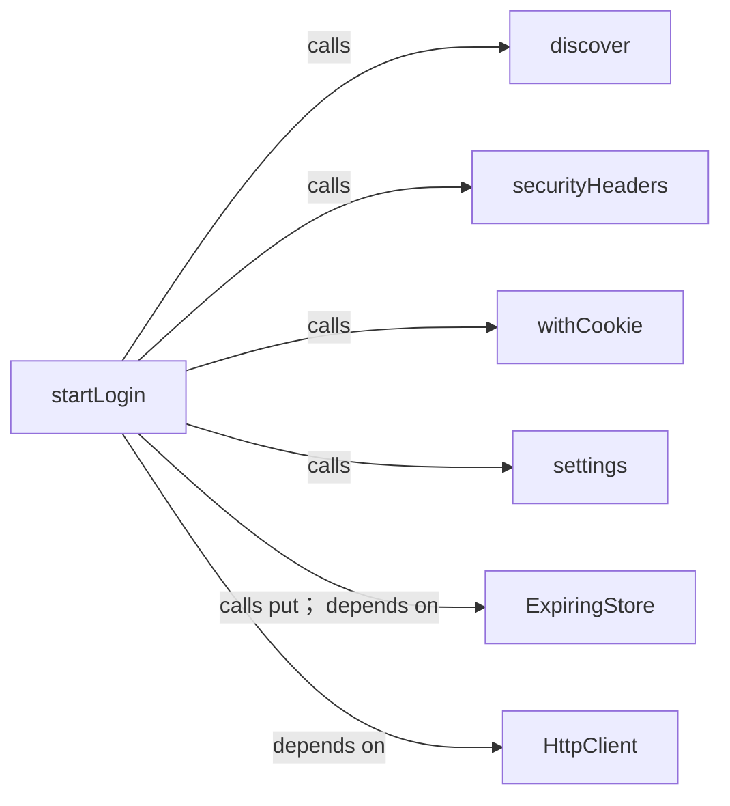

#### View 2 of 2

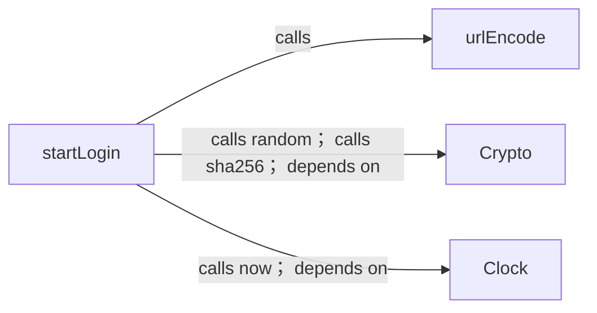

## Sequences

Call arrows identify checked targets; loop and branch frames determine when they run. Open that target’s module to follow its implementation. Branches describe alternatives; loops describe repeated work. Native calls and interface dispatch stop at their declared contracts. Exit notes end that path; enclosing recovery and cleanup remain visible.

### startLogin

[Source](login.aug#L12)

`startLogin` handles `GET /login/start`.

Start a browser-bound, short-lived transaction. The PKCE verifier stays on the server.

It gets `crypto` ([`Crypto`](../.aug-spec/packages/%40git/url_9ef654c66d34ab8f5527/0.0.0-git.b14a0f9aa41f1ce58bd51133bcdc424033e40d40/contracts.aug.md#symbol-Crypto)), `clock` ([`Clock`](../.aug-spec/packages/%40git/url_c092cd151499c4e1d8a1/0.0.0-git.a39fc582565d4fca40be4f75fa304d71adc69301/contracts.aug.md#symbol-Clock)), `client` ([`HttpClient`](../.aug-spec/packages/%40git/url_897efafd565158fc4908/0.0.0-git.a39fc582565d4fca40be4f75fa304d71adc69301/contracts.aug.md#symbol-HttpClient)), and `transactions` ([`ExpiringStore<LoginTransaction>`](../.aug-spec/packages/%40git/url_0eb7c89453c87681ed15/0.0.0-git.a39fc582565d4fca40be4f75fa304d71adc69301/store.aug.md#symbol-ExpiringStore)) from dependency injection.

It can call [`Crypto.random`](../.aug-spec/packages/%40git/url_9ef654c66d34ab8f5527/0.0.0-git.b14a0f9aa41f1ce58bd51133bcdc424033e40d40/contracts.aug.md#symbol-Crypto.random), [`Clock.now`](../.aug-spec/packages/%40git/url_c092cd151499c4e1d8a1/0.0.0-git.a39fc582565d4fca40be4f75fa304d71adc69301/contracts.aug.md#symbol-Clock.now), [`ExpiringStore<LoginTransaction>.put`](../.aug-spec/packages/%40git/url_0eb7c89453c87681ed15/0.0.0-git.a39fc582565d4fca40be4f75fa304d71adc69301/store.aug.md#symbol-ExpiringStore.put), [`Crypto.sha256`](../.aug-spec/packages/%40git/url_9ef654c66d34ab8f5527/0.0.0-git.b14a0f9aa41f1ce58bd51133bcdc424033e40d40/contracts.aug.md#symbol-Crypto.sha256), and [`HttpClient.request`](../.aug-spec/packages/%40git/url_897efafd565158fc4908/0.0.0-git.a39fc582565d4fca40be4f75fa304d71adc69301/contracts.aug.md#symbol-HttpClient.request).

The handler responds with HTTP 502 for [`SessionError`](contracts.aug.md#symbol-SessionError), HTTP 503 for `CryptoError`, HTTP 503 for `TimeError`, and HTTP 503 for [`StoreFull`](../.aug-spec/packages/%40git/url_0eb7c89453c87681ed15/0.0.0-git.a39fc582565d4fca40be4f75fa304d71adc69301/store.aug.md#symbol-StoreFull).

It can also raise `HttpError`.

#### Sequence 1 of 3

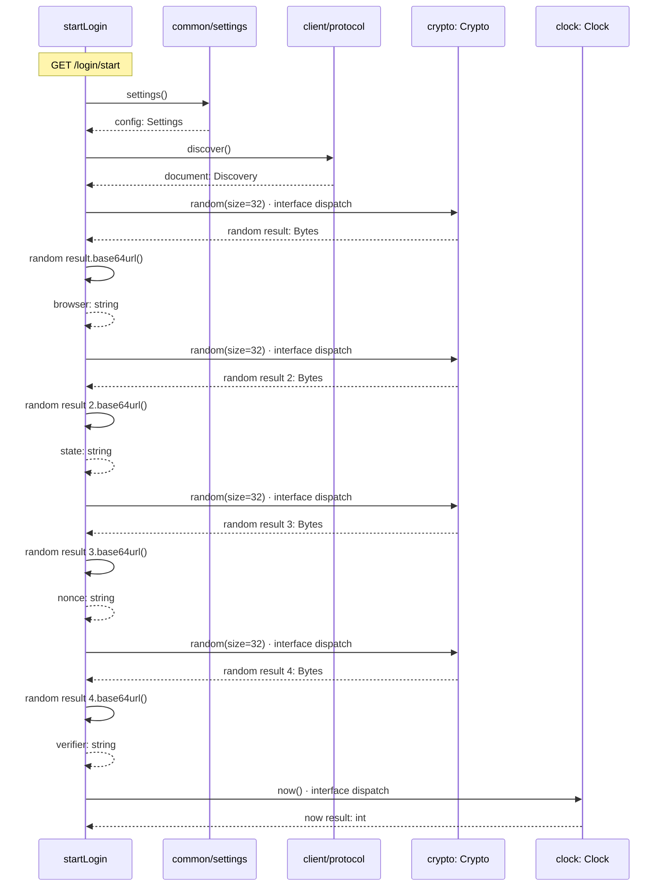

#### Sequence 2 of 3 (continued)

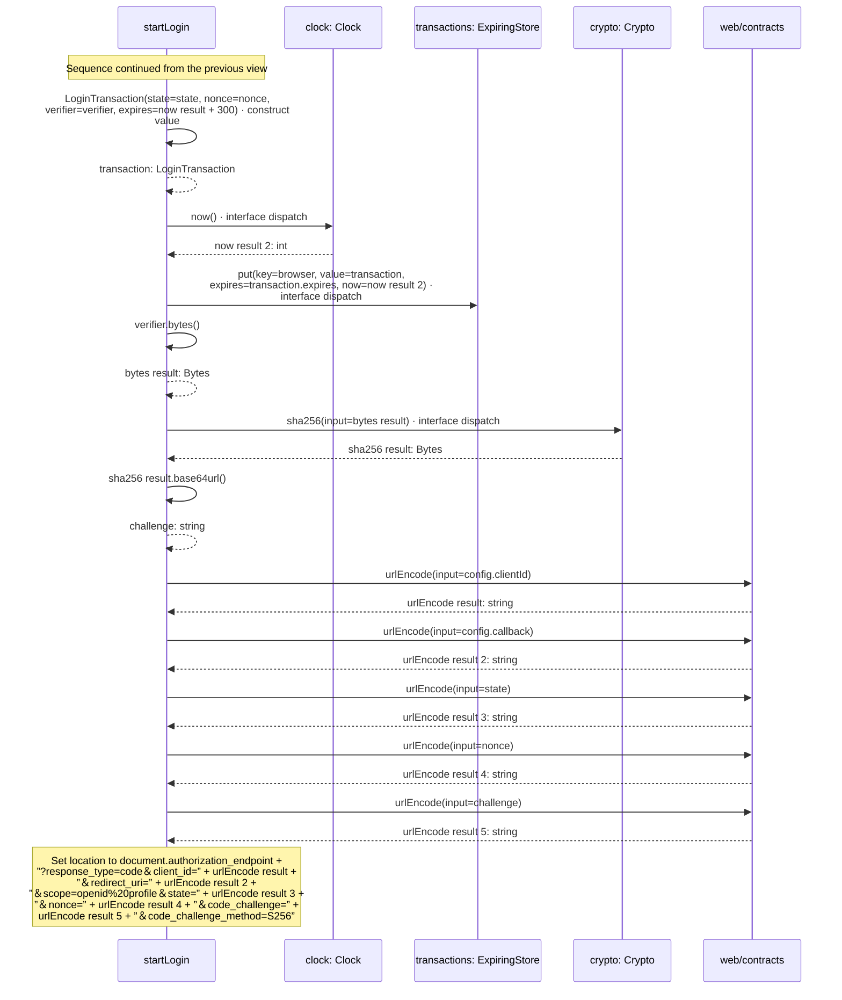

#### Sequence 3 of 3 (continued)

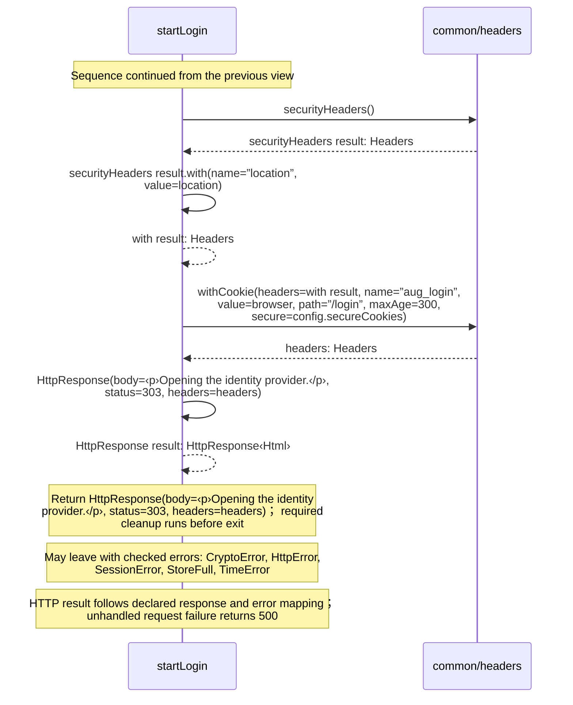

### loginCallback

[Source](login.aug#L27)

`loginCallback` handles `GET /login/callback`.

Exchange a one-use code over HTTP, verify the provider JWT/JWKS and UserInfo subject, then issue a distinct app-session JWT.

It takes `code` and `state` as strings from the HTTP query and `browser` as `optional string` from the HTTP cookie `aug_login`. It gets `crypto` ([`Crypto`](../.aug-spec/packages/%40git/url_9ef654c66d34ab8f5527/0.0.0-git.b14a0f9aa41f1ce58bd51133bcdc424033e40d40/contracts.aug.md#symbol-Crypto)), `clock` ([`Clock`](../.aug-spec/packages/%40git/url_c092cd151499c4e1d8a1/0.0.0-git.a39fc582565d4fca40be4f75fa304d71adc69301/contracts.aug.md#symbol-Clock)), `client` ([`HttpClient`](../.aug-spec/packages/%40git/url_897efafd565158fc4908/0.0.0-git.a39fc582565d4fca40be4f75fa304d71adc69301/contracts.aug.md#symbol-HttpClient)), `keys` ([`SigningKeys`](../common/keys.aug.md#symbol-SigningKeys)), `transactions` ([`ExpiringStore<LoginTransaction>`](../.aug-spec/packages/%40git/url_0eb7c89453c87681ed15/0.0.0-git.a39fc582565d4fca40be4f75fa304d71adc69301/store.aug.md#symbol-ExpiringStore)), and `sessions` ([`ExpiringStore<SessionClaims>`](../.aug-spec/packages/%40git/url_0eb7c89453c87681ed15/0.0.0-git.a39fc582565d4fca40be4f75fa304d71adc69301/store.aug.md#symbol-ExpiringStore)) from dependency injection. Omitted optional inputs are null.

It can call [`Clock.now`](../.aug-spec/packages/%40git/url_c092cd151499c4e1d8a1/0.0.0-git.a39fc582565d4fca40be4f75fa304d71adc69301/contracts.aug.md#symbol-Clock.now), [`ExpiringStore<LoginTransaction>.take`](../.aug-spec/packages/%40git/url_0eb7c89453c87681ed15/0.0.0-git.a39fc582565d4fca40be4f75fa304d71adc69301/store.aug.md#symbol-ExpiringStore.take), [`Crypto.equal`](../.aug-spec/packages/%40git/url_9ef654c66d34ab8f5527/0.0.0-git.b14a0f9aa41f1ce58bd51133bcdc424033e40d40/contracts.aug.md#symbol-Crypto.equal), [`HttpClient.request`](../.aug-spec/packages/%40git/url_897efafd565158fc4908/0.0.0-git.a39fc582565d4fca40be4f75fa304d71adc69301/contracts.aug.md#symbol-HttpClient.request), [`Crypto.random`](../.aug-spec/packages/%40git/url_9ef654c66d34ab8f5527/0.0.0-git.b14a0f9aa41f1ce58bd51133bcdc424033e40d40/contracts.aug.md#symbol-Crypto.random), [`SigningKeys.session`](../common/keys.aug.md#symbol-SigningKeys.session), [`ExpiringStore<SessionClaims>.put`](../.aug-spec/packages/%40git/url_0eb7c89453c87681ed15/0.0.0-git.a39fc582565d4fca40be4f75fa304d71adc69301/store.aug.md#symbol-ExpiringStore.put), [`Crypto.signRsa`](../.aug-spec/packages/%40git/url_9ef654c66d34ab8f5527/0.0.0-git.b14a0f9aa41f1ce58bd51133bcdc424033e40d40/contracts.aug.md#symbol-Crypto.signRsa), [`Crypto.decodeBase64url`](../.aug-spec/packages/%40git/url_9ef654c66d34ab8f5527/0.0.0-git.b14a0f9aa41f1ce58bd51133bcdc424033e40d40/contracts.aug.md#symbol-Crypto.decodeBase64url), [`Crypto.importRsa`](../.aug-spec/packages/%40git/url_9ef654c66d34ab8f5527/0.0.0-git.b14a0f9aa41f1ce58bd51133bcdc424033e40d40/contracts.aug.md#symbol-Crypto.importRsa), and [`Crypto.verifyRsa`](../.aug-spec/packages/%40git/url_9ef654c66d34ab8f5527/0.0.0-git.b14a0f9aa41f1ce58bd51133bcdc424033e40d40/contracts.aug.md#symbol-Crypto.verifyRsa).

The handler responds with HTTP 400 for [`SessionError`](contracts.aug.md#symbol-SessionError), HTTP 503 for `CryptoError`, HTTP 503 for `TimeError`, and HTTP 503 for [`StoreFull`](../.aug-spec/packages/%40git/url_0eb7c89453c87681ed15/0.0.0-git.a39fc582565d4fca40be4f75fa304d71adc69301/store.aug.md#symbol-StoreFull).

It can also raise `HttpError`, `JsonError`, `JwtError`, and `KeyError`.

#### Sequence 1 of 5

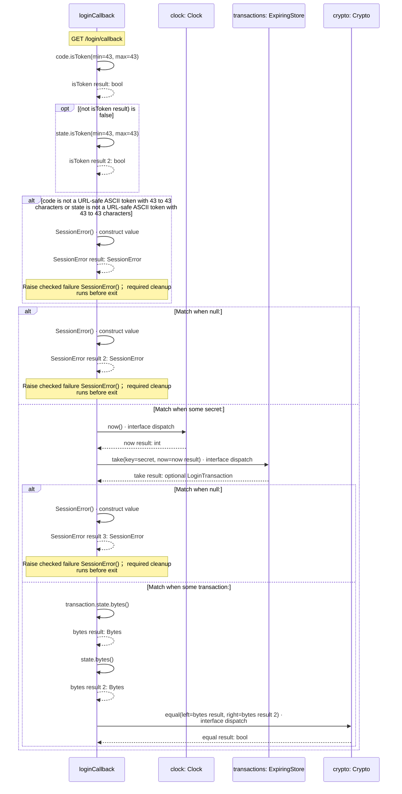

#### Sequence 2 of 5 (continued)

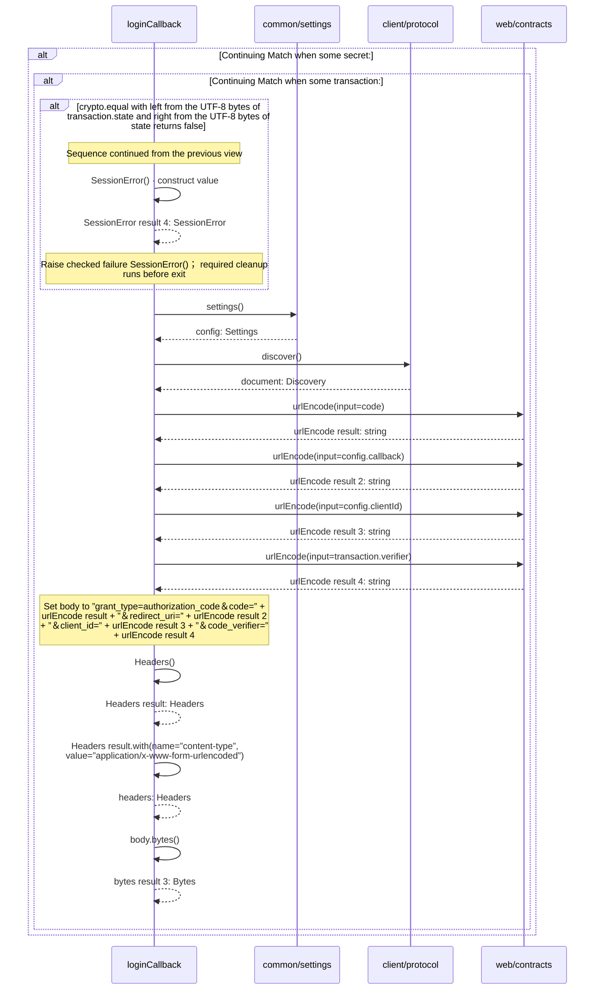

#### Sequence 3 of 5 (continued)

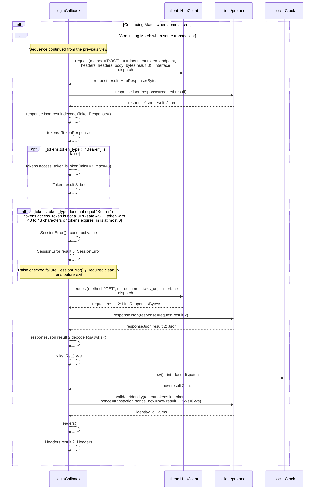

#### Sequence 4 of 5 (continued)

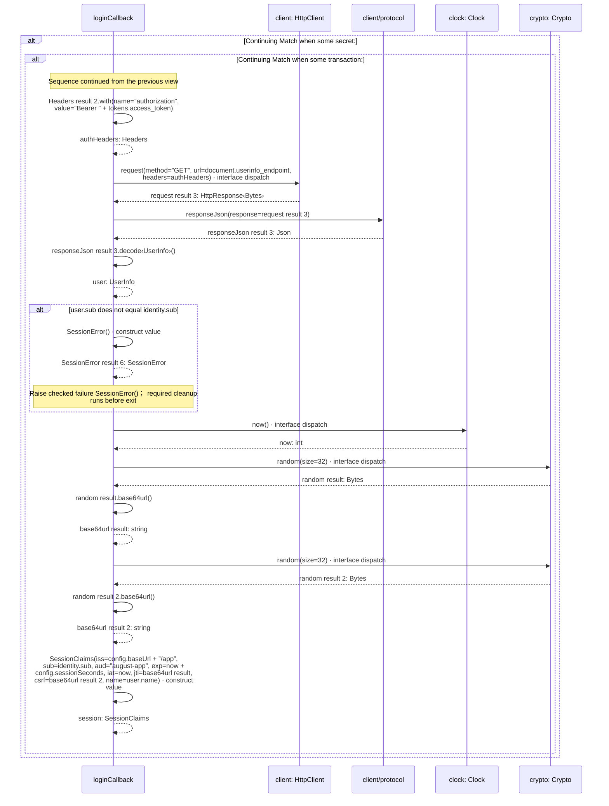

#### Sequence 5 of 5 (continued)

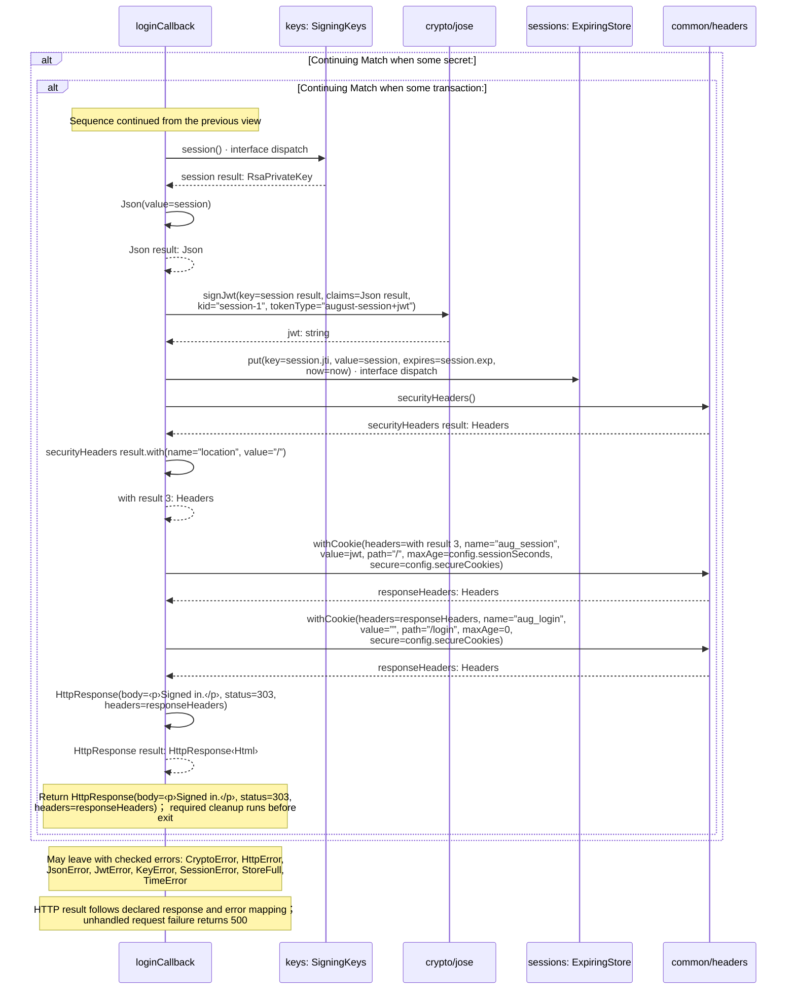

## Called contracts

- [LoginTransaction](contracts.aug.diagrams.md#sequence-LoginTransaction-20-constructor) — client/contracts.aug
- [SessionClaims](contracts.aug.diagrams.md#sequence-SessionClaims-20-constructor) — client/contracts.aug
- [SessionError](contracts.aug.diagrams.md#sequence-SessionError-20-constructor) — client/contracts.aug
- [discover](protocol.aug.diagrams.md#sequence-discover) — client/protocol.aug
- [responseJson](protocol.aug.diagrams.md#sequence-responseJson) — client/protocol.aug
- [validateIdentity](protocol.aug.diagrams.md#sequence-validateIdentity) — client/protocol.aug
- [securityHeaders](../common/headers.aug.diagrams.md#sequence-securityHeaders) — common/headers.aug
- [withCookie](../common/headers.aug.diagrams.md#sequence-withCookie) — common/headers.aug
- [SigningKeys](../common/keys.aug.diagrams.md) — common/keys.aug
- [SigningKeys.session](../common/keys.aug.diagrams.md#sequence-SigningKeys.session) — common/keys.aug
- [settings](../common/settings.aug.diagrams.md#sequence-settings) — common/settings.aug
- [ExpiringStore](../.aug-spec/packages/%40git/url_0eb7c89453c87681ed15/0.0.0-git.a39fc582565d4fca40be4f75fa304d71adc69301/store.aug.diagrams.md) — package/@git/url\_0eb7c89453c87681ed15@0.0.0-git.a39fc582565d4fca40be4f75fa304d71adc69301/store.aug
- [ExpiringStore.put](../.aug-spec/packages/%40git/url_0eb7c89453c87681ed15/0.0.0-git.a39fc582565d4fca40be4f75fa304d71adc69301/store.aug.diagrams.md#sequence-ExpiringStore.put) — package/@git/url\_0eb7c89453c87681ed15@0.0.0-git.a39fc582565d4fca40be4f75fa304d71adc69301/store.aug
- [ExpiringStore.take](../.aug-spec/packages/%40git/url_0eb7c89453c87681ed15/0.0.0-git.a39fc582565d4fca40be4f75fa304d71adc69301/store.aug.diagrams.md#sequence-ExpiringStore.take) — package/@git/url\_0eb7c89453c87681ed15@0.0.0-git.a39fc582565d4fca40be4f75fa304d71adc69301/store.aug
- [HttpClient](../.aug-spec/packages/%40git/url_897efafd565158fc4908/0.0.0-git.a39fc582565d4fca40be4f75fa304d71adc69301/contracts.aug.diagrams.md) — package/@git/url\_897efafd565158fc4908@0.0.0-git.a39fc582565d4fca40be4f75fa304d71adc69301/contracts.aug
- [HttpClient.request](../.aug-spec/packages/%40git/url_897efafd565158fc4908/0.0.0-git.a39fc582565d4fca40be4f75fa304d71adc69301/contracts.aug.diagrams.md#sequence-HttpClient.request) — package/@git/url\_897efafd565158fc4908@0.0.0-git.a39fc582565d4fca40be4f75fa304d71adc69301/contracts.aug
- [urlEncode](../.aug-spec/packages/%40git/url_897efafd565158fc4908/0.0.0-git.a39fc582565d4fca40be4f75fa304d71adc69301/contracts.aug.diagrams.md#sequence-urlEncode) — package/@git/url\_897efafd565158fc4908@0.0.0-git.a39fc582565d4fca40be4f75fa304d71adc69301/contracts.aug
- [Crypto](../.aug-spec/packages/%40git/url_9ef654c66d34ab8f5527/0.0.0-git.b14a0f9aa41f1ce58bd51133bcdc424033e40d40/contracts.aug.diagrams.md) — package/@git/url\_9ef654c66d34ab8f5527@0.0.0-git.b14a0f9aa41f1ce58bd51133bcdc424033e40d40/contracts.aug
- [Crypto.equal](../.aug-spec/packages/%40git/url_9ef654c66d34ab8f5527/0.0.0-git.b14a0f9aa41f1ce58bd51133bcdc424033e40d40/contracts.aug.diagrams.md#sequence-Crypto.equal) — package/@git/url\_9ef654c66d34ab8f5527@0.0.0-git.b14a0f9aa41f1ce58bd51133bcdc424033e40d40/contracts.aug
- [Crypto.random](../.aug-spec/packages/%40git/url_9ef654c66d34ab8f5527/0.0.0-git.b14a0f9aa41f1ce58bd51133bcdc424033e40d40/contracts.aug.diagrams.md#sequence-Crypto.random) — package/@git/url\_9ef654c66d34ab8f5527@0.0.0-git.b14a0f9aa41f1ce58bd51133bcdc424033e40d40/contracts.aug
- [Crypto.sha256](../.aug-spec/packages/%40git/url_9ef654c66d34ab8f5527/0.0.0-git.b14a0f9aa41f1ce58bd51133bcdc424033e40d40/contracts.aug.diagrams.md#sequence-Crypto.sha256) — package/@git/url\_9ef654c66d34ab8f5527@0.0.0-git.b14a0f9aa41f1ce58bd51133bcdc424033e40d40/contracts.aug
- [signJwt](../.aug-spec/packages/%40git/url_9ef654c66d34ab8f5527/0.0.0-git.b14a0f9aa41f1ce58bd51133bcdc424033e40d40/jose.aug.diagrams.md#sequence-signJwt) — package/@git/url\_9ef654c66d34ab8f5527@0.0.0-git.b14a0f9aa41f1ce58bd51133bcdc424033e40d40/jose.aug
- [Clock](../.aug-spec/packages/%40git/url_c092cd151499c4e1d8a1/0.0.0-git.a39fc582565d4fca40be4f75fa304d71adc69301/contracts.aug.diagrams.md) — package/@git/url\_c092cd151499c4e1d8a1@0.0.0-git.a39fc582565d4fca40be4f75fa304d71adc69301/contracts.aug
- [Clock.now](../.aug-spec/packages/%40git/url_c092cd151499c4e1d8a1/0.0.0-git.a39fc582565d4fca40be4f75fa304d71adc69301/contracts.aug.diagrams.md#sequence-Clock.now) — package/@git/url\_c092cd151499c4e1d8a1@0.0.0-git.a39fc582565d4fca40be4f75fa304d71adc69301/contracts.aug
