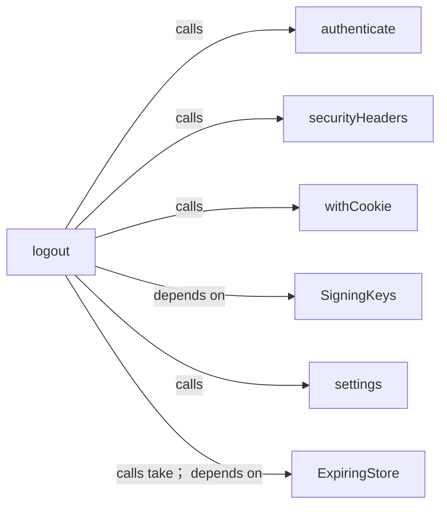
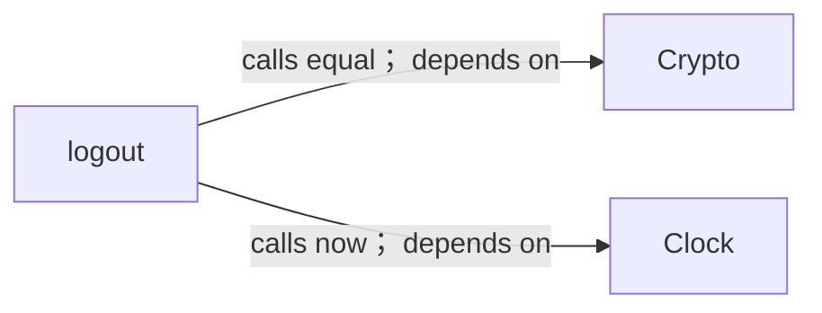
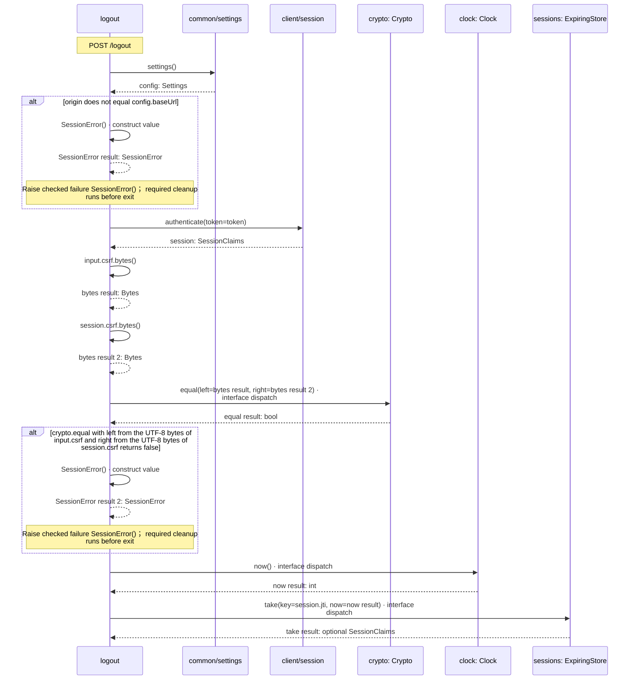
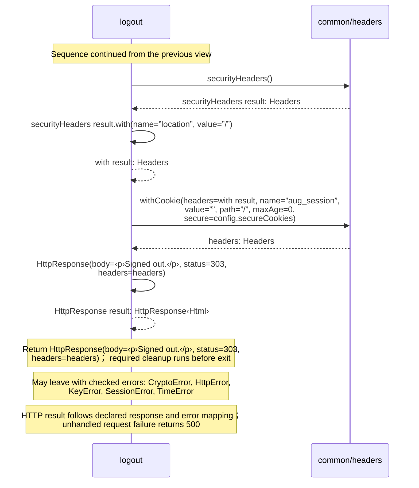

<!-- Generated by aug spec. Edit the August source, then regenerate. -->

# client/logout.aug diagrams

[Project overview](../.aug-spec/diagrams/index.md) · [Compiled explanation](logout.aug.md)

## Class interactions

### logout

#### View 1 of 2

#### View 2 of 2

## Sequences

Call arrows identify checked targets; loop and branch frames determine when they run. Open that target’s module to follow its implementation. Branches describe alternatives; loops describe repeated work. Native calls and interface dispatch stop at their declared contracts. Exit notes end that path; enclosing recovery and cleanup remain visible.

### logout

[Source](logout.aug#L10)

`logout` handles `POST /logout`.

POST logout checks the origin and session-bound CSRF value, then removes the live registry entry before clearing the cookie.

It takes `input` as [`LogoutForm`](contracts.aug.md#symbol-LogoutForm) from the HTTP form, `token` as `optional string` from the HTTP cookie `aug_session`, and `origin` as `optional string` from the HTTP header. It gets `crypto` ([`Crypto`](../.aug-spec/packages/%40git/url_9ef654c66d34ab8f5527/0.0.0-git.b14a0f9aa41f1ce58bd51133bcdc424033e40d40/contracts.aug.md#symbol-Crypto)), `clock` ([`Clock`](../.aug-spec/packages/%40git/url_c092cd151499c4e1d8a1/0.0.0-git.a39fc582565d4fca40be4f75fa304d71adc69301/contracts.aug.md#symbol-Clock)), `keys` ([`SigningKeys`](../common/keys.aug.md#symbol-SigningKeys)), and `sessions` ([`ExpiringStore<SessionClaims>`](../.aug-spec/packages/%40git/url_0eb7c89453c87681ed15/0.0.0-git.a39fc582565d4fca40be4f75fa304d71adc69301/store.aug.md#symbol-ExpiringStore)) from dependency injection. Omitted optional inputs are null.

It can call [`Crypto.equal`](../.aug-spec/packages/%40git/url_9ef654c66d34ab8f5527/0.0.0-git.b14a0f9aa41f1ce58bd51133bcdc424033e40d40/contracts.aug.md#symbol-Crypto.equal), [`Clock.now`](../.aug-spec/packages/%40git/url_c092cd151499c4e1d8a1/0.0.0-git.a39fc582565d4fca40be4f75fa304d71adc69301/contracts.aug.md#symbol-Clock.now), [`ExpiringStore<SessionClaims>.take`](../.aug-spec/packages/%40git/url_0eb7c89453c87681ed15/0.0.0-git.a39fc582565d4fca40be4f75fa304d71adc69301/store.aug.md#symbol-ExpiringStore.take), [`SigningKeys.session`](../common/keys.aug.md#symbol-SigningKeys.session), [`Crypto.publicRsa`](../.aug-spec/packages/%40git/url_9ef654c66d34ab8f5527/0.0.0-git.b14a0f9aa41f1ce58bd51133bcdc424033e40d40/contracts.aug.md#symbol-Crypto.publicRsa), [`ExpiringStore<SessionClaims>.get`](../.aug-spec/packages/%40git/url_0eb7c89453c87681ed15/0.0.0-git.a39fc582565d4fca40be4f75fa304d71adc69301/store.aug.md#symbol-ExpiringStore.get), [`Crypto.decodeBase64url`](../.aug-spec/packages/%40git/url_9ef654c66d34ab8f5527/0.0.0-git.b14a0f9aa41f1ce58bd51133bcdc424033e40d40/contracts.aug.md#symbol-Crypto.decodeBase64url), and [`Crypto.verifyRsa`](../.aug-spec/packages/%40git/url_9ef654c66d34ab8f5527/0.0.0-git.b14a0f9aa41f1ce58bd51133bcdc424033e40d40/contracts.aug.md#symbol-Crypto.verifyRsa).

The handler responds with HTTP 403 for [`SessionError`](contracts.aug.md#symbol-SessionError).

It can also raise `CryptoError`, `HttpError`, `KeyError`, and `TimeError`.

#### Sequence 1 of 2

#### Sequence 2 of 2 (continued)

## Called contracts

- [SessionError](contracts.aug.diagrams.md#sequence-SessionError-20-constructor) — client/contracts.aug
- [authenticate](session.aug.diagrams.md#sequence-authenticate) — client/session.aug
- [securityHeaders](../common/headers.aug.diagrams.md#sequence-securityHeaders) — common/headers.aug
- [withCookie](../common/headers.aug.diagrams.md#sequence-withCookie) — common/headers.aug
- [SigningKeys](../common/keys.aug.diagrams.md) — common/keys.aug
- [settings](../common/settings.aug.diagrams.md#sequence-settings) — common/settings.aug
- [ExpiringStore](../.aug-spec/packages/%40git/url_0eb7c89453c87681ed15/0.0.0-git.a39fc582565d4fca40be4f75fa304d71adc69301/store.aug.diagrams.md) — package/@git/url\_0eb7c89453c87681ed15@0.0.0-git.a39fc582565d4fca40be4f75fa304d71adc69301/store.aug
- [ExpiringStore.take](../.aug-spec/packages/%40git/url_0eb7c89453c87681ed15/0.0.0-git.a39fc582565d4fca40be4f75fa304d71adc69301/store.aug.diagrams.md#sequence-ExpiringStore.take) — package/@git/url\_0eb7c89453c87681ed15@0.0.0-git.a39fc582565d4fca40be4f75fa304d71adc69301/store.aug
- [Crypto](../.aug-spec/packages/%40git/url_9ef654c66d34ab8f5527/0.0.0-git.b14a0f9aa41f1ce58bd51133bcdc424033e40d40/contracts.aug.diagrams.md) — package/@git/url\_9ef654c66d34ab8f5527@0.0.0-git.b14a0f9aa41f1ce58bd51133bcdc424033e40d40/contracts.aug
- [Crypto.equal](../.aug-spec/packages/%40git/url_9ef654c66d34ab8f5527/0.0.0-git.b14a0f9aa41f1ce58bd51133bcdc424033e40d40/contracts.aug.diagrams.md#sequence-Crypto.equal) — package/@git/url\_9ef654c66d34ab8f5527@0.0.0-git.b14a0f9aa41f1ce58bd51133bcdc424033e40d40/contracts.aug
- [Clock](../.aug-spec/packages/%40git/url_c092cd151499c4e1d8a1/0.0.0-git.a39fc582565d4fca40be4f75fa304d71adc69301/contracts.aug.diagrams.md) — package/@git/url\_c092cd151499c4e1d8a1@0.0.0-git.a39fc582565d4fca40be4f75fa304d71adc69301/contracts.aug
- [Clock.now](../.aug-spec/packages/%40git/url_c092cd151499c4e1d8a1/0.0.0-git.a39fc582565d4fca40be4f75fa304d71adc69301/contracts.aug.diagrams.md#sequence-Clock.now) — package/@git/url\_c092cd151499c4e1d8a1@0.0.0-git.a39fc582565d4fca40be4f75fa304d71adc69301/contracts.aug
