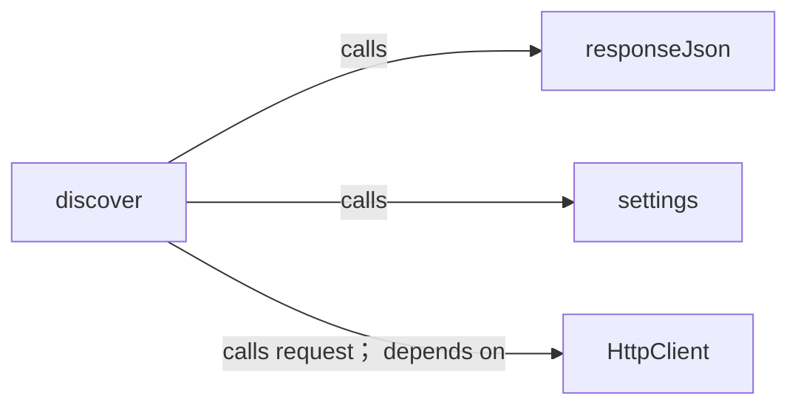
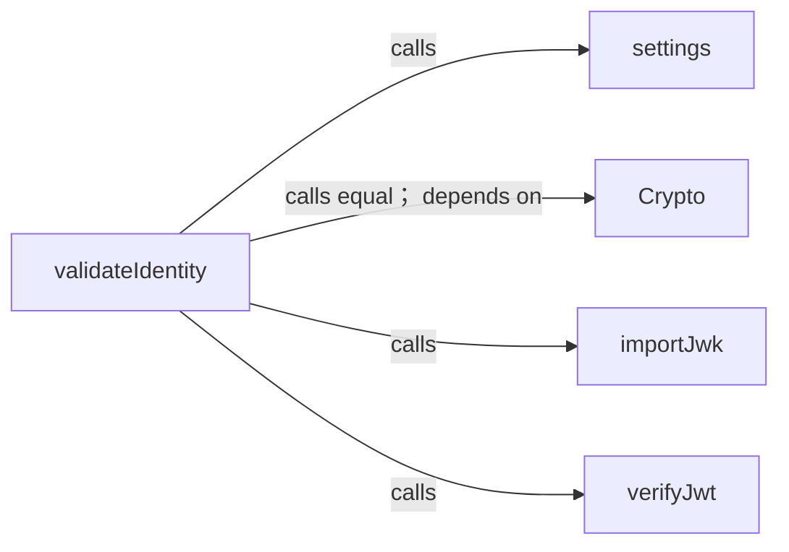
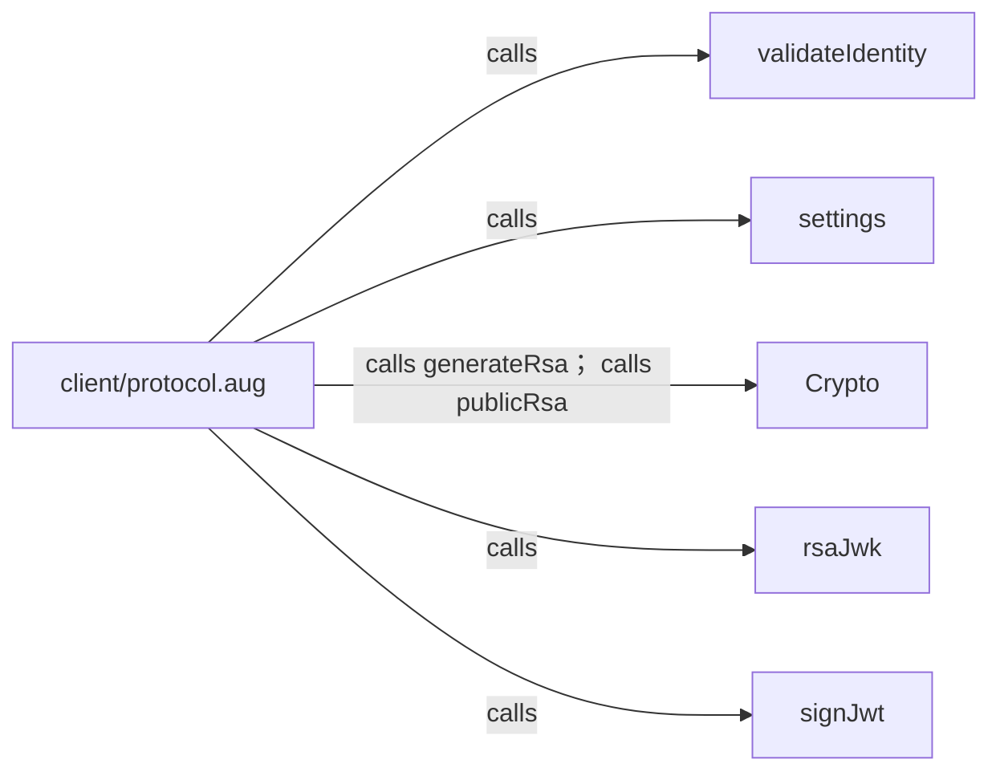
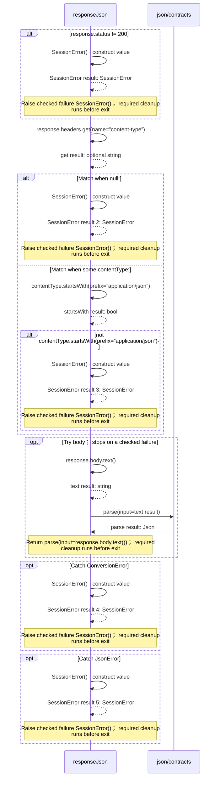
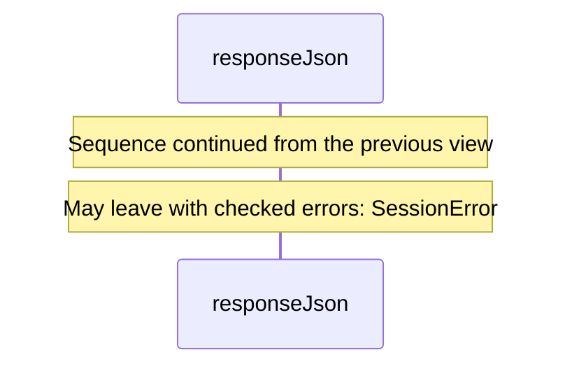
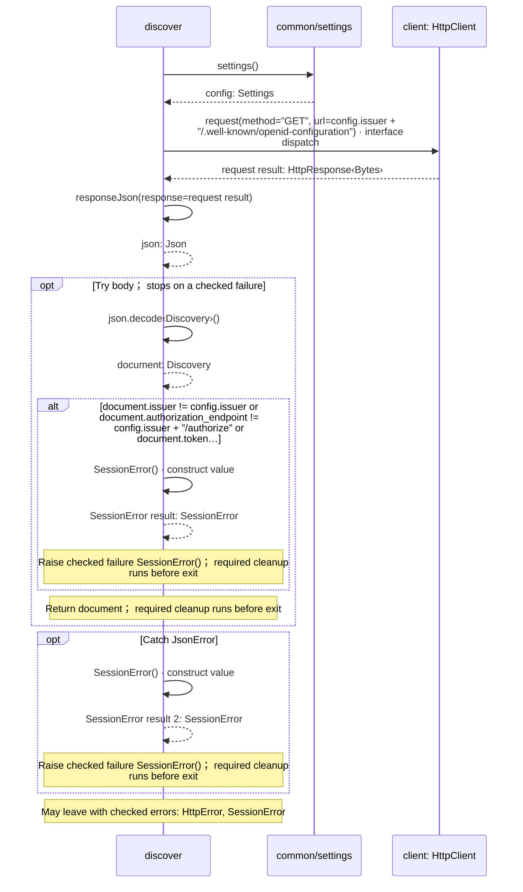
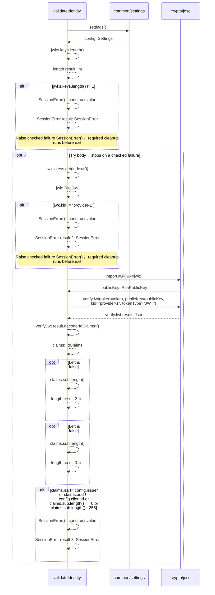
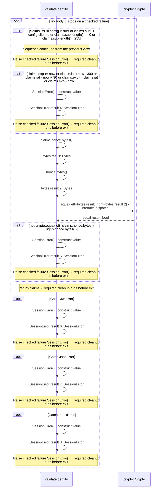
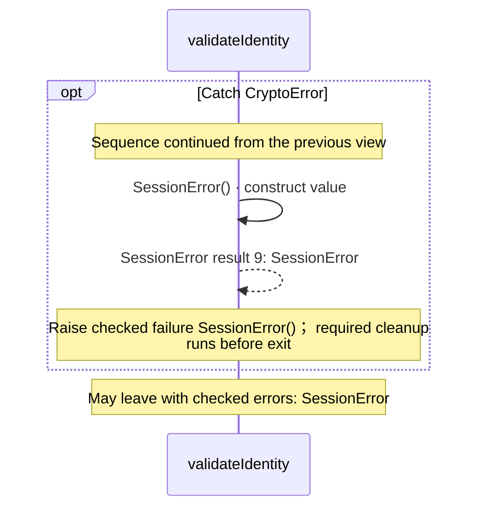

<!-- Generated by aug spec. Edit the August source, then regenerate. -->

# client/protocol.aug diagrams

[Project overview](../.aug-spec/diagrams/index.md) · [Compiled explanation](protocol.aug.md)

## Class interactions

### discover

### validateIdentity

### module:client/protocol.aug

## Sequences

Call arrows identify checked targets; loop and branch frames determine when they run. Open that target’s module to follow its implementation. Branches describe alternatives; loops describe repeated work. Native calls and interface dispatch stop at their declared contracts. Exit notes end that path; enclosing recovery and cleanup remain visible.

### responseJson

[Source](protocol.aug#L10)

#### Sequence 1 of 2

#### Sequence 2 of 2 (continued)

### discover

[Source](protocol.aug#L27)

### validateIdentity

[Source](protocol.aug#L39)

#### Sequence 1 of 3

#### Sequence 2 of 3 (continued)

#### Sequence 3 of 3 (continued)

## Called contracts

- [SessionError](contracts.aug.diagrams.md#sequence-SessionError-20-constructor) — client/contracts.aug
- [responseJson](protocol.aug.diagrams.md#sequence-responseJson) — client/protocol.aug
- [validateIdentity](protocol.aug.diagrams.md#sequence-validateIdentity) — client/protocol.aug
- [settings](../common/settings.aug.diagrams.md#sequence-settings) — common/settings.aug
- [parse](../.aug-spec/packages/%40git/url_2d3c37c690c0fa115be1/0.0.0-git.a39fc582565d4fca40be4f75fa304d71adc69301/contracts.aug.diagrams.md#sequence-parse) — package/@git/url\_2d3c37c690c0fa115be1@0.0.0-git.a39fc582565d4fca40be4f75fa304d71adc69301/contracts.aug
- [HttpClient](../.aug-spec/packages/%40git/url_897efafd565158fc4908/0.0.0-git.a39fc582565d4fca40be4f75fa304d71adc69301/contracts.aug.diagrams.md) — package/@git/url\_897efafd565158fc4908@0.0.0-git.a39fc582565d4fca40be4f75fa304d71adc69301/contracts.aug
- [HttpClient.request](../.aug-spec/packages/%40git/url_897efafd565158fc4908/0.0.0-git.a39fc582565d4fca40be4f75fa304d71adc69301/contracts.aug.diagrams.md#sequence-HttpClient.request) — package/@git/url\_897efafd565158fc4908@0.0.0-git.a39fc582565d4fca40be4f75fa304d71adc69301/contracts.aug
- [Crypto](../.aug-spec/packages/%40git/url_9ef654c66d34ab8f5527/0.0.0-git.b14a0f9aa41f1ce58bd51133bcdc424033e40d40/contracts.aug.diagrams.md) — package/@git/url\_9ef654c66d34ab8f5527@0.0.0-git.b14a0f9aa41f1ce58bd51133bcdc424033e40d40/contracts.aug
- [Crypto.equal](../.aug-spec/packages/%40git/url_9ef654c66d34ab8f5527/0.0.0-git.b14a0f9aa41f1ce58bd51133bcdc424033e40d40/contracts.aug.diagrams.md#sequence-Crypto.equal) — package/@git/url\_9ef654c66d34ab8f5527@0.0.0-git.b14a0f9aa41f1ce58bd51133bcdc424033e40d40/contracts.aug
- [Crypto.generateRsa](../.aug-spec/packages/%40git/url_9ef654c66d34ab8f5527/0.0.0-git.b14a0f9aa41f1ce58bd51133bcdc424033e40d40/contracts.aug.diagrams.md#sequence-Crypto.generateRsa) — package/@git/url\_9ef654c66d34ab8f5527@0.0.0-git.b14a0f9aa41f1ce58bd51133bcdc424033e40d40/contracts.aug
- [Crypto.publicRsa](../.aug-spec/packages/%40git/url_9ef654c66d34ab8f5527/0.0.0-git.b14a0f9aa41f1ce58bd51133bcdc424033e40d40/contracts.aug.diagrams.md#sequence-Crypto.publicRsa) — package/@git/url\_9ef654c66d34ab8f5527@0.0.0-git.b14a0f9aa41f1ce58bd51133bcdc424033e40d40/contracts.aug
- [RsaJwks](../.aug-spec/packages/%40git/url_9ef654c66d34ab8f5527/0.0.0-git.b14a0f9aa41f1ce58bd51133bcdc424033e40d40/jose.aug.diagrams.md#sequence-RsaJwks-20-constructor) — package/@git/url\_9ef654c66d34ab8f5527@0.0.0-git.b14a0f9aa41f1ce58bd51133bcdc424033e40d40/jose.aug
- [importJwk](../.aug-spec/packages/%40git/url_9ef654c66d34ab8f5527/0.0.0-git.b14a0f9aa41f1ce58bd51133bcdc424033e40d40/jose.aug.diagrams.md#sequence-importJwk) — package/@git/url\_9ef654c66d34ab8f5527@0.0.0-git.b14a0f9aa41f1ce58bd51133bcdc424033e40d40/jose.aug
- [rsaJwk](../.aug-spec/packages/%40git/url_9ef654c66d34ab8f5527/0.0.0-git.b14a0f9aa41f1ce58bd51133bcdc424033e40d40/jose.aug.diagrams.md#sequence-rsaJwk) — package/@git/url\_9ef654c66d34ab8f5527@0.0.0-git.b14a0f9aa41f1ce58bd51133bcdc424033e40d40/jose.aug
- [signJwt](../.aug-spec/packages/%40git/url_9ef654c66d34ab8f5527/0.0.0-git.b14a0f9aa41f1ce58bd51133bcdc424033e40d40/jose.aug.diagrams.md#sequence-signJwt) — package/@git/url\_9ef654c66d34ab8f5527@0.0.0-git.b14a0f9aa41f1ce58bd51133bcdc424033e40d40/jose.aug
- [verifyJwt](../.aug-spec/packages/%40git/url_9ef654c66d34ab8f5527/0.0.0-git.b14a0f9aa41f1ce58bd51133bcdc424033e40d40/jose.aug.diagrams.md#sequence-verifyJwt) — package/@git/url\_9ef654c66d34ab8f5527@0.0.0-git.b14a0f9aa41f1ce58bd51133bcdc424033e40d40/jose.aug
- [IdClaims](../provider/contracts.aug.diagrams.md#sequence-IdClaims-20-constructor) — provider/contracts.aug
