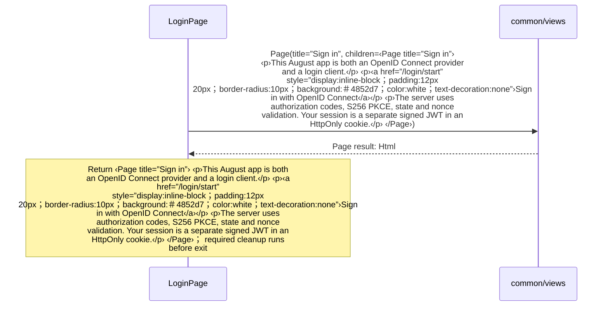
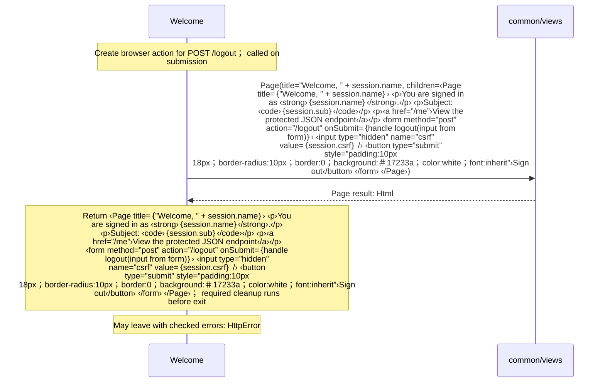

<!-- Generated by aug spec. Edit the August source, then regenerate. -->

# client/views.aug diagrams

[Project overview](../.aug-spec/diagrams/index.md) · [Compiled explanation](views.aug.md)

A browser action defers HTTP call to its handler until submission.

## Sequences

Call arrows identify checked targets; loop and branch frames determine when they run. Open that target’s module to follow its implementation. Branches describe alternatives; loops describe repeated work. Native calls and interface dispatch stop at their declared contracts. Exit notes end that path; enclosing recovery and cleanup remain visible.

### LoginPage

[Source](views.aug#L6)

### Welcome

[Source](views.aug#L13)

It takes `session` as [`SessionClaims`](contracts.aug.md#symbol-SessionClaims).

Failures can raise `HttpError`.

## Called contracts

- [logout](logout.aug.diagrams.md#sequence-logout) — client/logout.aug
- [Page](../common/views.aug.diagrams.md#sequence-Page) — common/views.aug
