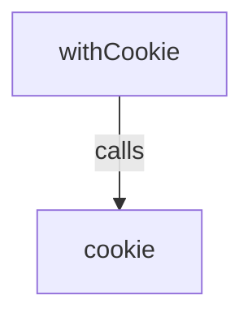
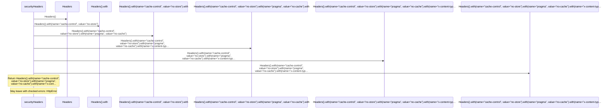
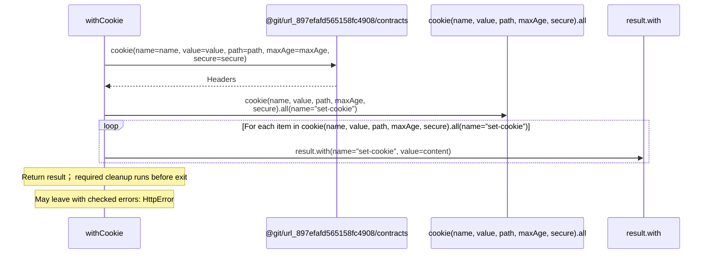

<!-- Generated by aug spec. Edit the August source, then regenerate. -->

# common/headers.aug diagrams

[Project overview](../.aug-spec/diagrams/index.md) · [Compiled explanation](headers.aug.md)

Call relationships

## Sequences

Call arrows identify checked targets; loop and branch frames determine when they run. Open that target’s module to follow its implementation. Branches describe alternatives; loops describe repeated work. Native calls and interface dispatch stop at their declared contracts. Exit notes end that path; enclosing recovery and cleanup remain visible.

### securityHeaders

[Source](headers.aug#L3)

### withCookie

[Source](headers.aug#L7)

## Called contracts

- [cookie](../.aug-spec/packages/%40git/url_897efafd565158fc4908/0.0.0-git.a39fc582565d4fca40be4f75fa304d71adc69301/contracts.aug.diagrams.md#sequence-cookie) — package/@git/url\_897efafd565158fc4908@0.0.0-git.a39fc582565d4fca40be4f75fa304d71adc69301/contracts.aug
