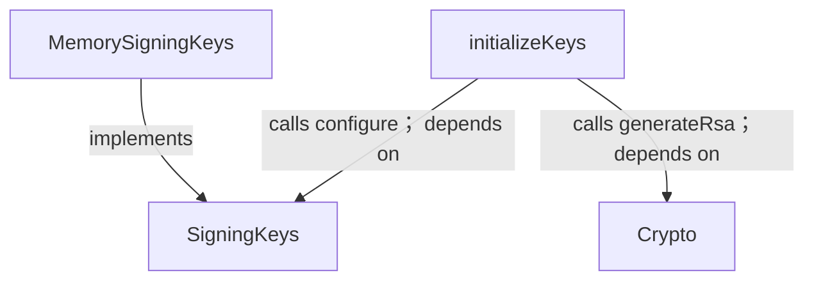
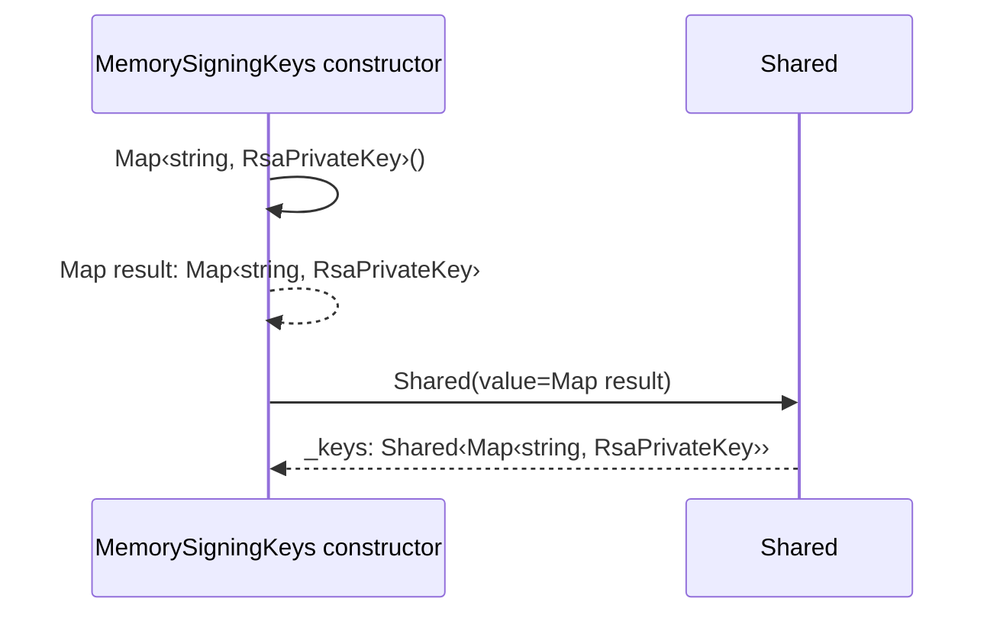
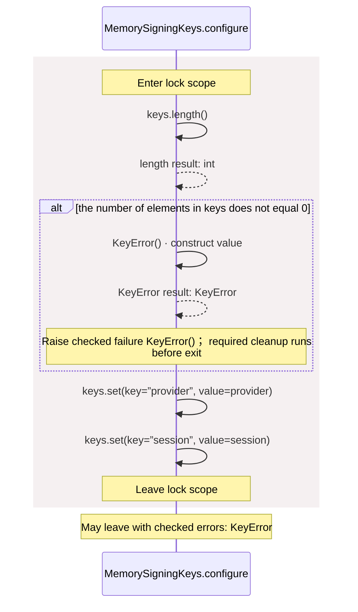
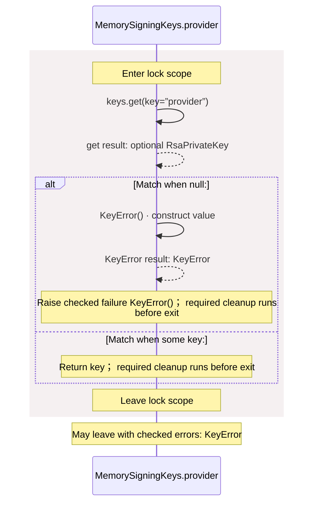
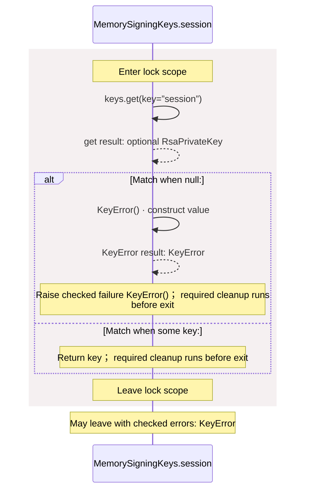
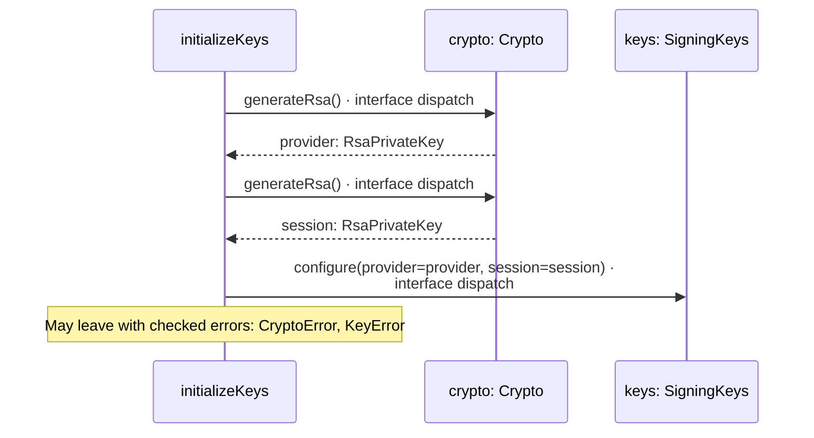

<!-- Generated by aug spec. Edit the August source, then regenerate. -->

# common/keys.aug diagrams

[Project overview](../.aug-spec/diagrams/index.md) · [Compiled explanation](keys.aug.md)

## Class interactions

## Sequences

Call arrows identify checked targets; loop and branch frames determine when they run. Open that target’s module to follow its implementation. Branches describe alternatives; loops describe repeated work. Native calls and interface dispatch stop at their declared contracts. Exit notes end that path; enclosing recovery and cleanup remain visible.

### KeyError constructor

[Source](keys.aug#L4)

It implements `Error`.

[Explanation](keys.aug.md).

### SigningKeys.configure

[Source](keys.aug#L8)

It takes `provider` and `session` as `RsaPrivateKey`.

It can call [`SigningKeys.configure`](keys.aug.md#symbol-SigningKeys.configure). Failures can raise [`KeyError`](keys.aug.md#symbol-KeyError).

May leave with checked errors: KeyError. Interface contract; implementation selected at runtime. [Explanation](keys.aug.md).

### SigningKeys.provider

[Source](keys.aug#L9)

It returns `RsaPrivateKey`. It can call [`SigningKeys.provider`](keys.aug.md#symbol-SigningKeys.provider). Failures can raise [`KeyError`](keys.aug.md#symbol-KeyError).

May leave with checked errors: KeyError. Interface contract; implementation selected at runtime. [Explanation](keys.aug.md).

### SigningKeys.session

[Source](keys.aug#L10)

It returns `RsaPrivateKey`. It can call [`SigningKeys.session`](keys.aug.md#symbol-SigningKeys.session). Failures can raise [`KeyError`](keys.aug.md#symbol-KeyError).

May leave with checked errors: KeyError. Interface contract; implementation selected at runtime. [Explanation](keys.aug.md).

### MemorySigningKeys constructor

[Source](keys.aug#L12)

It implements [`SigningKeys`](keys.aug.md#symbol-SigningKeys).

The read-only, private field `_keys` has type `Shared<Map<string,RsaPrivateKey>>` and starts as a `Shared` with `value` from an empty map from `string` to `RsaPrivateKey`.

### MemorySigningKeys.configure

[Source](keys.aug#L14)

It takes `provider` and `session` as `RsaPrivateKey`.

It can call [`SigningKeys.configure`](keys.aug.md#symbol-SigningKeys.configure). Failures can raise [`KeyError`](keys.aug.md#symbol-KeyError).

### MemorySigningKeys.provider

[Source](keys.aug#L20)

It can call [`SigningKeys.provider`](keys.aug.md#symbol-SigningKeys.provider). Failures can raise [`KeyError`](keys.aug.md#symbol-KeyError).

### MemorySigningKeys.session

[Source](keys.aug#L27)

It can call [`SigningKeys.session`](keys.aug.md#symbol-SigningKeys.session). Failures can raise [`KeyError`](keys.aug.md#symbol-KeyError).

### initializeKeys

[Source](keys.aug#L35)

It gets `crypto` ([`Crypto`](../.aug-spec/packages/%40git/url_9ef654c66d34ab8f5527/0.0.0-git.b14a0f9aa41f1ce58bd51133bcdc424033e40d40/contracts.aug.md#symbol-Crypto)) and `keys` ([`SigningKeys`](keys.aug.md#symbol-SigningKeys)) from dependency injection.

It can call [`Crypto.generateRsa`](../.aug-spec/packages/%40git/url_9ef654c66d34ab8f5527/0.0.0-git.b14a0f9aa41f1ce58bd51133bcdc424033e40d40/contracts.aug.md#symbol-Crypto.generateRsa) and [`SigningKeys.configure`](keys.aug.md#symbol-SigningKeys.configure). Failures can raise `CryptoError` and [`KeyError`](keys.aug.md#symbol-KeyError).

## Called contracts

- [KeyError](keys.aug.diagrams.md#sequence-KeyError-20-constructor) — common/keys.aug
- [SigningKeys](keys.aug.diagrams.md) — common/keys.aug
- [SigningKeys.configure](keys.aug.diagrams.md#sequence-SigningKeys.configure) — common/keys.aug
- [Crypto](../.aug-spec/packages/%40git/url_9ef654c66d34ab8f5527/0.0.0-git.b14a0f9aa41f1ce58bd51133bcdc424033e40d40/contracts.aug.diagrams.md) — package/@git/url\_9ef654c66d34ab8f5527@0.0.0-git.b14a0f9aa41f1ce58bd51133bcdc424033e40d40/contracts.aug
- [Crypto.generateRsa](../.aug-spec/packages/%40git/url_9ef654c66d34ab8f5527/0.0.0-git.b14a0f9aa41f1ce58bd51133bcdc424033e40d40/contracts.aug.diagrams.md#sequence-Crypto.generateRsa) — package/@git/url\_9ef654c66d34ab8f5527@0.0.0-git.b14a0f9aa41f1ce58bd51133bcdc424033e40d40/contracts.aug
