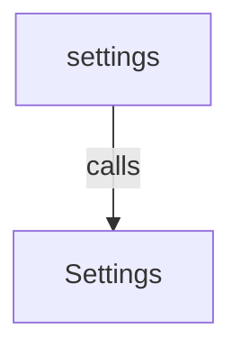
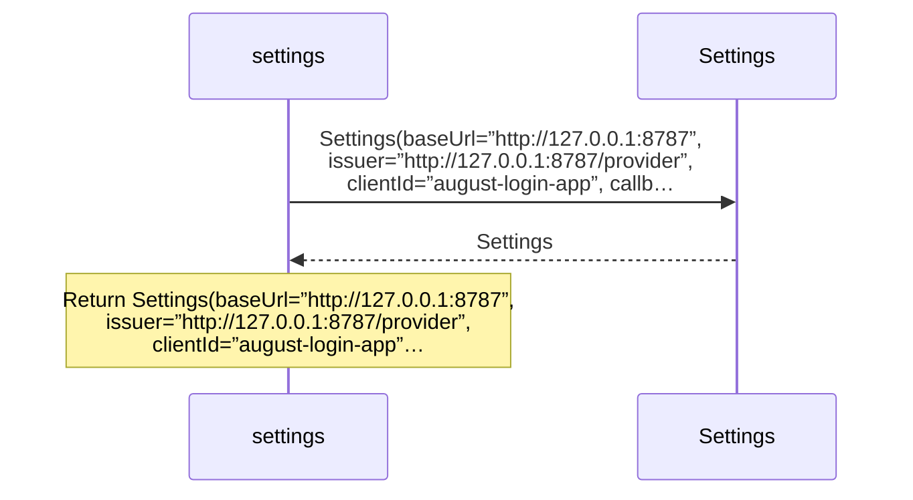

<!-- Generated by aug spec. Edit the August source, then regenerate. -->

# common/settings.aug diagrams

[Project overview](../.aug-spec/diagrams/index.md) · [Compiled explanation](settings.aug.md)

Call relationships

## Sequences

Call arrows identify checked targets; loop and branch frames determine when they run. Open that target’s module to follow its implementation. Branches describe alternatives; loops describe repeated work. Native calls and interface dispatch stop at their declared contracts. Exit notes end that path; enclosing recovery and cleanup remain visible.

### Settings constructor

[Source](settings.aug#L3)

Receive fields: baseUrl, issuer, clientId, callback, sessionSeconds, secureCookies. [Explanation](settings.aug.md).

### settings

[Source](settings.aug#L4)

## Called contracts

- [Settings](settings.aug.diagrams.md#sequence-Settings-20-constructor) — common/settings.aug
