<!-- Generated by aug spec. Edit the August source, then regenerate. -->

# provider/authorization.aug diagrams

[Project overview](../.aug-spec/diagrams/index.md) · [Compiled explanation](authorization.aug.md)

## Class interactions

### authorize

#### View 1 of 2

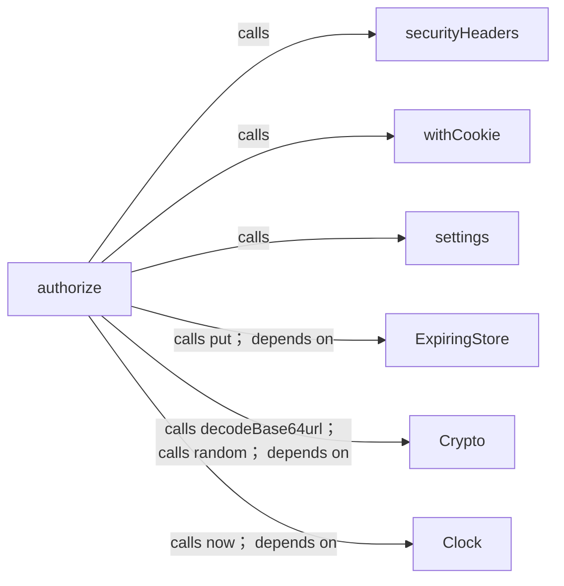

#### View 2 of 2

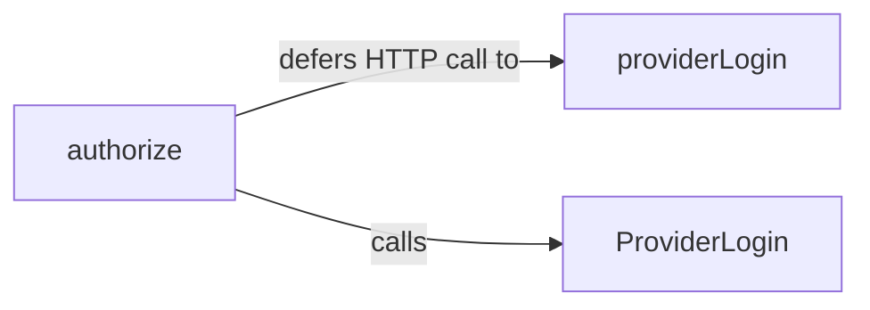

### providerLogin

#### View 1 of 2

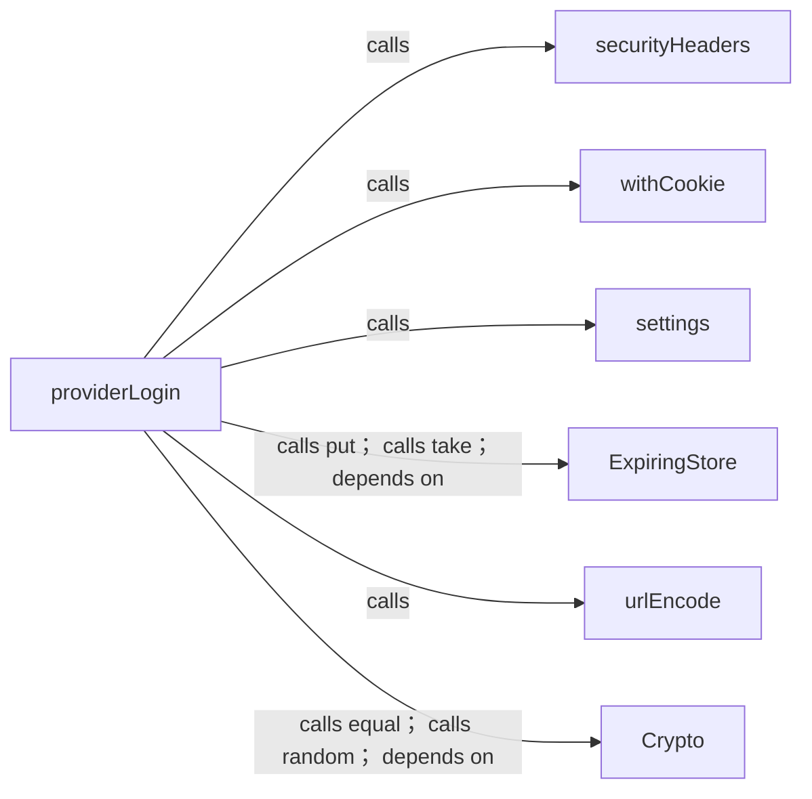

#### View 2 of 2

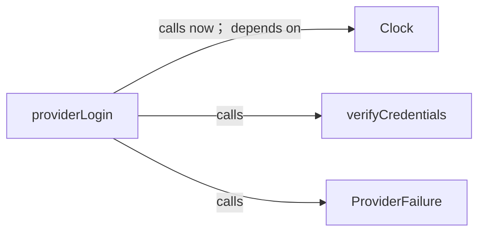

A browser action defers HTTP call to its handler until submission.

## Sequences

Call arrows identify checked targets; loop and branch frames determine when they run. Open that target’s module to follow its implementation. Branches describe alternatives; loops describe repeated work. Native calls and interface dispatch stop at their declared contracts. Exit notes end that path; enclosing recovery and cleanup remain visible.

### authorize

[Source](authorization.aug#L12)

#### Sequence 1 of 3

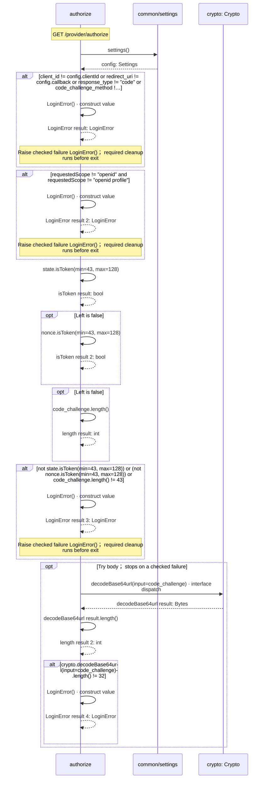

#### Sequence 2 of 3 (continued)

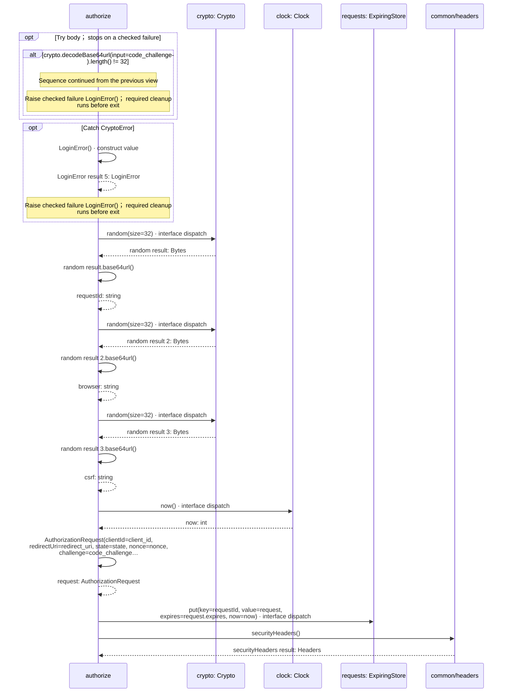

#### Sequence 3 of 3 (continued)

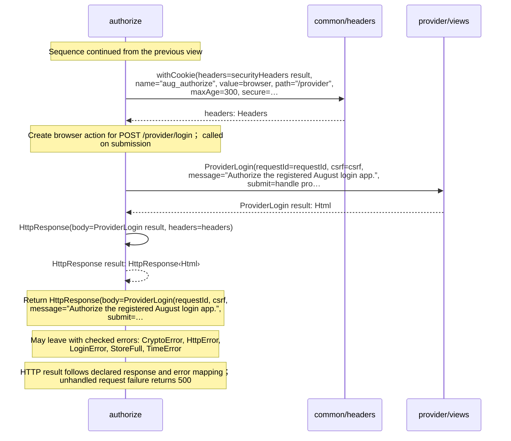

### providerLogin

[Source](authorization.aug#L35)

#### Sequence 1 of 5

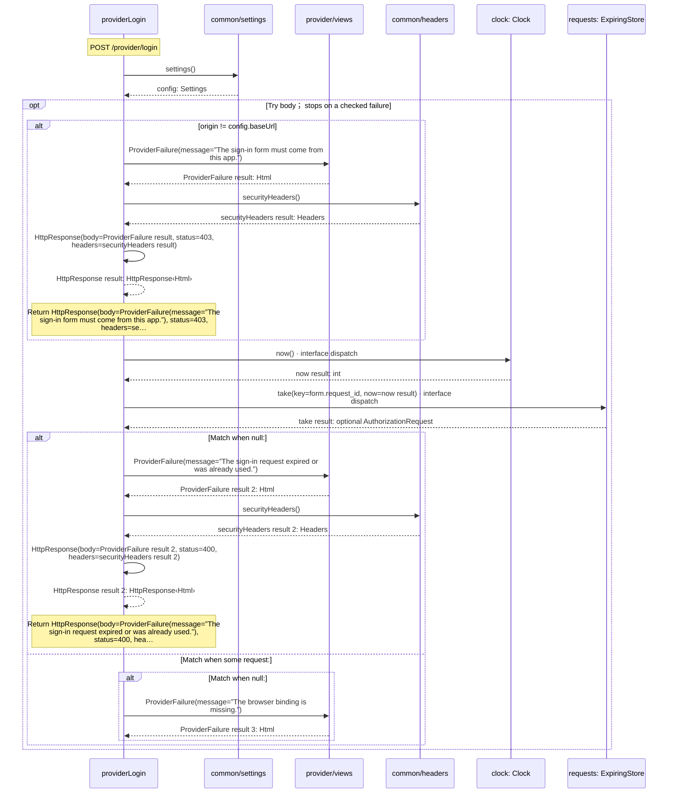

#### Sequence 2 of 5 (continued)

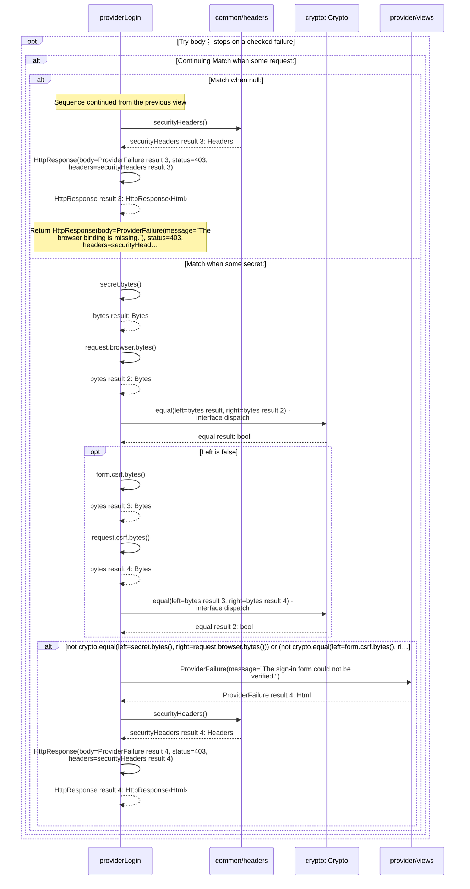

#### Sequence 3 of 5 (continued)

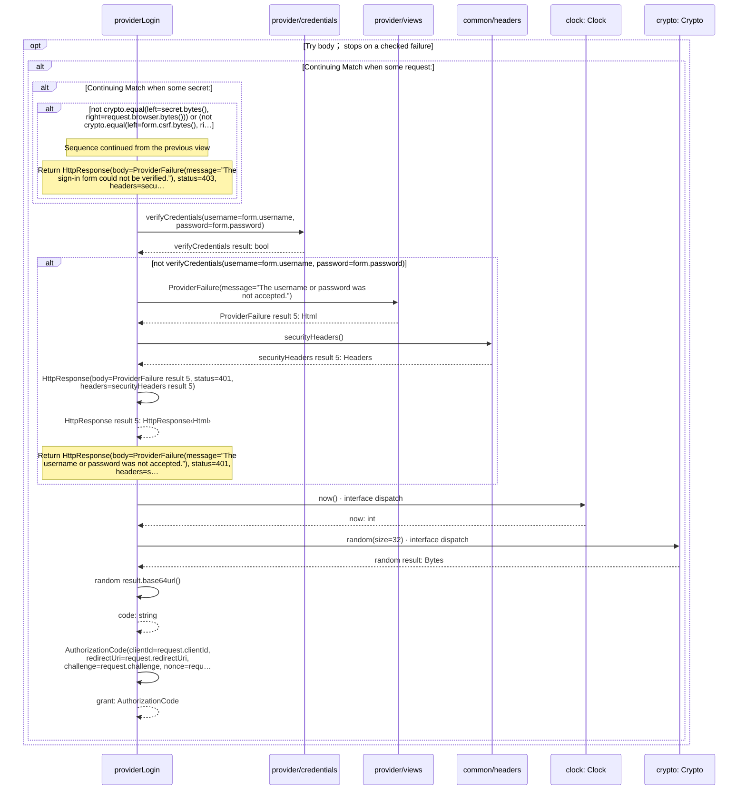

#### Sequence 4 of 5 (continued)

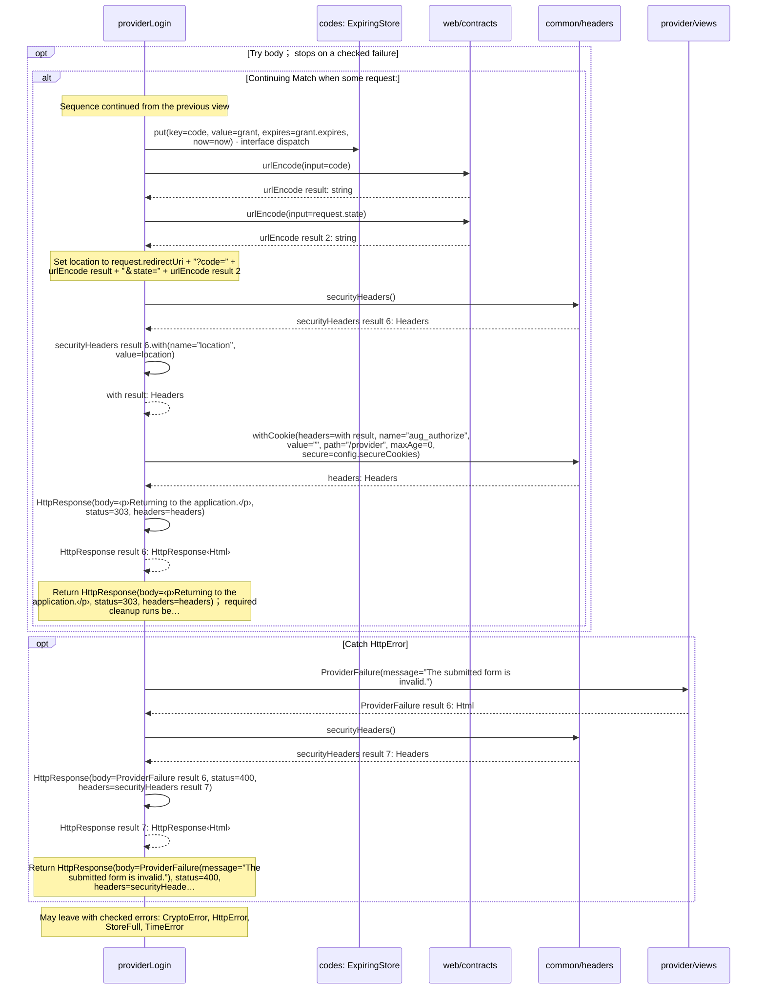

#### Sequence 5 of 5 (continued)

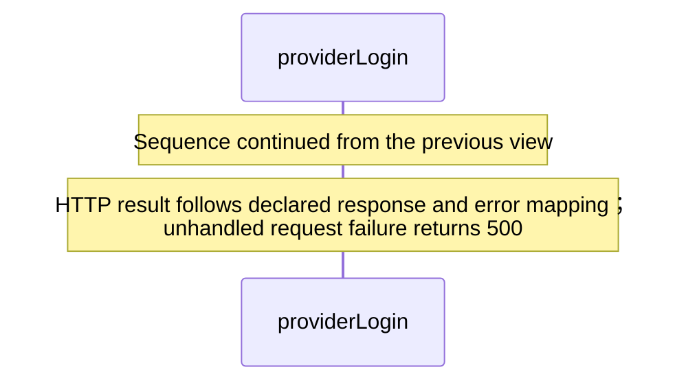

## Called contracts

- [securityHeaders](../common/headers.aug.diagrams.md#sequence-securityHeaders) — common/headers.aug
- [withCookie](../common/headers.aug.diagrams.md#sequence-withCookie) — common/headers.aug
- [settings](../common/settings.aug.diagrams.md#sequence-settings) — common/settings.aug
- [ExpiringStore](../.aug-spec/packages/%40git/url_0eb7c89453c87681ed15/0.0.0-git.a39fc582565d4fca40be4f75fa304d71adc69301/store.aug.diagrams.md) — package/@git/url\_0eb7c89453c87681ed15@0.0.0-git.a39fc582565d4fca40be4f75fa304d71adc69301/store.aug
- [ExpiringStore.put](../.aug-spec/packages/%40git/url_0eb7c89453c87681ed15/0.0.0-git.a39fc582565d4fca40be4f75fa304d71adc69301/store.aug.diagrams.md#sequence-ExpiringStore.put) — package/@git/url\_0eb7c89453c87681ed15@0.0.0-git.a39fc582565d4fca40be4f75fa304d71adc69301/store.aug
- [ExpiringStore.take](../.aug-spec/packages/%40git/url_0eb7c89453c87681ed15/0.0.0-git.a39fc582565d4fca40be4f75fa304d71adc69301/store.aug.diagrams.md#sequence-ExpiringStore.take) — package/@git/url\_0eb7c89453c87681ed15@0.0.0-git.a39fc582565d4fca40be4f75fa304d71adc69301/store.aug
- [urlEncode](../.aug-spec/packages/%40git/url_897efafd565158fc4908/0.0.0-git.a39fc582565d4fca40be4f75fa304d71adc69301/contracts.aug.diagrams.md#sequence-urlEncode) — package/@git/url\_897efafd565158fc4908@0.0.0-git.a39fc582565d4fca40be4f75fa304d71adc69301/contracts.aug
- [Crypto](../.aug-spec/packages/%40git/url_9ef654c66d34ab8f5527/0.0.0-git.b14a0f9aa41f1ce58bd51133bcdc424033e40d40/contracts.aug.diagrams.md) — package/@git/url\_9ef654c66d34ab8f5527@0.0.0-git.b14a0f9aa41f1ce58bd51133bcdc424033e40d40/contracts.aug
- [Crypto.decodeBase64url](../.aug-spec/packages/%40git/url_9ef654c66d34ab8f5527/0.0.0-git.b14a0f9aa41f1ce58bd51133bcdc424033e40d40/contracts.aug.diagrams.md#sequence-Crypto.decodeBase64url) — package/@git/url\_9ef654c66d34ab8f5527@0.0.0-git.b14a0f9aa41f1ce58bd51133bcdc424033e40d40/contracts.aug
- [Crypto.equal](../.aug-spec/packages/%40git/url_9ef654c66d34ab8f5527/0.0.0-git.b14a0f9aa41f1ce58bd51133bcdc424033e40d40/contracts.aug.diagrams.md#sequence-Crypto.equal) — package/@git/url\_9ef654c66d34ab8f5527@0.0.0-git.b14a0f9aa41f1ce58bd51133bcdc424033e40d40/contracts.aug
- [Crypto.random](../.aug-spec/packages/%40git/url_9ef654c66d34ab8f5527/0.0.0-git.b14a0f9aa41f1ce58bd51133bcdc424033e40d40/contracts.aug.diagrams.md#sequence-Crypto.random) — package/@git/url\_9ef654c66d34ab8f5527@0.0.0-git.b14a0f9aa41f1ce58bd51133bcdc424033e40d40/contracts.aug
- [Clock](../.aug-spec/packages/%40git/url_c092cd151499c4e1d8a1/0.0.0-git.a39fc582565d4fca40be4f75fa304d71adc69301/contracts.aug.diagrams.md) — package/@git/url\_c092cd151499c4e1d8a1@0.0.0-git.a39fc582565d4fca40be4f75fa304d71adc69301/contracts.aug
- [Clock.now](../.aug-spec/packages/%40git/url_c092cd151499c4e1d8a1/0.0.0-git.a39fc582565d4fca40be4f75fa304d71adc69301/contracts.aug.diagrams.md#sequence-Clock.now) — package/@git/url\_c092cd151499c4e1d8a1@0.0.0-git.a39fc582565d4fca40be4f75fa304d71adc69301/contracts.aug
- [providerLogin](authorization.aug.diagrams.md#sequence-providerLogin) — provider/authorization.aug
- [AuthorizationCode](contracts.aug.diagrams.md#sequence-AuthorizationCode-20-constructor) — provider/contracts.aug
- [AuthorizationRequest](contracts.aug.diagrams.md#sequence-AuthorizationRequest-20-constructor) — provider/contracts.aug
- [LoginError](contracts.aug.diagrams.md#sequence-LoginError-20-constructor) — provider/contracts.aug
- [verifyCredentials](credentials.aug.diagrams.md#sequence-verifyCredentials) — provider/credentials.aug
- [ProviderFailure](views.aug.diagrams.md#sequence-ProviderFailure) — provider/views.aug
- [ProviderLogin](views.aug.diagrams.md#sequence-ProviderLogin) — provider/views.aug
