<!-- Generated by aug spec. Edit the August source, then regenerate. -->

# provider/contracts.aug diagrams

[Project overview](../.aug-spec/diagrams/index.md) · [Compiled explanation](contracts.aug.md)

## Class interactions

```mermaid
flowchart TD
    n0["AccessGrant · provider/contracts.aug"]
    n1["AuthorizationCode · provider/contracts.aug"]
    n2["AuthorizationRequest · provider/contracts.aug"]
    n3["CodeError · provider/contracts.aug"]
    n4["IdClaims · provider/contracts.aug"]
    n5["LoginError · provider/contracts.aug"]
    n6["LoginForm · provider/contracts.aug"]
    n7["OAuthError · provider/contracts.aug"]
    n8["TokenForm · provider/contracts.aug"]
    n9["TokenResponse · provider/contracts.aug"]
    n10["UserInfo · provider/contracts.aug"]

```

## API calls

No relationships at this level.

## Sequences

Call arrows identify checked targets; loop and branch frames determine when they run. Open that target’s module to follow its implementation. Branches describe alternatives; loops describe repeated work. Native calls and interface dispatch stop at their declared contracts. Exit notes end that path; enclosing recovery and cleanup remain visible.

### AuthorizationRequest constructor

[Source](contracts.aug#L3)

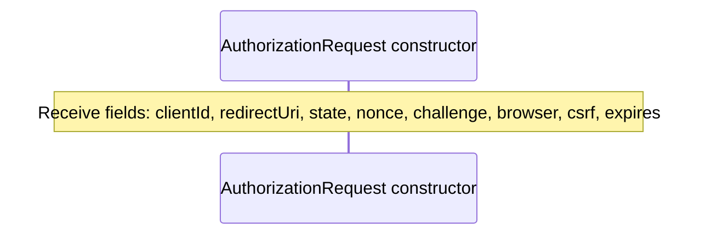

### AuthorizationCode constructor

[Source](contracts.aug#L5)

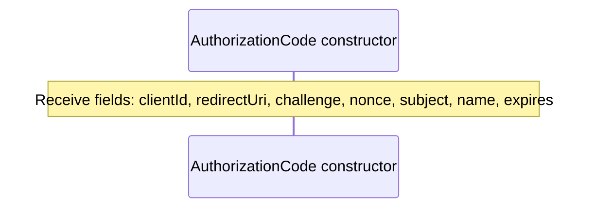

### IdClaims constructor

[Source](contracts.aug#L6)

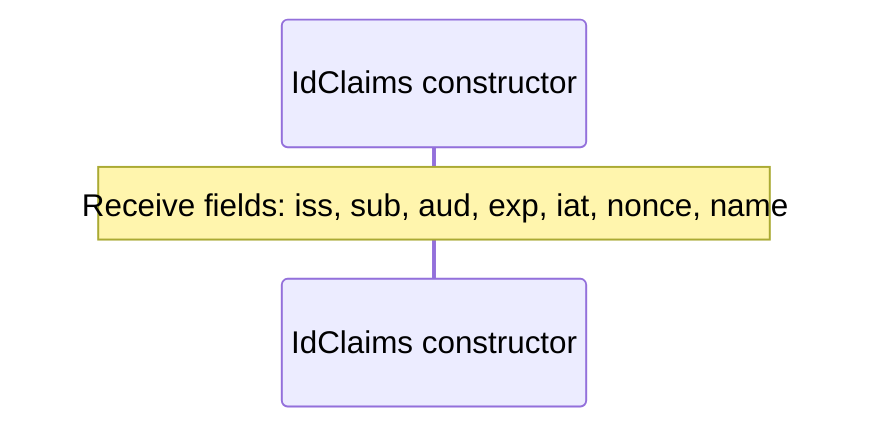

### AccessGrant constructor

[Source](contracts.aug#L7)

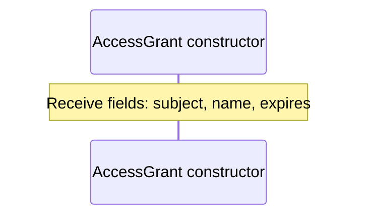

### TokenResponse constructor

[Source](contracts.aug#L8)

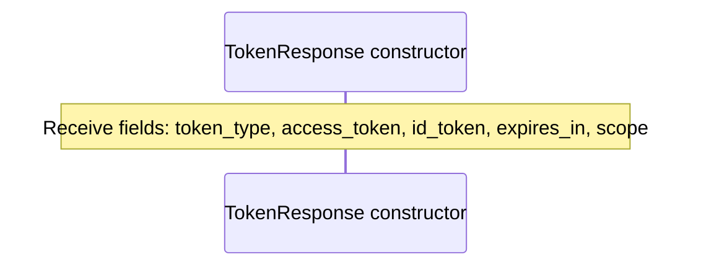

### OAuthError constructor

[Source](contracts.aug#L9)

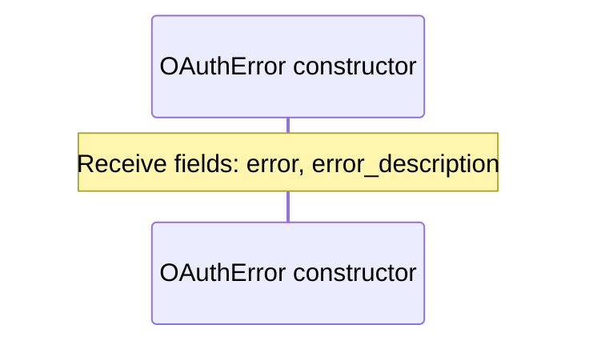

### TokenForm constructor

[Source](contracts.aug#L10)

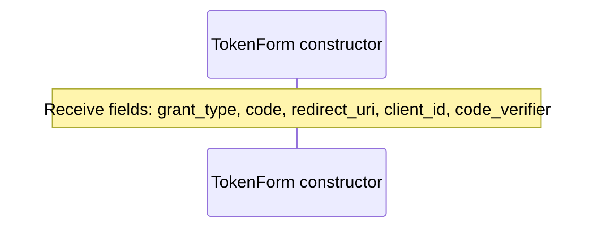

### LoginForm constructor

[Source](contracts.aug#L11)

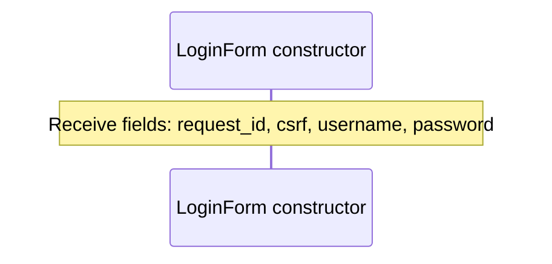

### UserInfo constructor

[Source](contracts.aug#L12)

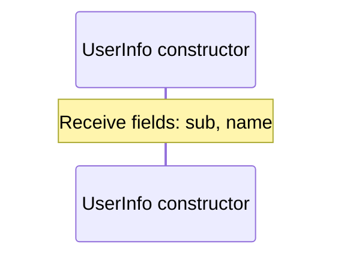

### LoginError constructor

[Source](contracts.aug#L13)

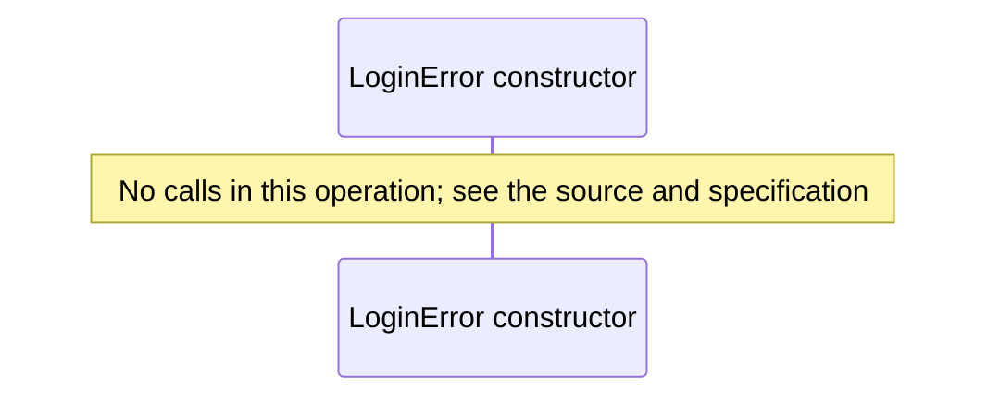

### CodeError constructor

[Source](contracts.aug#L15)

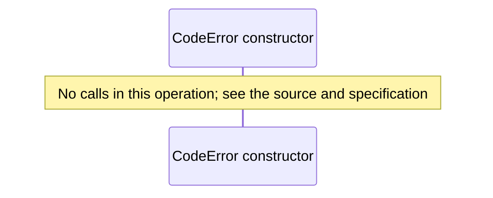

