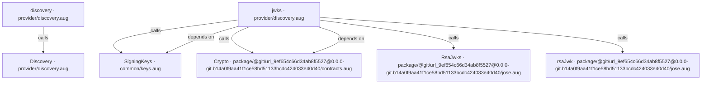
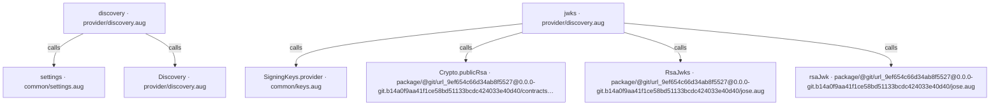
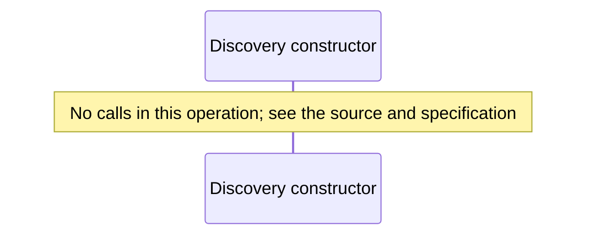
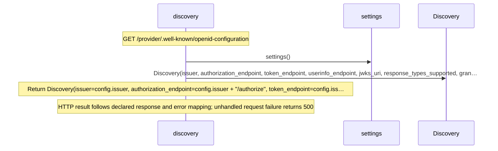
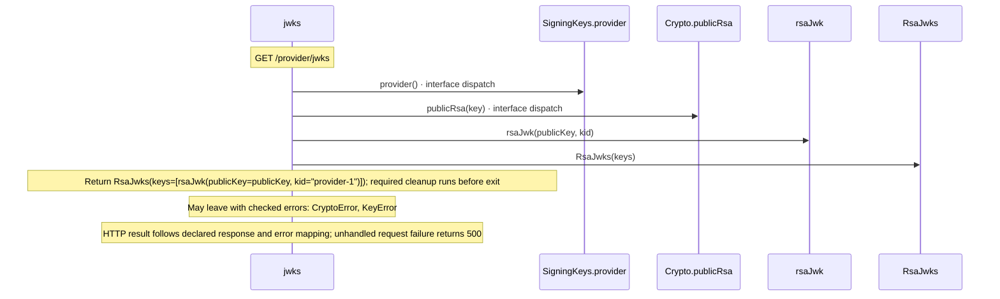

<!-- Generated by aug spec. Edit the August source, then regenerate. -->

# provider/discovery.aug diagrams

[Project overview](../.aug-spec/diagrams/index.md) · [Compiled explanation](discovery.aug.md)

## Class interactions

## API calls

## Sequences

Call arrows identify checked targets; loop and branch frames determine when they run. Open that target’s module to follow its implementation. Branches describe alternatives; loops describe repeated work. Native calls and interface dispatch stop at their declared contracts. Exit notes end that path; enclosing recovery and cleanup remain visible.

### Discovery constructor

[Source](discovery.aug#L6)

### discovery

[Source](discovery.aug#L7)

### jwks

[Source](discovery.aug#L12)

## Called contracts

- [SigningKeys](../common/keys.aug.diagrams.md) — common/keys.aug
- [SigningKeys.provider](../common/keys.aug.diagrams.md#sequence-SigningKeys.provider) — common/keys.aug
- [settings](../common/settings.aug.diagrams.md#sequence-settings) — common/settings.aug
- [Crypto](../.aug-spec/packages/%40git/url_9ef654c66d34ab8f5527/0.0.0-git.b14a0f9aa41f1ce58bd51133bcdc424033e40d40/contracts.aug.diagrams.md) — package/@git/url\_9ef654c66d34ab8f5527@0.0.0-git.b14a0f9aa41f1ce58bd51133bcdc424033e40d40/contracts.aug
- [Crypto.publicRsa](../.aug-spec/packages/%40git/url_9ef654c66d34ab8f5527/0.0.0-git.b14a0f9aa41f1ce58bd51133bcdc424033e40d40/contracts.aug.diagrams.md#sequence-Crypto.publicRsa) — package/@git/url\_9ef654c66d34ab8f5527@0.0.0-git.b14a0f9aa41f1ce58bd51133bcdc424033e40d40/contracts.aug
- [RsaJwks](../.aug-spec/packages/%40git/url_9ef654c66d34ab8f5527/0.0.0-git.b14a0f9aa41f1ce58bd51133bcdc424033e40d40/jose.aug.diagrams.md#sequence-RsaJwks-20-constructor) — package/@git/url\_9ef654c66d34ab8f5527@0.0.0-git.b14a0f9aa41f1ce58bd51133bcdc424033e40d40/jose.aug
- [rsaJwk](../.aug-spec/packages/%40git/url_9ef654c66d34ab8f5527/0.0.0-git.b14a0f9aa41f1ce58bd51133bcdc424033e40d40/jose.aug.diagrams.md#sequence-rsaJwk) — package/@git/url\_9ef654c66d34ab8f5527@0.0.0-git.b14a0f9aa41f1ce58bd51133bcdc424033e40d40/jose.aug
- [Discovery](discovery.aug.diagrams.md#sequence-Discovery-20-constructor) — provider/discovery.aug
