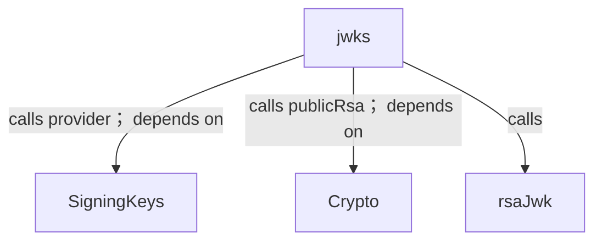
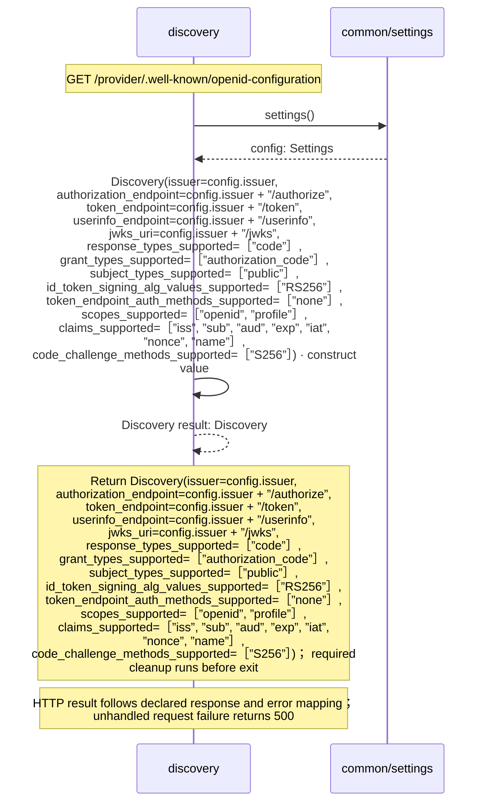
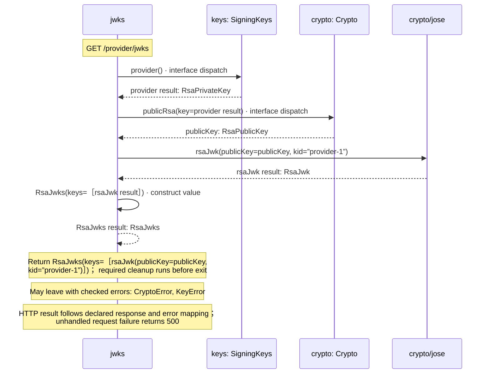

<!-- Generated by aug spec. Edit the August source, then regenerate. -->

# provider/discovery.aug diagrams

[Project overview](../.aug-spec/diagrams/index.md) · [Compiled explanation](discovery.aug.md)

## Class interactions

## Sequences

Call arrows identify checked targets; loop and branch frames determine when they run. Open that target’s module to follow its implementation. Branches describe alternatives; loops describe repeated work. Native calls and interface dispatch stop at their declared contracts. Exit notes end that path; enclosing recovery and cleanup remain visible.

### Discovery constructor

[Source](discovery.aug#L6)

Discovery advertises exactly this provider's supported authorization-code profile.

It takes `issuer`, `authorization_endpoint`, `token_endpoint`, `userinfo_endpoint`, and `jwks_uri` as strings, kept read-only and `response_types_supported`, `grant_types_supported`, `subject_types_supported`, `id_token_signing_alg_values_supported`, `token_endpoint_auth_methods_supported`, `scopes_supported`, `claims_supported`, and `code_challenge_methods_supported` as `List<string>`, kept read-only.

Receive fields: issuer, authorization\_endpoint, token\_endpoint, userinfo\_endpoint, jwks\_uri, response\_types\_supported, grant\_types\_supported, subject\_types\_supported, id\_token\_signing\_alg\_values\_supported, token\_endpoint\_auth\_methods\_supported, scopes\_supported, claims\_supported, code\_challenge\_methods\_supported. [Explanation](discovery.aug.md).

### discovery

[Source](discovery.aug#L7)

`discovery` handles `GET /provider/.well-known/openid-configuration`.

### jwks

[Source](discovery.aug#L12)

`jwks` handles `GET /provider/jwks`.

Only the provider's public signing key is published. Session keys never enter this JWKS.

It gets `crypto` ([`Crypto`](../.aug-spec/packages/%40git/url_9ef654c66d34ab8f5527/0.0.0-git.b14a0f9aa41f1ce58bd51133bcdc424033e40d40/contracts.aug.md#symbol-Crypto)) and `keys` ([`SigningKeys`](../common/keys.aug.md#symbol-SigningKeys)) from dependency injection.

It can call [`SigningKeys.provider`](../common/keys.aug.md#symbol-SigningKeys.provider), [`Crypto.publicRsa`](../.aug-spec/packages/%40git/url_9ef654c66d34ab8f5527/0.0.0-git.b14a0f9aa41f1ce58bd51133bcdc424033e40d40/contracts.aug.md#symbol-Crypto.publicRsa), and [`Crypto.exportRsa`](../.aug-spec/packages/%40git/url_9ef654c66d34ab8f5527/0.0.0-git.b14a0f9aa41f1ce58bd51133bcdc424033e40d40/contracts.aug.md#symbol-Crypto.exportRsa).

It can also raise `CryptoError` and `KeyError`.

## Called contracts

- [SigningKeys](../common/keys.aug.diagrams.md) — common/keys.aug
- [SigningKeys.provider](../common/keys.aug.diagrams.md#sequence-SigningKeys.provider) — common/keys.aug
- [settings](../common/settings.aug.diagrams.md#sequence-settings) — common/settings.aug
- [Crypto](../.aug-spec/packages/%40git/url_9ef654c66d34ab8f5527/0.0.0-git.b14a0f9aa41f1ce58bd51133bcdc424033e40d40/contracts.aug.diagrams.md) — package/@git/url\_9ef654c66d34ab8f5527@0.0.0-git.b14a0f9aa41f1ce58bd51133bcdc424033e40d40/contracts.aug
- [Crypto.publicRsa](../.aug-spec/packages/%40git/url_9ef654c66d34ab8f5527/0.0.0-git.b14a0f9aa41f1ce58bd51133bcdc424033e40d40/contracts.aug.diagrams.md#sequence-Crypto.publicRsa) — package/@git/url\_9ef654c66d34ab8f5527@0.0.0-git.b14a0f9aa41f1ce58bd51133bcdc424033e40d40/contracts.aug
- [RsaJwks](../.aug-spec/packages/%40git/url_9ef654c66d34ab8f5527/0.0.0-git.b14a0f9aa41f1ce58bd51133bcdc424033e40d40/jose.aug.diagrams.md#sequence-RsaJwks-20-constructor) — package/@git/url\_9ef654c66d34ab8f5527@0.0.0-git.b14a0f9aa41f1ce58bd51133bcdc424033e40d40/jose.aug
- [rsaJwk](../.aug-spec/packages/%40git/url_9ef654c66d34ab8f5527/0.0.0-git.b14a0f9aa41f1ce58bd51133bcdc424033e40d40/jose.aug.diagrams.md#sequence-rsaJwk) — package/@git/url\_9ef654c66d34ab8f5527@0.0.0-git.b14a0f9aa41f1ce58bd51133bcdc424033e40d40/jose.aug
- [Discovery](discovery.aug.diagrams.md#sequence-Discovery-20-constructor) — provider/discovery.aug
