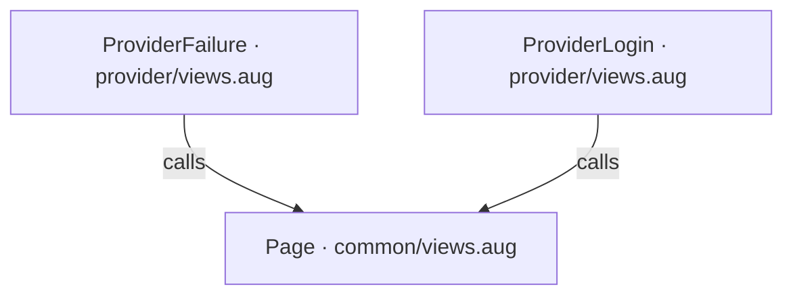
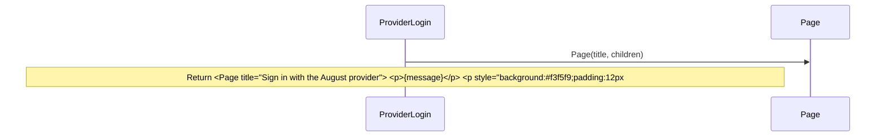
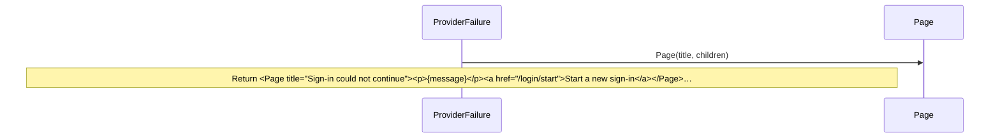

<!-- Generated by aug spec. Edit the August source, then regenerate. -->

# provider/views.aug diagrams

[Project overview](../.aug-spec/diagrams/index.md) · [Compiled explanation](views.aug.md)

## Class interactions

No relationships at this level.

## API calls

## Sequences

Call arrows identify checked targets; loop and branch frames determine when they run. Open that target’s module to follow its implementation. Branches describe alternatives; loops describe repeated work. Native calls and interface dispatch stop at their declared contracts. Exit notes end that path; enclosing recovery and cleanup remain visible.

### ProviderLogin

[Source](views.aug#L4)

### ProviderFailure

[Source](views.aug#L18)

## Called contracts

- [Page](../common/views.aug.diagrams.md#sequence-Page) — common/views.aug
