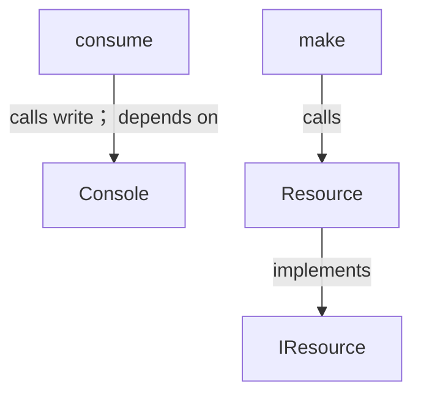
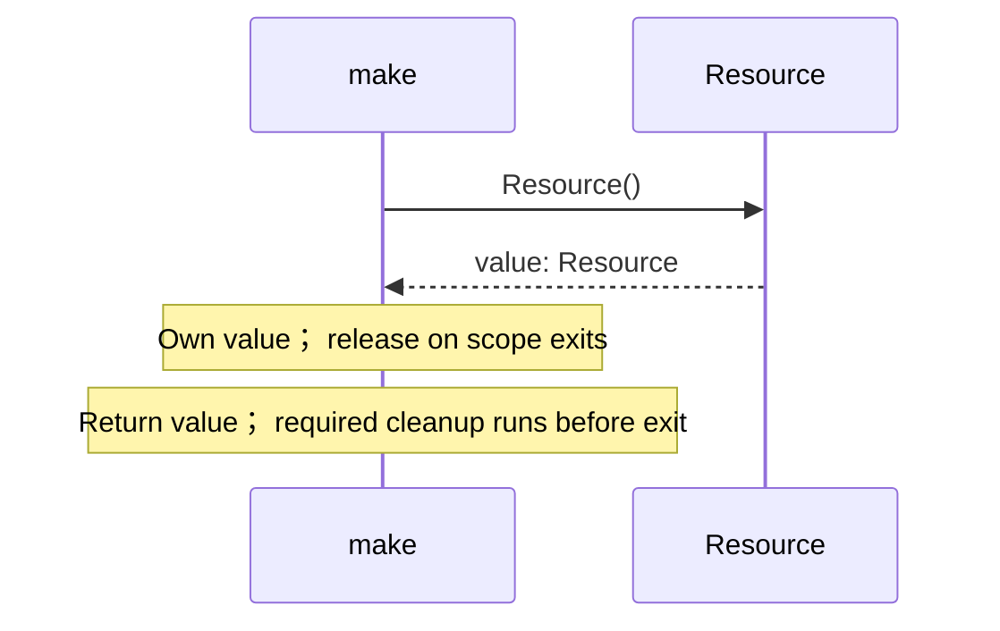
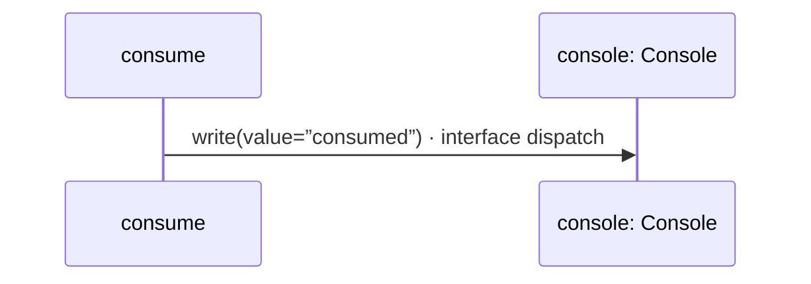

<!-- Generated by aug spec. Edit the August source, then regenerate. -->

# resource.aug diagrams

[Project overview](.aug-spec/diagrams/index.md) · [Compiled explanation](resource.aug.md)

## Class interactions

## Sequences

Call arrows identify checked targets; loop and branch frames determine when they run. Open that target’s module to follow its implementation. Branches describe alternatives; loops describe repeated work. Native calls and interface dispatch stop at their declared contracts. Exit notes end that path; enclosing recovery and cleanup remain visible.

### Resource constructor

[Source](resource.aug#L3)

[Explanation](resource.aug.md).

### Resource.drop

[Source](resource.aug#L4)

[Explanation](resource.aug.md).

### make

[Source](resource.aug#L11)

### consume

[Source](resource.aug#L15)

## Called contracts

- [Console](.aug-spec/august/0.23.0/io/contracts.aug.diagrams.md) — august/io/contracts.aug
- [Console.write](.aug-spec/august/0.23.0/io/contracts.aug.diagrams.md#sequence-Console.write) — august/io/contracts.aug
- [IResource](resource.aug.diagrams.md) — resource.aug
- [Resource](resource.aug.diagrams.md#sequence-Resource-20-constructor) — resource.aug
