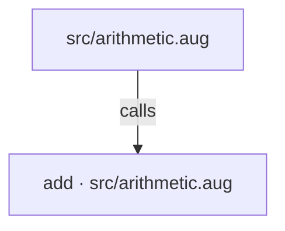
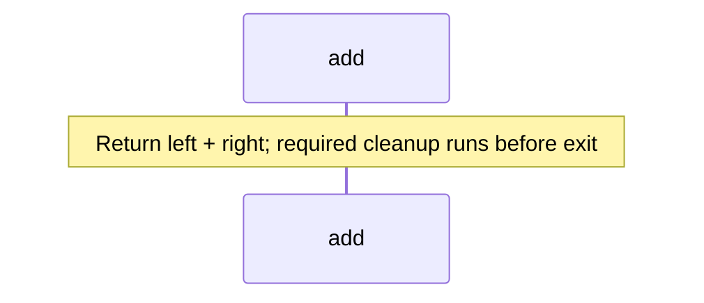

<!-- Generated by aug spec. Edit the August source, then regenerate. -->

# src/arithmetic.aug diagrams

[Project overview](../.aug-spec/diagrams/index.md) · [Compiled explanation](arithmetic.aug.md)

## Class interactions

No relationships at this level.

## API calls

## Sequences

Call arrows identify checked targets; loop and branch frames determine when they run. Open that target’s module to follow its implementation. Branches describe alternatives; loops describe repeated work. Native calls and interface dispatch stop at their declared contracts. Exit notes end that path; enclosing recovery and cleanup remain visible.

### add

[Source](arithmetic.aug#L3)

## Called contracts

- [add](arithmetic.aug.diagrams.md#sequence-add) — src/arithmetic.aug
