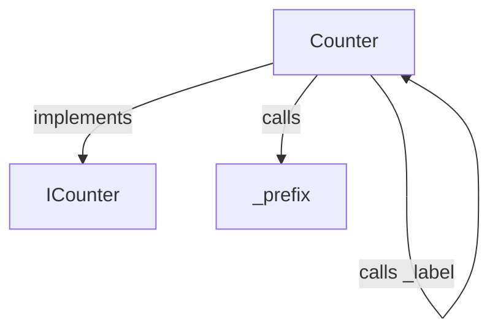
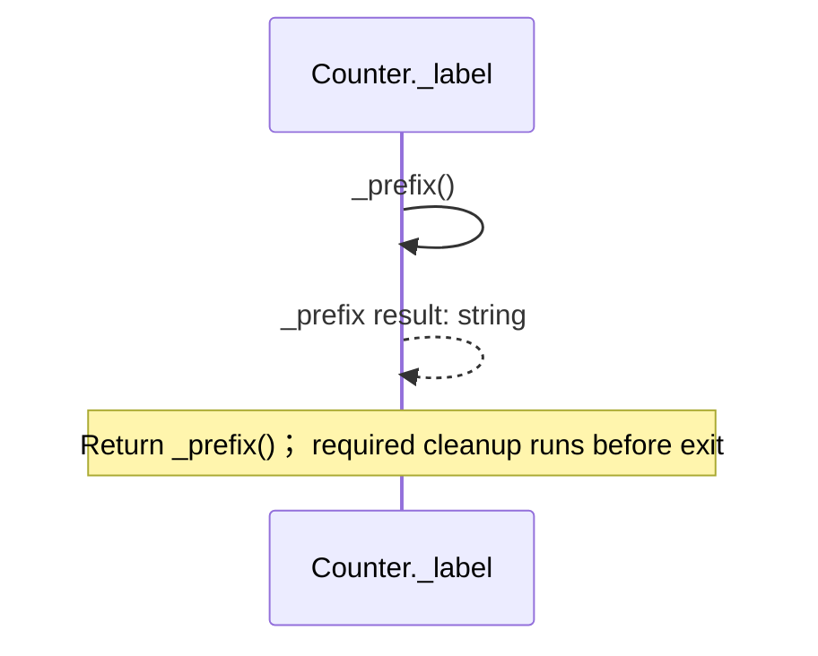
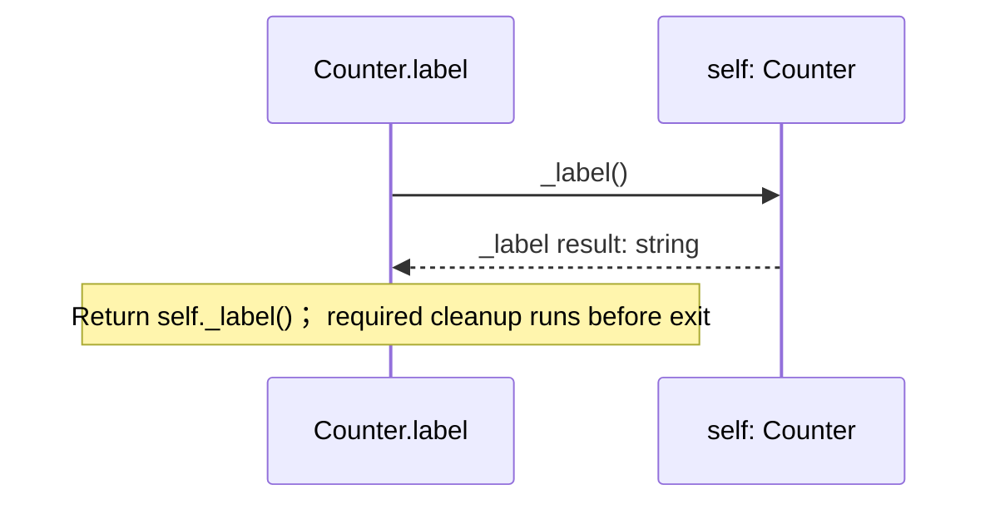

<!-- Generated by aug spec. Edit the August source, then regenerate. -->

# counter.aug diagrams

[Project overview](.aug-spec/diagrams/index.md) · [Compiled explanation](counter.aug.md)

## Class interactions

## Sequences

Call arrows identify checked targets; loop and branch frames determine when they run. Open that target’s module to follow its implementation. Branches describe alternatives; loops describe repeated work. Native calls and interface dispatch stop at their declared contracts. Exit notes end that path; enclosing recovery and cleanup remain visible.

### ICounter.label

[Source](counter.aug#L3)

It returns `string`.

Interface contract; implementation selected at runtime. [Explanation](counter.aug.md).

### Counter constructor

[Source](counter.aug#L5)

It implements [`ICounter`](counter.aug.md#symbol-ICounter).

It takes `value` as an integer, kept mutable.

Receive fields: value. [Explanation](counter.aug.md).

### Counter.\_label

[Source](counter.aug#L6)

It is private to its defining scope.

### Counter.label

[Source](counter.aug#L9)

### \_prefix

[Source](counter.aug#L13)

It is private to its defining scope.

Return "count"; required cleanup runs before exit. [Explanation](counter.aug.md).

## Called contracts

- [Counter.\_label](counter.aug.diagrams.md#sequence-Counter._label) — counter.aug
- [ICounter](counter.aug.diagrams.md) — counter.aug
- [\_prefix](counter.aug.diagrams.md#sequence-_prefix) — counter.aug
