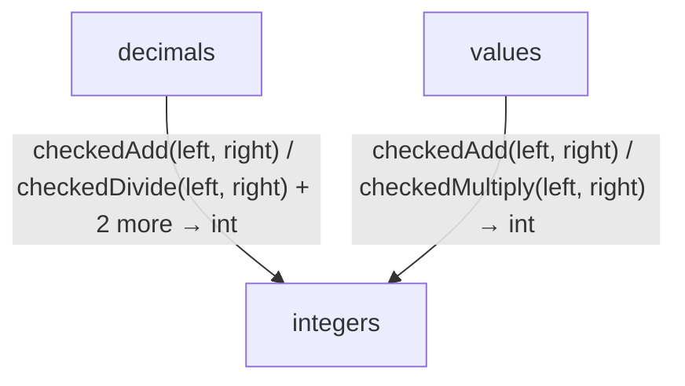

<!-- Generated by aug spec. Edit the August source, then regenerate. -->

# math data flow

[Project overview](../../index.md)

This view opens the math folder one level deeper. Each arrow shows the called operation and the data it returns to its caller. Calls inside a file stay in that file’s sequence view.

### Follow the data

Each row opens the complete operations and call sites behind one pair of logical units. A grouped arrow records calls between those units; connected arrows need not belong to the same execution path.

| From | To | Operations | Read |
| --- | --- | --- | --- |
| decimals | integers | 4 | [Inputs, results and call sites](index.md#boundary-47547039f070) |
| values | integers | 2 | [Inputs, results and call sites](index.md#boundary-a2a4ba73b9ff) |

#### Data crossing these boundaries (6 contracts)

#### decimals → integers

4 operations, 7 sites

**[checkedAdd](../../../../math/integers.aug.md#symbol-checkedAdd)**

Inputs: left: int, right: int. Result: int.

| Caller or entry | Evidence |
| --- | --- |
| addDecimals | [Call site](../../../../math/decimals.aug#L81) · [Caller explanation](../../../../math/decimals.aug.md#symbol-addDecimals) |

**[checkedDivide](../../../../math/integers.aug.md#symbol-checkedDivide)**

Inputs: left: int, right: int. Result: int.

| Caller or entry | Evidence |
| --- | --- |
| divideDecimals | [Call site](../../../../math/decimals.aug#L116) · [Caller explanation](../../../../math/decimals.aug.md#symbol-divideDecimals) |

**[checkedMultiply](../../../../math/integers.aug.md#symbol-checkedMultiply)**

Inputs: left: int, right: int. Result: int.

| Caller or entry | Evidence |
| --- | --- |
| rescaleDecimal | [Call site](../../../../math/decimals.aug#L65) · [Caller explanation](../../../../math/decimals.aug.md#symbol-rescaleDecimal) |
| multiplyDecimals | [Call site](../../../../math/decimals.aug#L94) · [Caller explanation](../../../../math/decimals.aug.md#symbol-multiplyDecimals) |
| divideDecimals | [Call site](../../../../math/decimals.aug#L109) · [Caller explanation](../../../../math/decimals.aug.md#symbol-divideDecimals) |
| divideDecimals | [Call site](../../../../math/decimals.aug#L112) · [Caller explanation](../../../../math/decimals.aug.md#symbol-divideDecimals) |

**[checkedSubtract](../../../../math/integers.aug.md#symbol-checkedSubtract)**

Inputs: left: int, right: int. Result: int.

| Caller or entry | Evidence |
| --- | --- |
| subtractDecimals | [Call site](../../../../math/decimals.aug#L90) · [Caller explanation](../../../../math/decimals.aug.md#symbol-subtractDecimals) |

#### values → integers

2 operations, 2 sites

**[checkedAdd](../../../../math/integers.aug.md#symbol-checkedAdd)**

Inputs: left: int, right: int. Result: int.

| Caller or entry | Evidence |
| --- | --- |
| addDurations | [Call site](../../../../values/durations.aug#L77) · [Caller explanation](../../../../values/durations.aug.md#symbol-addDurations) |

**[checkedMultiply](../../../../math/integers.aug.md#symbol-checkedMultiply)**

Inputs: left: int, right: int. Result: int.

| Caller or entry | Evidence |
| --- | --- |
| durationFromSeconds | [Call site](../../../../values/durations.aug#L71) · [Caller explanation](../../../../values/durations.aug.md#symbol-durationFromSeconds) |

## What this folder exposes

### Exports

Export the declaration `checkedAdd` from [`integers.aug`](../../../../math/integers.aug.md#symbol-checkedAdd). Export the declaration `checkedSubtract` from [`integers.aug`](../../../../math/integers.aug.md#symbol-checkedSubtract). Export the declaration `checkedMultiply` from [`integers.aug`](../../../../math/integers.aug.md#symbol-checkedMultiply). Export the declaration `checkedDivide` from [`integers.aug`](../../../../math/integers.aug.md#symbol-checkedDivide).

Export the declaration `checkedNegate` from [`integers.aug`](../../../../math/integers.aug.md#symbol-checkedNegate). Export the declaration `checkedAbs` from [`integers.aug`](../../../../math/integers.aug.md#symbol-checkedAbs). Export the declaration `checkedSum` from [`integers.aug`](../../../../math/integers.aug.md#symbol-checkedSum). Export the declaration `Decimal` from [`decimals.aug`](../../../../math/decimals.aug.md#symbol-Decimal).

Export the declaration `parseDecimal` from [`decimals.aug`](../../../../math/decimals.aug.md#symbol-parseDecimal). Export the declaration `formatDecimal` from [`decimals.aug`](../../../../math/decimals.aug.md#symbol-formatDecimal). Export the declaration `rescaleDecimal` from [`decimals.aug`](../../../../math/decimals.aug.md#symbol-rescaleDecimal). Export the declaration `addDecimals` from [`decimals.aug`](../../../../math/decimals.aug.md#symbol-addDecimals).

Export the declaration `subtractDecimals` from [`decimals.aug`](../../../../math/decimals.aug.md#symbol-subtractDecimals). Export the declaration `multiplyDecimals` from [`decimals.aug`](../../../../math/decimals.aug.md#symbol-multiplyDecimals). Export the declaration `divideDecimals` from [`decimals.aug`](../../../../math/decimals.aug.md#symbol-divideDecimals). Export the declaration `compareDecimals` from [`decimals.aug`](../../../../math/decimals.aug.md#symbol-compareDecimals).

## Files in this folder

| Module | Read |
| --- | --- |
| august/math/decimals.aug | [Flow and sequences](../../../../math/decimals.aug.diagrams.md) · [Explanation](../../../../math/decimals.aug.md) |
| august/math/export.aug | [Flow and sequences](../../../../math/export.aug.diagrams.md) · [Explanation](../../../../math/export.aug.md) |
| august/math/integers.aug | [Flow and sequences](../../../../math/integers.aug.diagrams.md) · [Explanation](../../../../math/integers.aug.md) |
