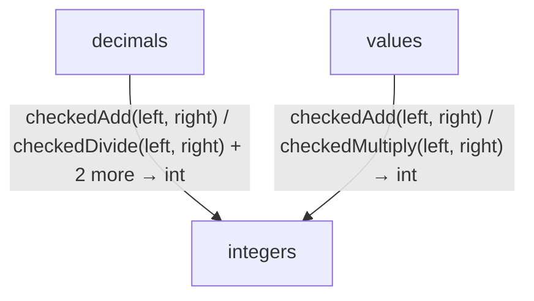

<!-- Generated by aug spec. Edit the August source, then regenerate. -->

# math data flow

[Project overview](../../index.md)

This view opens the math folder one level deeper. Each arrow shows the called operation and the data it returns to its caller. Calls inside a file stay in that file’s sequence view.

Data crossing these boundaries (6 contracts)

| From | To | Operation and inputs | Result |
| --- | --- | --- | --- |
| decimals | integers | [checkedAdd](../../../../math/integers.aug.md#symbol-checkedAdd) · left: int, right: int | int |
| decimals | integers | [checkedDivide](../../../../math/integers.aug.md#symbol-checkedDivide) · left: int, right: int | int |
| decimals | integers | [checkedMultiply](../../../../math/integers.aug.md#symbol-checkedMultiply) · left: int, right: int | int |
| decimals | integers | [checkedSubtract](../../../../math/integers.aug.md#symbol-checkedSubtract) · left: int, right: int | int |
| values | integers | [checkedAdd](../../../../math/integers.aug.md#symbol-checkedAdd) · left: int, right: int | int |
| values | integers | [checkedMultiply](../../../../math/integers.aug.md#symbol-checkedMultiply) · left: int, right: int | int |

## Files in this folder

| Module | Read |
| --- | --- |
| august/math/decimals.aug | [Flow and sequences](../../../../math/decimals.aug.diagrams.md) · [Explanation](../../../../math/decimals.aug.md) |
| august/math/export.aug | [Flow and sequences](../../../../math/export.aug.diagrams.md) · [Explanation](../../../../math/export.aug.md) |
| august/math/integers.aug | [Flow and sequences](../../../../math/integers.aug.diagrams.md) · [Explanation](../../../../math/integers.aug.md) |
