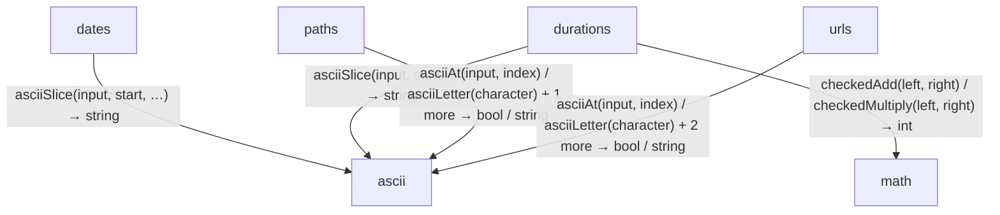

<!-- Generated by aug spec. Edit the August source, then regenerate. -->

# values data flow

[Project overview](../../index.md)

This view opens the values folder one level deeper. Each arrow shows the called operation and the data it returns to its caller. Calls inside a file stay in that file’s sequence view.

### Follow the data

Each row opens the complete operations and call sites behind one pair of logical units. A grouped arrow records calls between those units; connected arrows need not belong to the same execution path.

| From | To | Operations | Read |
| --- | --- | --- | --- |
| dates | ascii | 1 | [Inputs, results and call sites](index.md#boundary-612f4d37bdc1) |
| durations | math | 2 | [Inputs, results and call sites](index.md#boundary-3376c10efa50) |
| durations | ascii | 1 | [Inputs, results and call sites](index.md#boundary-dc1662c7ddea) |
| paths | ascii | 3 | [Inputs, results and call sites](index.md#boundary-e8f3bb0bcf49) |
| urls | ascii | 4 | [Inputs, results and call sites](index.md#boundary-c75ad6ec6bda) |

#### Data crossing these boundaries (11 contracts)

#### dates → ascii

1 operation, 5 sites

**[asciiSlice](../../../../values/ascii.aug.md#symbol-asciiSlice)**

Inputs: input: Bytes, start: int, end: int. Result: string.

| Caller or entry | Evidence |
| --- | --- |
| parseCivilDate | [Call site](../../../../values/dates.aug#L33) · [Caller explanation](../../../../values/dates.aug.md#symbol-parseCivilDate) |
| parseCivilDate | [Call site](../../../../values/dates.aug#L34) · [Caller explanation](../../../../values/dates.aug.md#symbol-parseCivilDate) |
| parseCivilDate | [Call site](../../../../values/dates.aug#L35) · [Caller explanation](../../../../values/dates.aug.md#symbol-parseCivilDate) |
| parseCivilDate | [Call site](../../../../values/dates.aug#L36) · [Caller explanation](../../../../values/dates.aug.md#symbol-parseCivilDate) |
| parseCivilDate | [Call site](../../../../values/dates.aug#L36) · [Caller explanation](../../../../values/dates.aug.md#symbol-parseCivilDate) |

#### durations → math

2 operations, 2 sites

**[checkedAdd](../../../../math/integers.aug.md#symbol-checkedAdd)**

Inputs: left: int, right: int. Result: int.

| Caller or entry | Evidence |
| --- | --- |
| addDurations | [Call site](../../../../values/durations.aug#L77) · [Caller explanation](../../../../values/durations.aug.md#symbol-addDurations) |

**[checkedMultiply](../../../../math/integers.aug.md#symbol-checkedMultiply)**

Inputs: left: int, right: int. Result: int.

| Caller or entry | Evidence |
| --- | --- |
| durationFromSeconds | [Call site](../../../../values/durations.aug#L71) · [Caller explanation](../../../../values/durations.aug.md#symbol-durationFromSeconds) |

#### durations → ascii

1 operation, 1 site

**[asciiSlice](../../../../values/ascii.aug.md#symbol-asciiSlice)**

Inputs: input: Bytes, start: int, end: int. Result: string.

| Caller or entry | Evidence |
| --- | --- |
| parseDuration | [Call site](../../../../values/durations.aug#L27) · [Caller explanation](../../../../values/durations.aug.md#symbol-parseDuration) |

#### paths → ascii

3 operations, 3 sites

**[asciiAt](../../../../values/ascii.aug.md#symbol-asciiAt)**

Inputs: input: Bytes, index: int. Result: string.

| Caller or entry | Evidence |
| --- | --- |
| \_validatePortablePath | [Call site](../../../../values/paths.aug#L42) · [Caller explanation](../../../../values/paths.aug.md#symbol-_validatePortablePath) |

**[asciiLetter](../../../../values/ascii.aug.md#symbol-asciiLetter)**

Inputs: character: string. Result: bool.

| Caller or entry | Evidence |
| --- | --- |
| \_validatePortablePath | [Call site](../../../../values/paths.aug#L43) · [Caller explanation](../../../../values/paths.aug.md#symbol-_validatePortablePath) |

**[asciiLower](../../../../values/ascii.aug.md#symbol-asciiLower)**

Inputs: text: string. Result: string.

| Caller or entry | Evidence |
| --- | --- |
| \_validatePortablePath | [Call site](../../../../values/paths.aug#L47) · [Caller explanation](../../../../values/paths.aug.md#symbol-_validatePortablePath) |

#### urls → ascii

4 operations, 11 sites

**[asciiAt](../../../../values/ascii.aug.md#symbol-asciiAt)**

Inputs: input: Bytes, index: int. Result: string.

| Caller or entry | Evidence |
| --- | --- |
| \_validateHttpUrl | [Call site](../../../../values/urls.aug#L36) · [Caller explanation](../../../../values/urls.aug.md#symbol-_validateHttpUrl) |
| \_validateHttpUrl | [Call site](../../../../values/urls.aug#L44) · [Caller explanation](../../../../values/urls.aug.md#symbol-_validateHttpUrl) |
| \_validateHttpUrl | [Call site](../../../../values/urls.aug#L51) · [Caller explanation](../../../../values/urls.aug.md#symbol-_validateHttpUrl) |
| \_validateHttpUrl | [Call site](../../../../values/urls.aug#L51) · [Caller explanation](../../../../values/urls.aug.md#symbol-_validateHttpUrl) |
| \_validateAuthority | [Call site](../../../../values/urls.aug#L74) · [Caller explanation](../../../../values/urls.aug.md#symbol-_validateAuthority) |

**[asciiLetter](../../../../values/ascii.aug.md#symbol-asciiLetter)**

Inputs: character: string. Result: bool.

| Caller or entry | Evidence |
| --- | --- |
| \_validateAuthority | [Call site](../../../../values/urls.aug#L75) · [Caller explanation](../../../../values/urls.aug.md#symbol-_validateAuthority) |

**[asciiLower](../../../../values/ascii.aug.md#symbol-asciiLower)**

Inputs: text: string. Result: string.

| Caller or entry | Evidence |
| --- | --- |
| \_validateHttpUrl | [Call site](../../../../values/urls.aug#L29) · [Caller explanation](../../../../values/urls.aug.md#symbol-_validateHttpUrl) |
| \_validateHttpUrl | [Call site](../../../../values/urls.aug#L31) · [Caller explanation](../../../../values/urls.aug.md#symbol-_validateHttpUrl) |

**[asciiSlice](../../../../values/ascii.aug.md#symbol-asciiSlice)**

Inputs: input: Bytes, start: int, end: int. Result: string.

| Caller or entry | Evidence |
| --- | --- |
| \_validateHttpUrl | [Call site](../../../../values/urls.aug#L29) · [Caller explanation](../../../../values/urls.aug.md#symbol-_validateHttpUrl) |
| \_validateHttpUrl | [Call site](../../../../values/urls.aug#L31) · [Caller explanation](../../../../values/urls.aug.md#symbol-_validateHttpUrl) |
| \_validateHttpUrl | [Call site](../../../../values/urls.aug#L40) · [Caller explanation](../../../../values/urls.aug.md#symbol-_validateHttpUrl) |

## What this folder exposes

### Exports

Export the declaration `CivilDate` from [`dates.aug`](../../../../values/dates.aug.md#symbol-CivilDate). Export the declaration `parseCivilDate` from [`dates.aug`](../../../../values/dates.aug.md#symbol-parseCivilDate). Export the declaration `formatCivilDate` from [`dates.aug`](../../../../values/dates.aug.md#symbol-formatCivilDate). Export the declaration `compareCivilDates` from [`dates.aug`](../../../../values/dates.aug.md#symbol-compareCivilDates).

Export the declaration `Duration` from [`durations.aug`](../../../../values/durations.aug.md#symbol-Duration). Export the declaration `parseDuration` from [`durations.aug`](../../../../values/durations.aug.md#symbol-parseDuration). Export the declaration `formatDuration` from [`durations.aug`](../../../../values/durations.aug.md#symbol-formatDuration). Export the declaration `durationFromSeconds` from [`durations.aug`](../../../../values/durations.aug.md#symbol-durationFromSeconds).

Export the declaration `addDurations` from [`durations.aug`](../../../../values/durations.aug.md#symbol-addDurations). Export the declaration `compareDurations` from [`durations.aug`](../../../../values/durations.aug.md#symbol-compareDurations). Export the declaration `TokenId` from [`text.aug`](../../../../values/text.aug.md#symbol-TokenId). Export the declaration `parseTokenId` from [`text.aug`](../../../../values/text.aug.md#symbol-parseTokenId).

Export the declaration `formatTokenId` from [`text.aug`](../../../../values/text.aug.md#symbol-formatTokenId). Export the declaration `BoundedText` from [`text.aug`](../../../../values/text.aug.md#symbol-BoundedText). Export the declaration `parseBoundedText` from [`text.aug`](../../../../values/text.aug.md#symbol-parseBoundedText). Export the declaration `formatBoundedText` from [`text.aug`](../../../../values/text.aug.md#symbol-formatBoundedText).

Export the declaration `HttpUrl` from [`urls.aug`](../../../../values/urls.aug.md#symbol-HttpUrl). Export the declaration `parseHttpUrl` from [`urls.aug`](../../../../values/urls.aug.md#symbol-parseHttpUrl). Export the declaration `formatHttpUrl` from [`urls.aug`](../../../../values/urls.aug.md#symbol-formatHttpUrl). Export the declaration `PortableRelativePath` from [`paths.aug`](../../../../values/paths.aug.md#symbol-PortableRelativePath).

Export the declaration `parsePortableRelativePath` from [`paths.aug`](../../../../values/paths.aug.md#symbol-parsePortableRelativePath). Export the declaration `formatPortableRelativePath` from [`paths.aug`](../../../../values/paths.aug.md#symbol-formatPortableRelativePath). Export the declaration `joinPortablePaths` from [`paths.aug`](../../../../values/paths.aug.md#symbol-joinPortablePaths). Export the declaration `RetryPolicy` from [`retries.aug`](../../../../values/retries.aug.md#symbol-RetryPolicy).

Export the declaration `retryDelay` from [`retries.aug`](../../../../values/retries.aug.md#symbol-retryDelay).

## Files in this folder

| Module | Read |
| --- | --- |
| august/values/ascii.aug | [Flow and sequences](../../../../values/ascii.aug.diagrams.md) · [Explanation](../../../../values/ascii.aug.md) |
| august/values/dates.aug | [Flow and sequences](../../../../values/dates.aug.diagrams.md) · [Explanation](../../../../values/dates.aug.md) |
| august/values/durations.aug | [Flow and sequences](../../../../values/durations.aug.diagrams.md) · [Explanation](../../../../values/durations.aug.md) |
| august/values/export.aug | [Flow and sequences](../../../../values/export.aug.diagrams.md) · [Explanation](../../../../values/export.aug.md) |
| august/values/paths.aug | [Flow and sequences](../../../../values/paths.aug.diagrams.md) · [Explanation](../../../../values/paths.aug.md) |
| august/values/retries.aug | [Flow and sequences](../../../../values/retries.aug.diagrams.md) · [Explanation](../../../../values/retries.aug.md) |
| august/values/text.aug | [Flow and sequences](../../../../values/text.aug.diagrams.md) · [Explanation](../../../../values/text.aug.md) |
| august/values/urls.aug | [Flow and sequences](../../../../values/urls.aug.diagrams.md) · [Explanation](../../../../values/urls.aug.md) |
