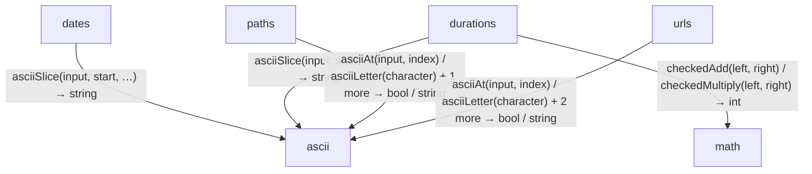

<!-- Generated by aug spec. Edit the August source, then regenerate. -->

# values data flow

[Project overview](../../index.md)

This view opens the values folder one level deeper. Each arrow shows the called operation and the data it returns to its caller. Calls inside a file stay in that file’s sequence view.

Data crossing these boundaries (11 contracts)

| From | To | Operation and inputs | Result |
| --- | --- | --- | --- |
| dates | ascii | [asciiSlice](../../../../values/ascii.aug.md#symbol-asciiSlice) · input: Bytes, start: int, end: int | string |
| durations | math | [checkedAdd](../../../../math/integers.aug.md#symbol-checkedAdd) · left: int, right: int | int |
| durations | math | [checkedMultiply](../../../../math/integers.aug.md#symbol-checkedMultiply) · left: int, right: int | int |
| durations | ascii | [asciiSlice](../../../../values/ascii.aug.md#symbol-asciiSlice) · input: Bytes, start: int, end: int | string |
| paths | ascii | [asciiAt](../../../../values/ascii.aug.md#symbol-asciiAt) · input: Bytes, index: int | string |
| paths | ascii | [asciiLetter](../../../../values/ascii.aug.md#symbol-asciiLetter) · character: string | bool |
| paths | ascii | [asciiLower](../../../../values/ascii.aug.md#symbol-asciiLower) · text: string | string |
| urls | ascii | [asciiAt](../../../../values/ascii.aug.md#symbol-asciiAt) · input: Bytes, index: int | string |
| urls | ascii | [asciiLetter](../../../../values/ascii.aug.md#symbol-asciiLetter) · character: string | bool |
| urls | ascii | [asciiLower](../../../../values/ascii.aug.md#symbol-asciiLower) · text: string | string |
| urls | ascii | [asciiSlice](../../../../values/ascii.aug.md#symbol-asciiSlice) · input: Bytes, start: int, end: int | string |

## Files in this folder

| Module | Read |
| --- | --- |
| august/values/ascii.aug | [Flow and sequences](../../../../values/ascii.aug.diagrams.md) · [Explanation](../../../../values/ascii.aug.md) |
| august/values/dates.aug | [Flow and sequences](../../../../values/dates.aug.diagrams.md) · [Explanation](../../../../values/dates.aug.md) |
| august/values/durations.aug | [Flow and sequences](../../../../values/durations.aug.diagrams.md) · [Explanation](../../../../values/durations.aug.md) |
| august/values/export.aug | [Flow and sequences](../../../../values/export.aug.diagrams.md) · [Explanation](../../../../values/export.aug.md) |
| august/values/paths.aug | [Flow and sequences](../../../../values/paths.aug.diagrams.md) · [Explanation](../../../../values/paths.aug.md) |
| august/values/retries.aug | [Flow and sequences](../../../../values/retries.aug.diagrams.md) · [Explanation](../../../../values/retries.aug.md) |
| august/values/text.aug | [Flow and sequences](../../../../values/text.aug.diagrams.md) · [Explanation](../../../../values/text.aug.md) |
| august/values/urls.aug | [Flow and sequences](../../../../values/urls.aug.diagrams.md) · [Explanation](../../../../values/urls.aug.md) |
