<!-- Generated by aug spec. Edit the August source, then regenerate. -->

# august/collections/operations.aug diagrams

[Project overview](.aug-spec/diagrams/index.md) · [Compiled explanation](operations.aug.md)

## Class interactions

### IntegerOrder

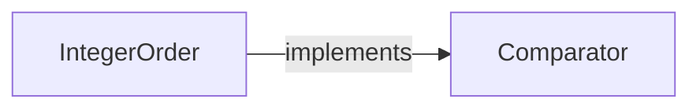

### TextOrder

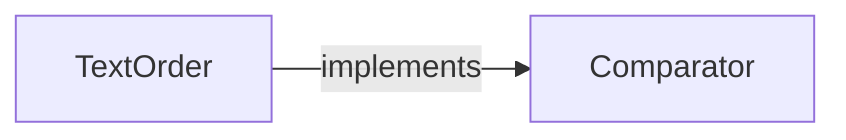

### aggregate

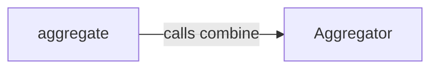

### filter

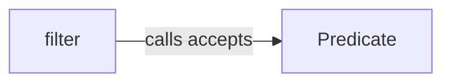

### find


### remove

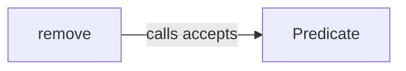

### sort

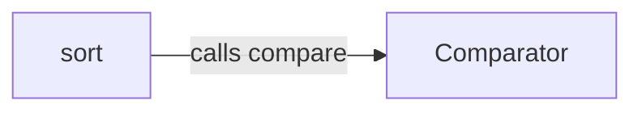

### sortIntegers

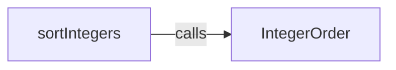

### sortText

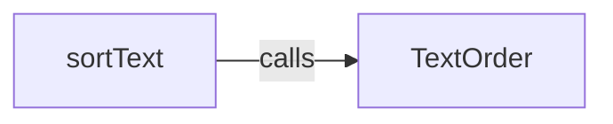

### transform

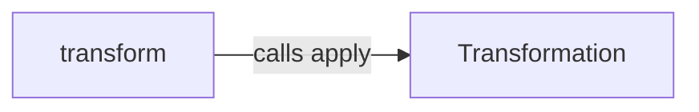


## Sequences

Call arrows identify checked targets; loop and branch frames determine when they run. Open that target’s module to follow its implementation. Branches describe alternatives; loops describe repeated work. Native calls and interface dispatch stop at their declared contracts. Exit notes end that path; enclosing recovery and cleanup remain visible.

<a id="sequence-Predicate.accepts"></a>

### Predicate.accepts

[Source](operations.aug#L4)

It takes `value` as `T`.

It returns `bool`.

Interface contract; implementation selected at runtime. [Explanation](operations.aug.md).

<a id="sequence-Transformation.apply"></a>

### Transformation.apply

[Source](operations.aug#L8)

It takes `value` as `T`.

It returns `U`.

Interface contract; implementation selected at runtime. [Explanation](operations.aug.md).

<a id="sequence-Aggregator.combine"></a>

### Aggregator.combine

[Source](operations.aug#L12)

It takes `total` as `U` and `value` as `T`.

It returns `U`.

Interface contract; implementation selected at runtime. [Explanation](operations.aug.md).

<a id="sequence-Comparator.compare"></a>

### Comparator.compare

[Source](operations.aug#L16)

It takes `left` and `right` as `T`.

It returns `int`.

Interface contract; implementation selected at runtime. [Explanation](operations.aug.md).

<a id="sequence-filter"></a>

### filter

[Source](operations.aug#L21)

Return a new list of matching values in snapshot order; an empty input returns an empty list.
Read references without copying their contents or granting mutable access.

It takes `values` as `List<T>` and `predicate` as [`Predicate<T>`](operations.aug.md#symbol-Predicate).


<a id="sequence-transform"></a>

### transform

[Source](operations.aug#L32)

Transform every snapshot value once, preserving order in a new list.
An empty input returns an empty list. Transformations cannot mutate inputs or perform I/O.

It takes `values` as `List<T>` and `transformation` as [`Transformation<T,U>`](operations.aug.md#symbol-Transformation).

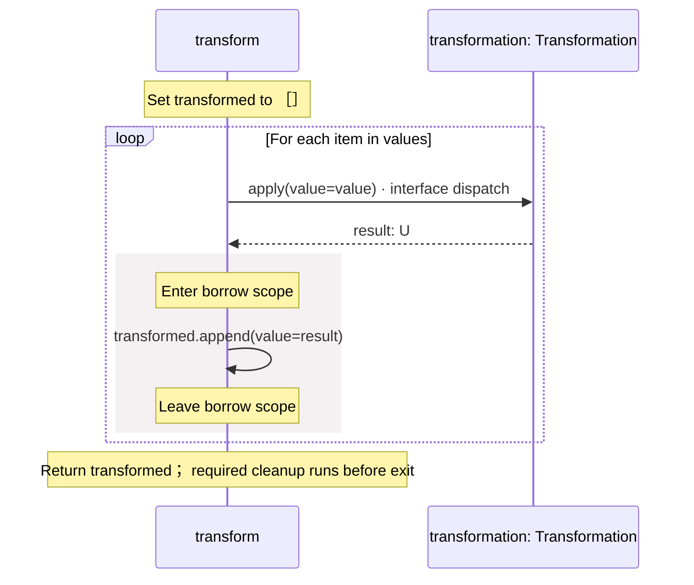

<a id="sequence-aggregate"></a>

### aggregate

[Source](operations.aug#L43)

Combine snapshot values from left to right, starting with initial.
An empty input returns initial. This operation does not choose a numeric overflow policy.

It takes `values` as `List<T>`, `aggregator` as [`Aggregator<T,U>`](operations.aug.md#symbol-Aggregator), and `initial` as `U`.

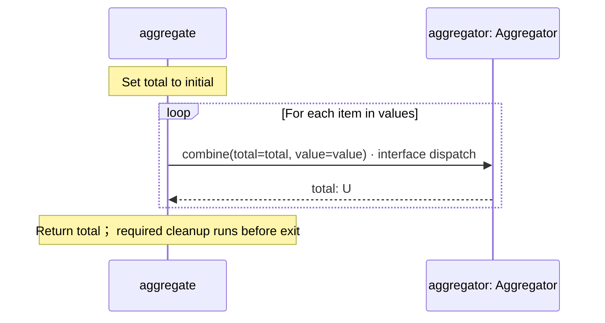

<a id="sequence-remove"></a>

### remove

[Source](operations.aug#L50)

Return a new list without matching values, preserving snapshot order; do not mutate values.

It takes `values` as `List<T>` and `predicate` as [`Predicate<T>`](operations.aug.md#symbol-Predicate).

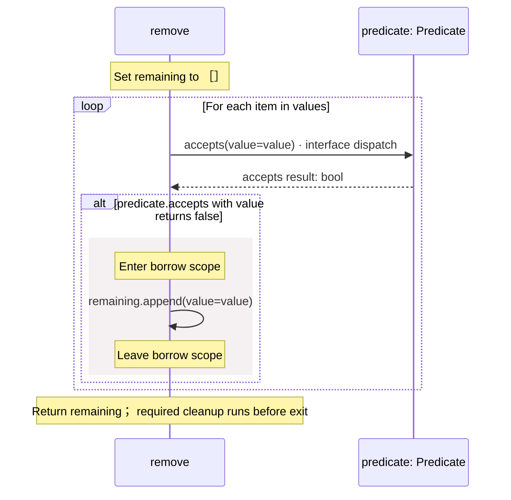

<a id="sequence-find"></a>

### find

[Source](operations.aug#L61)

Read the first matching snapshot value or null, stopping after the first match.
A matching null value is also null; use an explicit loop when presence must be distinguished.

It takes `values` as `List<T>` and `predicate` as [`Predicate<T>`](operations.aug.md#symbol-Predicate).

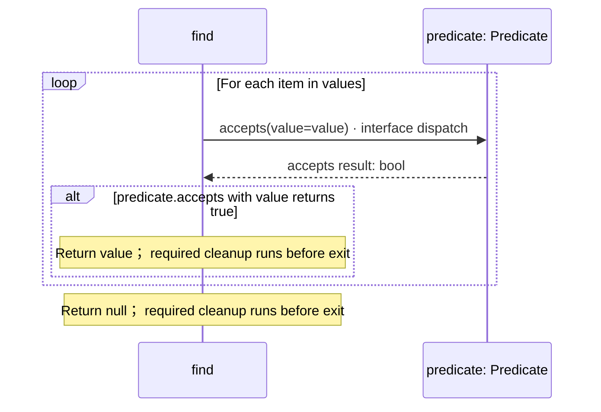

<a id="sequence-sort"></a>

### sort

[Source](operations.aug#L71)

Return a stably sorted copy. Equal values keep their input order; values remains unchanged.
Bottom-up merging uses O(n log n) comparisons and O(n) additional elements per merge pass; retained allocation depends on collection by the runtime.
Checked indexed reads retain IndexError in the contract; internal indices stay within the snapshot.

It takes `values` as `List<T>` and `comparator` as [`Comparator<T>`](operations.aug.md#symbol-Comparator).

Failures can raise `IndexError`.

#### Sequence 1 of 2

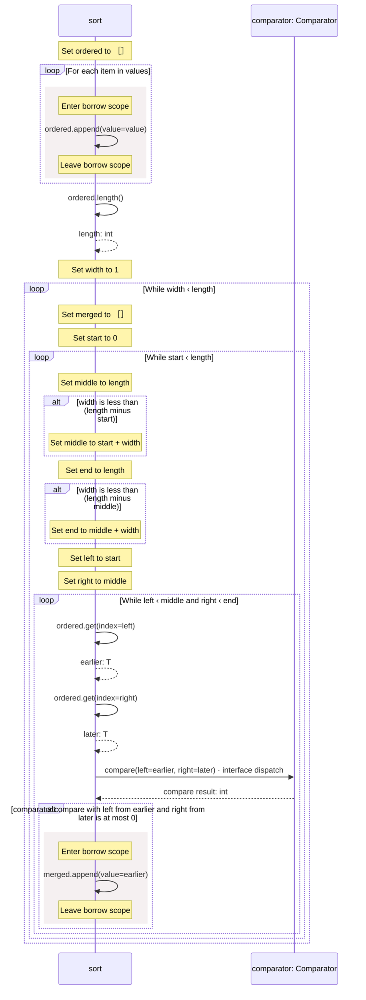

#### Sequence 2 of 2 (continued)

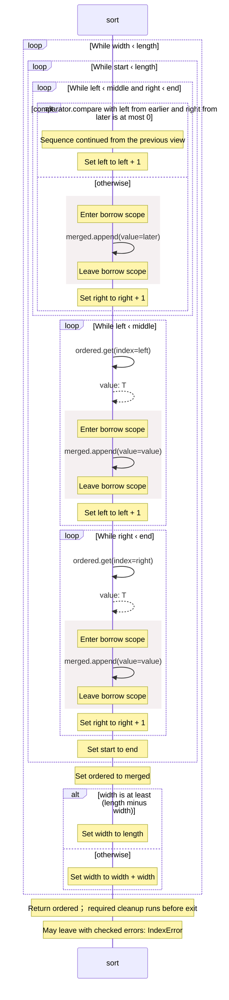

<a id="sequence-IntegerOrder-20-constructor"></a>

### IntegerOrder constructor

[Source](operations.aug#L120)

Order integers without subtracting and overflowing at the int64 boundaries. It implements [`Comparator<int>`](operations.aug.md#symbol-Comparator).

[Explanation](operations.aug.md).

<a id="sequence-IntegerOrder.compare"></a>

### IntegerOrder.compare

[Source](operations.aug#L121)

It takes `left` and `right` as integers.

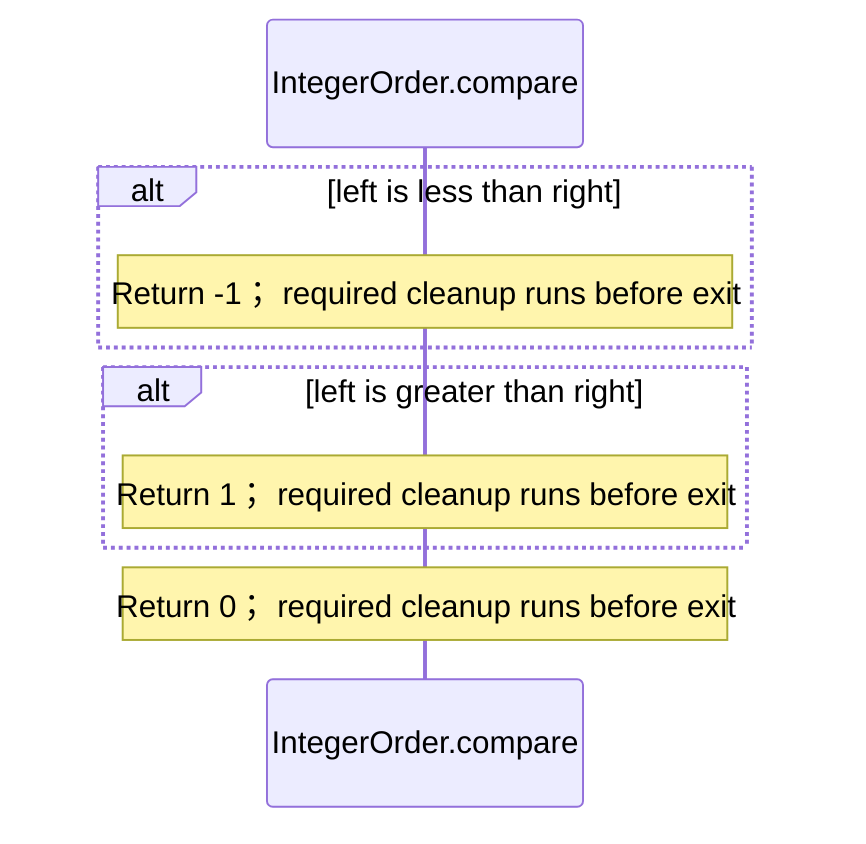

<a id="sequence-TextOrder-20-constructor"></a>

### TextOrder constructor

[Source](operations.aug#L129)

Order unsigned UTF-8 bytes lexicographically without locale collation or normalization. It implements [`Comparator<string>`](operations.aug.md#symbol-Comparator).

[Explanation](operations.aug.md).

<a id="sequence-TextOrder.compare"></a>

### TextOrder.compare

[Source](operations.aug#L130)

It takes `left` and `right` as strings.

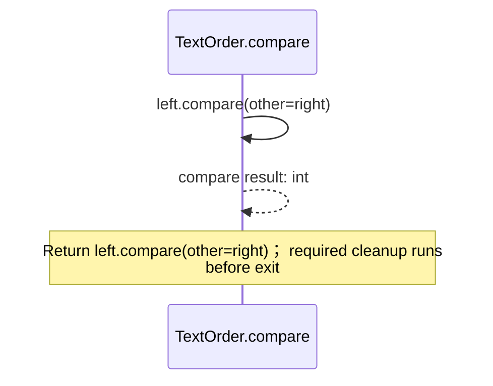

<a id="sequence-sortIntegers"></a>

### sortIntegers

[Source](operations.aug#L134)

Return a stable ascending copy of integer values.

It takes `values` as `List<int>`.

Failures can raise `IndexError`.

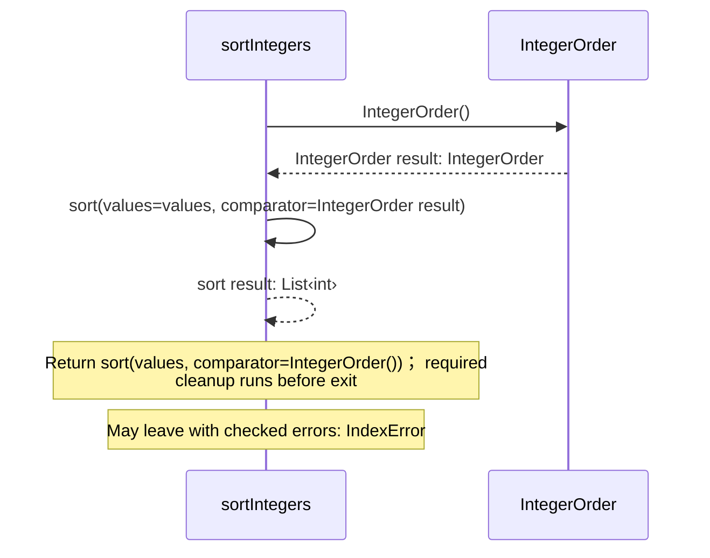

<a id="sequence-sortText"></a>

### sortText

[Source](operations.aug#L138)

Return a stable ordinal copy of text values.

It takes `values` as `List<string>`.

Failures can raise `IndexError`.

```mermaid
sequenceDiagram
    participant p0 as sortText
    participant p1 as TextOrder
    p0->>p1: TextOrder()
    p1-->>p0: TextOrder result: TextOrder
    p0->>p0: sort(values=values, comparator=TextOrder result)
    p0-->>p0: sort result: List‹string›
    Note over p0: Return sort(values, comparator=TextOrder())； required<br/>cleanup runs before exit
    Note over p0: May leave with checked errors: IndexError
```

## Called contracts

- [Aggregator.combine](operations.aug.diagrams.md#sequence-Aggregator.combine) — august/collections/operations.aug
- [Comparator](operations.aug.diagrams.md) — august/collections/operations.aug
- [Comparator.compare](operations.aug.diagrams.md#sequence-Comparator.compare) — august/collections/operations.aug
- [IntegerOrder](operations.aug.diagrams.md#sequence-IntegerOrder-20-constructor) — august/collections/operations.aug
- [Predicate.accepts](operations.aug.diagrams.md#sequence-Predicate.accepts) — august/collections/operations.aug
- [TextOrder](operations.aug.diagrams.md#sequence-TextOrder-20-constructor) — august/collections/operations.aug
- [Transformation.apply](operations.aug.diagrams.md#sequence-Transformation.apply) — august/collections/operations.aug
- [sort](operations.aug.diagrams.md#sequence-sort) — august/collections/operations.aug
