<!-- Generated by aug spec. Edit the August source, then regenerate. -->

# august/collections/operations.aug diagrams

[Project overview](.aug-spec/diagrams/index.md) · [Compiled explanation](operations.aug.md)

## Class interactions

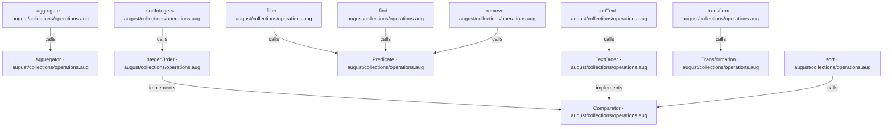

## API calls

```mermaid
flowchart TD
    n0["Aggregator.combine · august/collections/operations.aug"]
    n1["Comparator.compare · august/collections/operations.aug"]
    n2["IntegerOrder · august/collections/operations.aug"]
    n3["IntegerOrder.compare · august/collections/operations.aug"]
    n4["Predicate.accepts · august/collections/operations.aug"]
    n5["TextOrder · august/collections/operations.aug"]
    n6["TextOrder.compare · august/collections/operations.aug"]
    n7["Transformation.apply · august/collections/operations.aug"]
    n8["aggregate · august/collections/operations.aug"]
    n9["filter · august/collections/operations.aug"]
    n10["find · august/collections/operations.aug"]
    n11["remove · august/collections/operations.aug"]
    n12["sort · august/collections/operations.aug"]
    n13["sortIntegers · august/collections/operations.aug"]
    n14["sortText · august/collections/operations.aug"]
    n15["transform · august/collections/operations.aug"]
    n8 -->|"calls"| n0
    n9 -->|"calls"| n4
    n10 -->|"calls"| n4
    n11 -->|"calls"| n4
    n12 -->|"calls"| n1
    n13 -->|"calls"| n2
    n13 -->|"calls"| n12
    n14 -->|"calls"| n5
    n14 -->|"calls"| n12
    n15 -->|"calls"| n7
```

## Sequences

Call arrows identify checked targets; loop and branch frames determine when they run. Open that target’s module to follow its implementation. Branches describe alternatives; loops describe repeated work. Native calls and interface dispatch stop at their declared contracts. Exit notes end that path; enclosing recovery and cleanup remain visible.

### Predicate.accepts

[Source](operations.aug#L4)

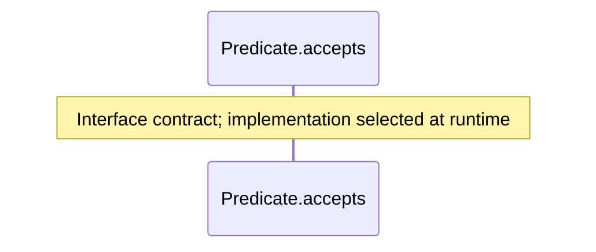

### Transformation.apply

[Source](operations.aug#L8)

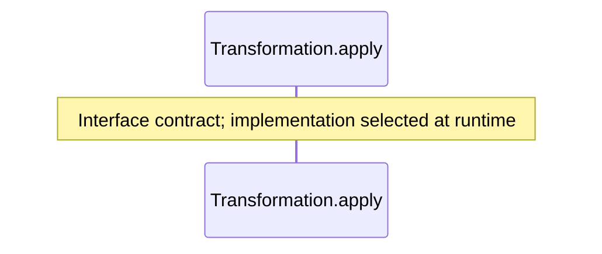

### Aggregator.combine

[Source](operations.aug#L12)

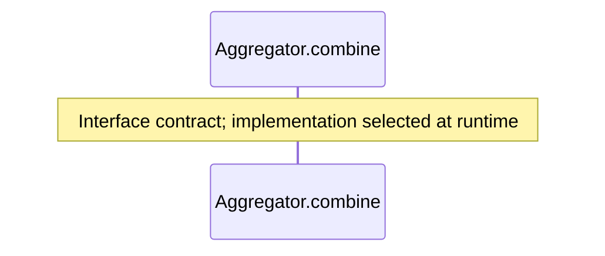

### Comparator.compare

[Source](operations.aug#L16)

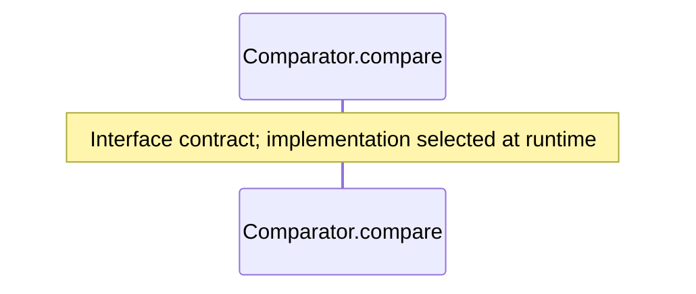

### filter

[Source](operations.aug#L21)

### transform

[Source](operations.aug#L32)

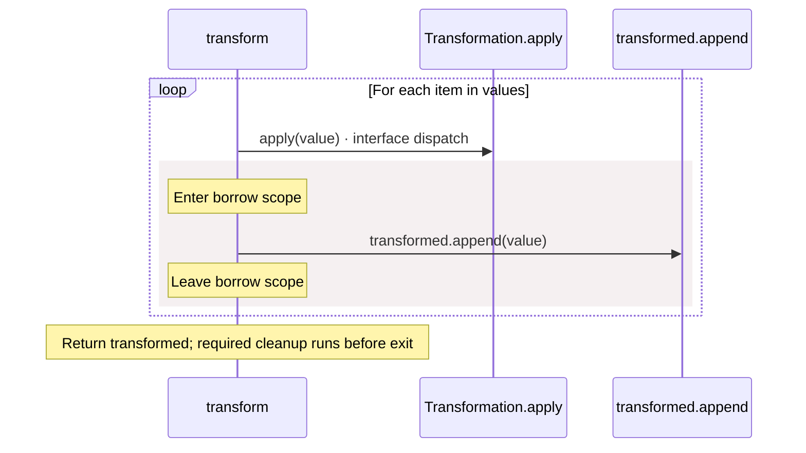

### aggregate

[Source](operations.aug#L43)

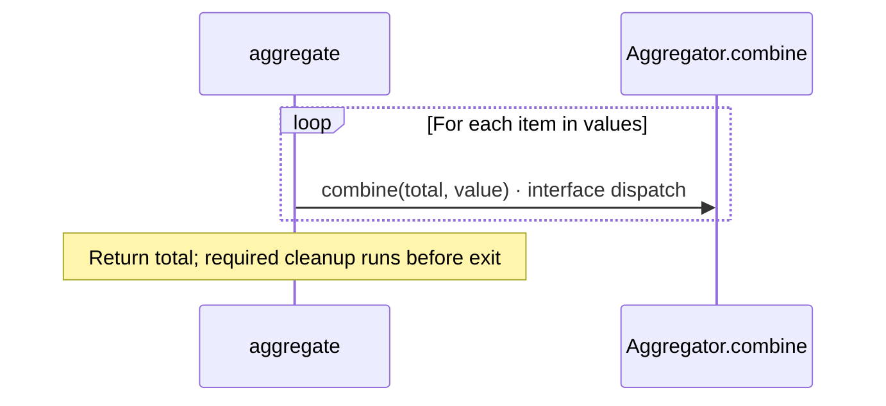

### remove

[Source](operations.aug#L50)

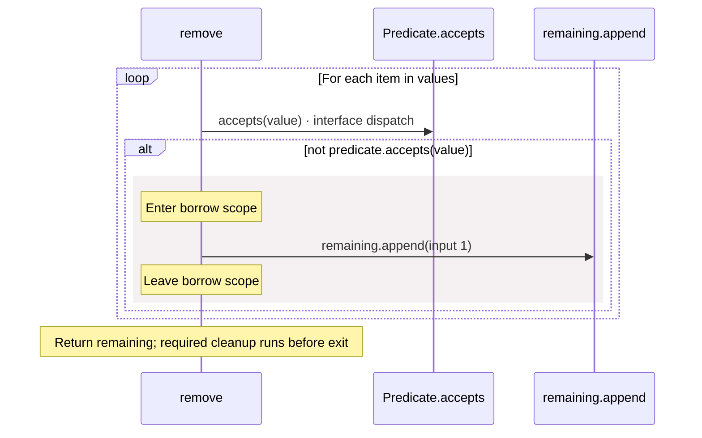

### find

[Source](operations.aug#L61)

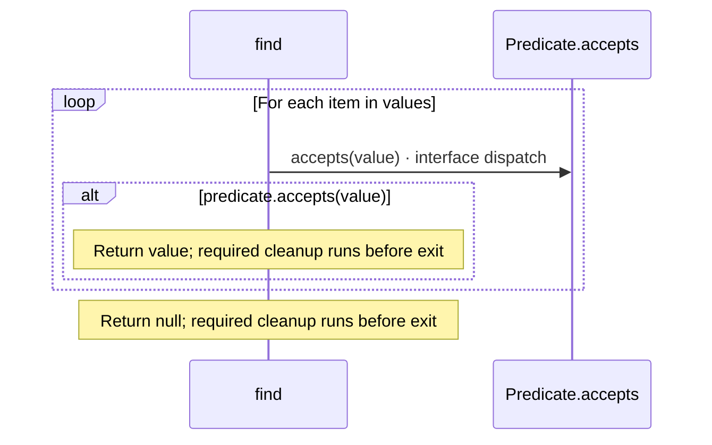

### sort

[Source](operations.aug#L71)

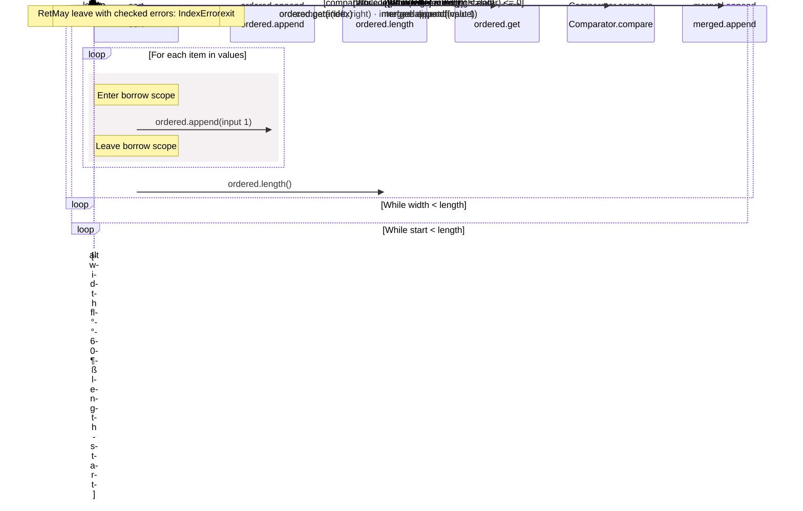

### IntegerOrder constructor

[Source](operations.aug#L120)

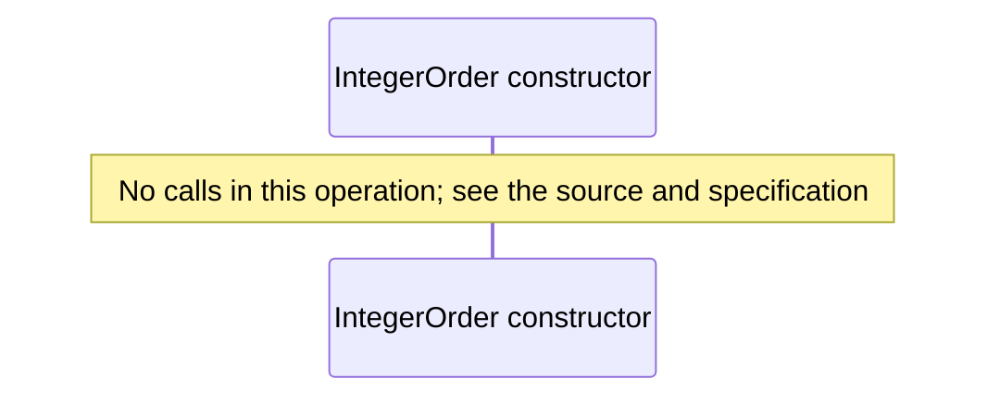

### IntegerOrder.compare

[Source](operations.aug#L121)

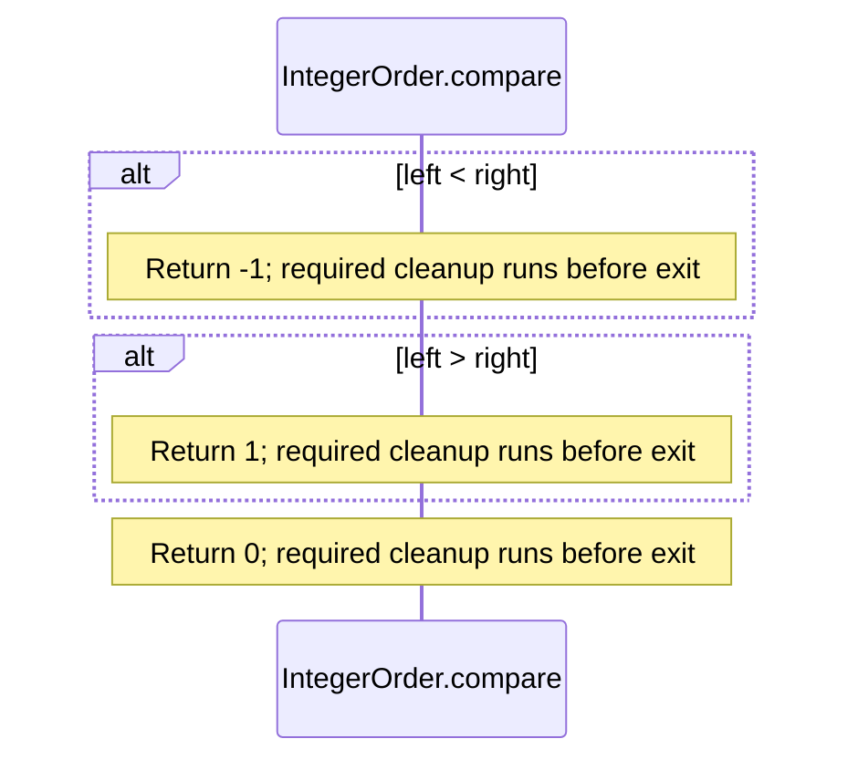

### TextOrder constructor

[Source](operations.aug#L129)

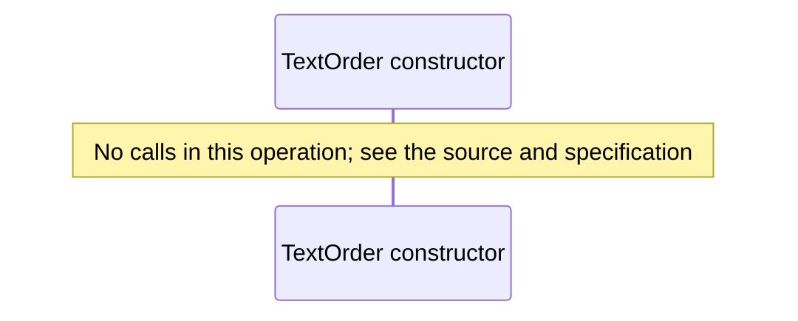

### TextOrder.compare

[Source](operations.aug#L130)

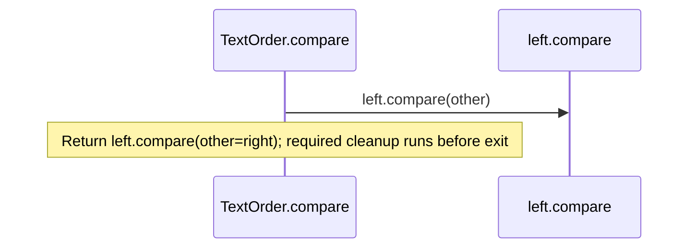

### sortIntegers

[Source](operations.aug#L134)

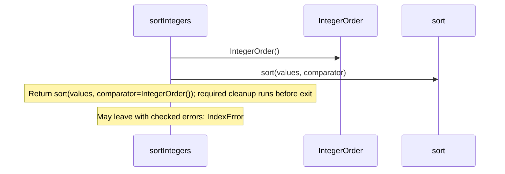

### sortText

[Source](operations.aug#L138)

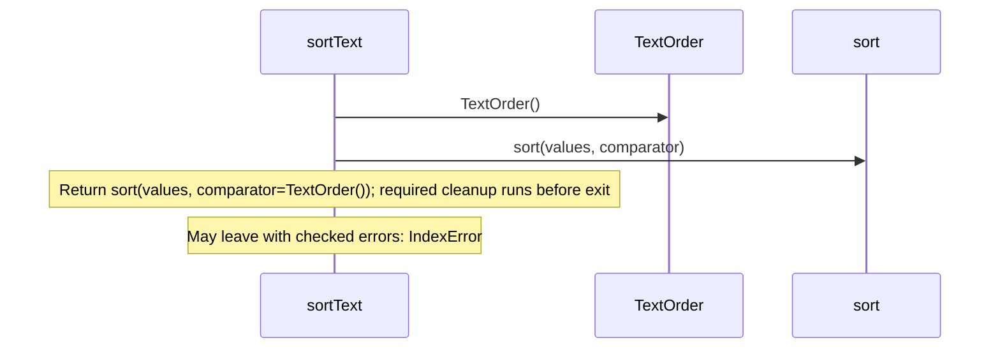

## Called contracts

- [Aggregator.combine](operations.aug.diagrams.md#sequence-Aggregator.combine) — august/collections/operations.aug
- [Comparator](operations.aug.diagrams.md) — august/collections/operations.aug
- [Comparator.compare](operations.aug.diagrams.md#sequence-Comparator.compare) — august/collections/operations.aug
- [IntegerOrder](operations.aug.diagrams.md#sequence-IntegerOrder-20-constructor) — august/collections/operations.aug
- [Predicate.accepts](operations.aug.diagrams.md#sequence-Predicate.accepts) — august/collections/operations.aug
- [TextOrder](operations.aug.diagrams.md#sequence-TextOrder-20-constructor) — august/collections/operations.aug
- [Transformation.apply](operations.aug.diagrams.md#sequence-Transformation.apply) — august/collections/operations.aug
- [sort](operations.aug.diagrams.md#sequence-sort) — august/collections/operations.aug
