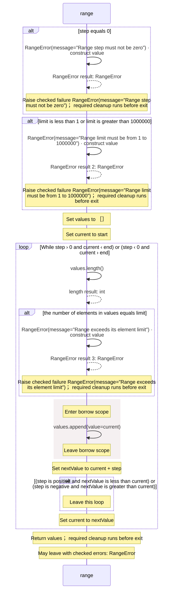

<!-- Generated by aug spec. Edit the August source, then regenerate. -->

# august/collections/ranges.aug diagrams

[Project overview](.aug-spec/diagrams/index.md) · [Compiled explanation](ranges.aug.md)

## Sequences

Call arrows identify checked targets; loop and branch frames determine when they run. Open that target’s module to follow its implementation. Branches describe alternatives; loops describe repeated work. Native calls and interface dispatch stop at their declared contracts. Exit notes end that path; enclosing recovery and cleanup remain visible.

### RangeError constructor

[Source](ranges.aug#L3)

A range has an invalid step or exceeds its explicit allocation limit. It implements `Error`.

It takes `message` as a string, kept read-only.

Receive fields: message. [Explanation](ranges.aug.md).

### range

[Source](ranges.aug#L13)

Return a new list of integers from start up to, but excluding, end.
A step past the int64 boundary stops before producing a wrapped value.

It takes `end` as an integer, `start` as an integer (when omitted, `0`), `step` as an integer (when omitted, `1`), and `limit` as an integer (when omitted, `1000000`).

Failures can raise [`RangeError`](ranges.aug.md#symbol-RangeError) (Invalid step, invalid limit, or too many elements).

## Called contracts

- [RangeError](ranges.aug.diagrams.md#sequence-RangeError-20-constructor) — august/collections/ranges.aug
