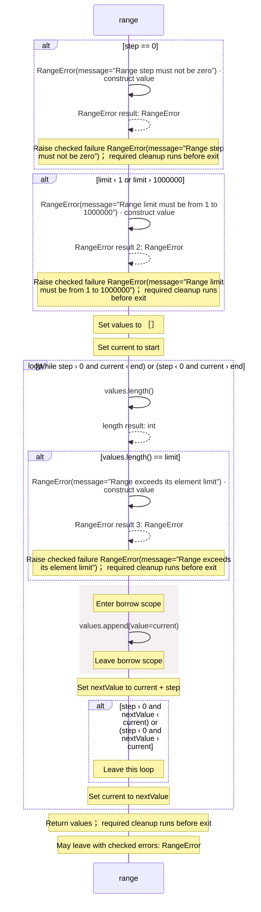

<!-- Generated by aug spec. Edit the August source, then regenerate. -->

# august/collections/ranges.aug diagrams

[Project overview](.aug-spec/diagrams/index.md) · [Compiled explanation](ranges.aug.md)

## Sequences

Call arrows identify checked targets; loop and branch frames determine when they run. Open that target’s module to follow its implementation. Branches describe alternatives; loops describe repeated work. Native calls and interface dispatch stop at their declared contracts. Exit notes end that path; enclosing recovery and cleanup remain visible.

### RangeError constructor

[Source](ranges.aug#L3)

Receive fields: message. [Explanation](ranges.aug.md).

### range

[Source](ranges.aug#L13)

## Called contracts

- [RangeError](ranges.aug.diagrams.md#sequence-RangeError-20-constructor) — august/collections/ranges.aug
