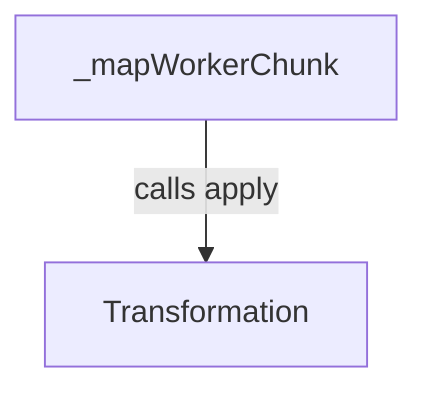
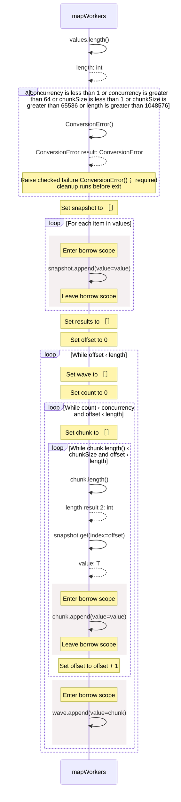
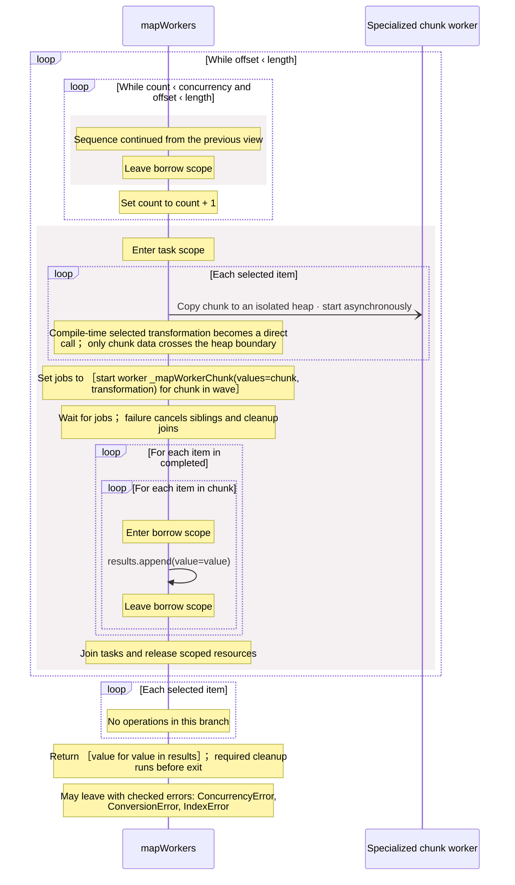
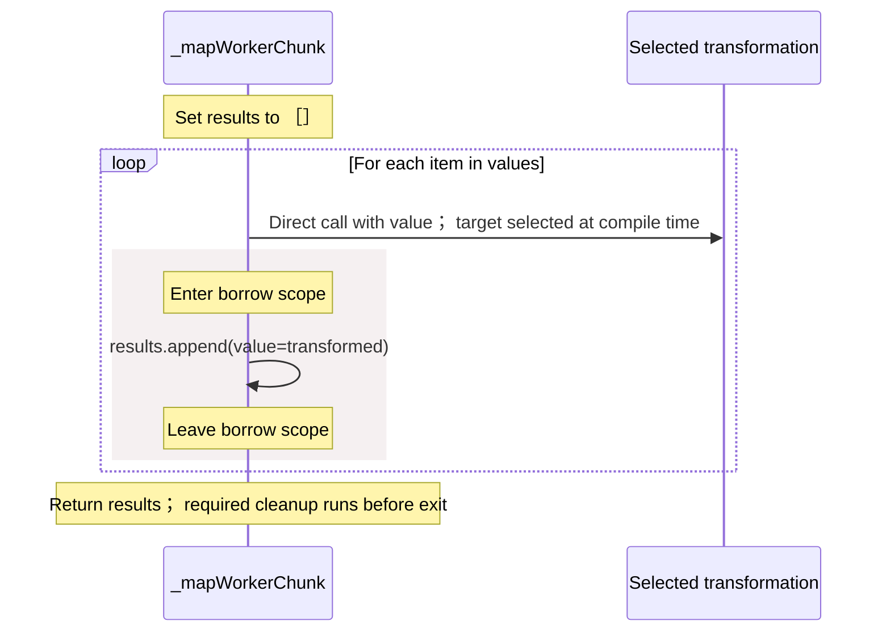

<!-- Generated by aug spec. Edit the August source, then regenerate. -->

# august/collections/workers.aug diagrams

[Project overview](.aug-spec/diagrams/index.md) · [Compiled explanation](workers.aug.md)

## Class interactions

## Sequences

Call arrows identify checked targets; loop and branch frames determine when they run. Open that target’s module to follow its implementation. Branches describe alternatives; loops describe repeated work. Native calls and interface dispatch stop at their declared contracts. Exit notes end that path; enclosing recovery and cleanup remain visible.

### mapWorkers

[Source](workers.aug#L15)

Transform copied data on isolated worker heaps, preserving input order.
Supply a directly named concrete pure function with one value input; callbacks and behavior objects are not worker inputs.

It takes `values` as `List<T>`, `concurrency` and `chunkSize` as integers, and `transformation` as [`Transformation<T,U>`](operations.aug.md#symbol-Transformation).

Failures can raise `ConcurrencyError` (The shared pool cannot admit a job or copy its inputs), `ConversionError` (Invalid bounds, checked before any worker starts, including for an empty input), and `IndexError` (Checked snapshot reads retain this error; indices stay within the snapshot.
Admission or cancellation joins already admitted jobs before leaving the current wave).

#### Sequence 1 of 2

#### Sequence 2 of 2 (continued)

### \_mapWorkerChunk

[Source](workers.aug#L52)

It is private to its defining scope.

Compiler template specialized for each named transformation before native lowering.
The generated worker entry receives copied chunk data. Compilation replaces transformation.apply with a direct call.

It takes `values` as `List<T>` and `transformation` as [`Transformation<T,U>`](operations.aug.md#symbol-Transformation).

## Called contracts

- [Transformation.apply](operations.aug.diagrams.md#sequence-Transformation.apply) — august/collections/operations.aug
- [\_mapWorkerChunk](workers.aug.diagrams.md#sequence-_mapWorkerChunk) — august/collections/workers.aug
