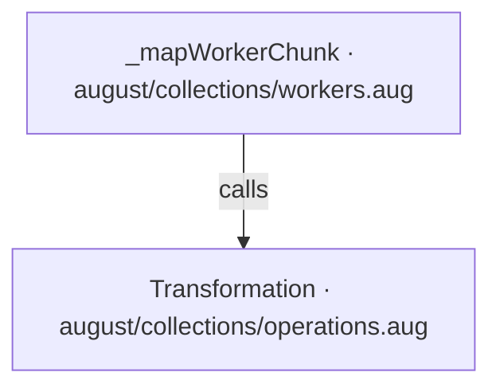
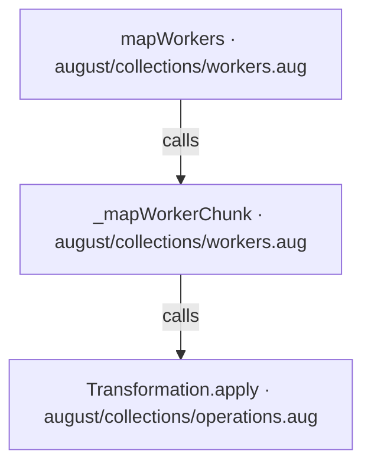
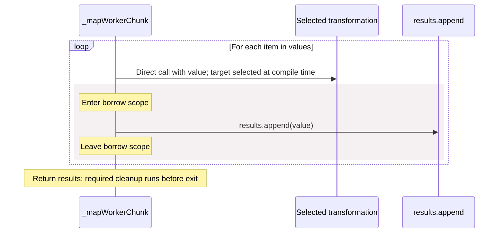

<!-- Generated by aug spec. Edit the August source, then regenerate. -->

# august/collections/workers.aug diagrams

[Project overview](.aug-spec/diagrams/index.md) · [Compiled explanation](workers.aug.md)

## Class interactions

## API calls

## Sequences

Call arrows identify checked targets; loop and branch frames determine when they run. Open that target’s module to follow its implementation. Branches describe alternatives; loops describe repeated work. Native calls and interface dispatch stop at their declared contracts. Exit notes end that path; enclosing recovery and cleanup remain visible.

### mapWorkers

[Source](workers.aug#L15)

```mermaid
sequenceDiagram
    participant p0 as mapWorkers
    participant p1 as values.length
    participant p2 as ConversionError
    participant p3 as snapshot.append
    participant p4 as chunk.length
    participant p5 as snapshot.get
    participant p6 as chunk.append
    participant p7 as wave.append
    participant p8 as Specialized chunk worker
    participant p9 as results.append
    p0->>p1: values.length()
    opt Left is false
    end
    opt Left is false
    end
    opt Left is false
    end
    opt Left is false
    end
    alt concurrency #60; 1 or concurrency #62; 64 or chunkSize #60; 1 or chunkSize #62; 65536 or length #62; 1048576
    p0->>p2: ConversionError()
    Note over p0: Raise checked failure ConversionError()#59; required cleanup runs before exit
    end
    loop For each item in values
    rect rgb(245, 240, 241)
    Note over p0: Enter borrow scope
    p0->>p3: snapshot.append(input 1)
    Note over p0: Leave borrow scope
    end
    end
    loop While offset #60; length
    loop While count #60; concurrency and offset #60; length
    opt Left is true
    end
    loop While chunk.length() #60; chunkSize and offset #60; length
    p0->>p4: chunk.length()
    opt Left is true
    end
    p0->>p5: snapshot.get(index)
    rect rgb(245, 240, 241)
    Note over p0: Enter borrow scope
    p0->>p6: chunk.append(input 1)
    Note over p0: Leave borrow scope
    end
    end
    rect rgb(245, 240, 241)
    Note over p0: Enter borrow scope
    p0->>p7: wave.append(value)
    Note over p0: Leave borrow scope
    end
    end
    rect rgb(245, 240, 241)
    Note over p0: Enter task scope
    loop Each selected item
    p0-)p8: Copy chunk to an isolated heap · start asynchronously
    Note over p0: Compile-time selected transformation becomes a direct call#59; only chunk data crosses the heap boundary
    end
    Note over p0: Wait for jobs#59; failure cancels siblings and cleanup joins
    loop For each item in completed
    loop For each item in chunk
    rect rgb(245, 240, 241)
    Note over p0: Enter borrow scope
    p0->>p9: results.append(input 1)
    Note over p0: Leave borrow scope
    end
    end
    end
    Note over p0: Join tasks and release scoped resources
    end
    end
    loop Each selected item
    end
    Note over p0: Return #91;value for value in results#93;#59; required cleanup runs before exit
    Note over p0: May leave with checked errors: ConcurrencyError, ConversionError, IndexError
```

### \_mapWorkerChunk

[Source](workers.aug#L52)

## Called contracts

- [Transformation.apply](operations.aug.diagrams.md#sequence-Transformation.apply) — august/collections/operations.aug
- [\_mapWorkerChunk](workers.aug.diagrams.md#sequence-_mapWorkerChunk) — august/collections/workers.aug
