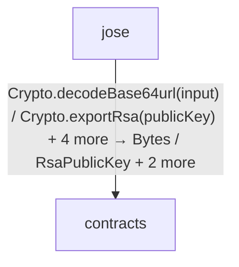
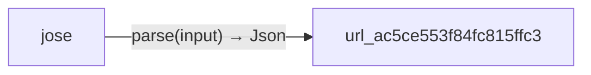

<!-- Generated by aug spec. Edit the August source, then regenerate. -->

# Project diagrams

Start here to see what moves between the application’s folders. Each arrow names an operation’s inputs and the result it returns to its caller. Open a folder for the next level of detail. Expand the contract list for complete types and dependency links.

## Data flow

### Package boundaries

jose package calls

Data crossing these boundaries (7 contracts)

| From | To | Operation and inputs | Result |
| --- | --- | --- | --- |
| jose | contracts | [Crypto.decodeBase64url](../../contracts.aug.md) · input: string · interface dispatch | Bytes |
| jose | contracts | [Crypto.exportRsa](../../contracts.aug.md) · publicKey: RsaPublicKey · interface dispatch | Tuple\<Bytes, Bytes\> |
| jose | contracts | [Crypto.importRsa](../../contracts.aug.md) · modulus: Bytes, exponent: Bytes · interface dispatch | RsaPublicKey |
| jose | contracts | [Crypto.signRsa](../../contracts.aug.md) · key: RsaPrivateKey, input: Bytes · interface dispatch | Bytes |
| jose | contracts | [Crypto.verifyEd25519](../../contracts.aug.md) · publicKey: string, input: Bytes, signature: Bytes · interface dispatch | bool |
| jose | contracts | [Crypto.verifyRsa](../../contracts.aug.md) · publicKey: RsaPublicKey, input: Bytes, signature: Bytes · interface dispatch | bool |
| jose | url\_ac5ce553f84fc815ffc3 | [parse](../packages/%40git/url_2d3c37c690c0fa115be1/0.0.0-git.a39fc582565d4fca40be4f75fa304d71adc69301/contracts.aug.md) · input: string | Json |

## Open a module

| Module | Read |
| --- | --- |
| contracts.aug | [Flow and sequences](../../contracts.aug.diagrams.md) · [Explanation](../../contracts.aug.md) |
| export.aug | [Flow and sequences](../../export.aug.diagrams.md) · [Explanation](../../export.aug.md) |
| jose.aug | [Flow and sequences](../../jose.aug.diagrams.md) · [Explanation](../../jose.aug.md) |

These are static call boundaries, not a request trace. Interface implementations and foreign internals stop at their checked contracts. Dotted arrows defer a callback or browser action. Imports alone do not imply a call.
