<!-- Generated by aug spec. Edit the August source, then regenerate. -->

# jose.aug diagrams

[Project overview](.aug-spec/diagrams/index.md) · [Compiled explanation](jose.aug.md)

## Class interactions

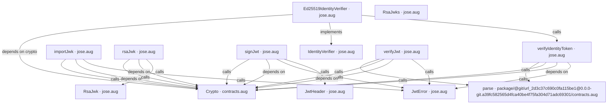

## API calls

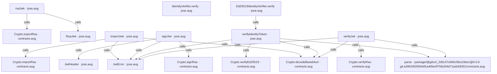

## Sequences

Call arrows identify checked targets; loop and branch frames determine when they run. Open that target’s module to follow its implementation. Branches describe alternatives; loops describe repeated work. Native calls and interface dispatch stop at their declared contracts. Exit notes end that path; enclosing recovery and cleanup remain visible.

### JwtError constructor

[Source](jose.aug#L6)

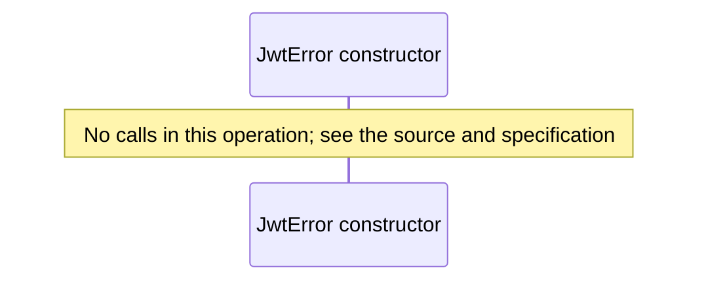

### JwtHeader constructor

[Source](jose.aug#L9)

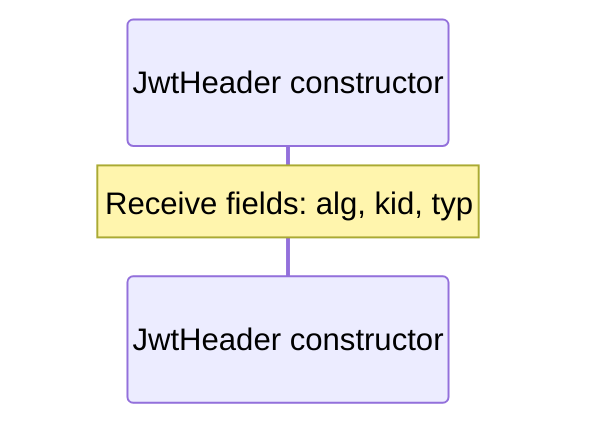

### RsaJwk constructor

[Source](jose.aug#L11)

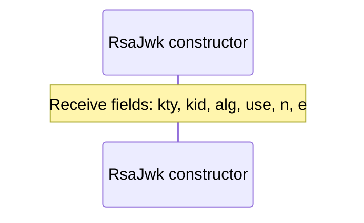

### RsaJwks constructor

[Source](jose.aug#L12)

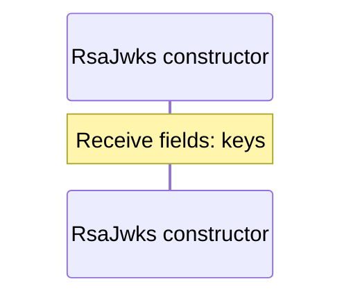

### rsaJwk

[Source](jose.aug#L15)

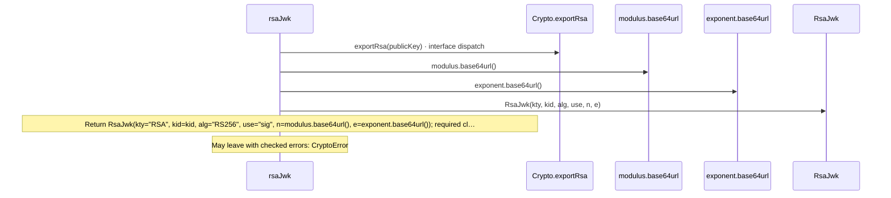

### importJwk

[Source](jose.aug#L20)

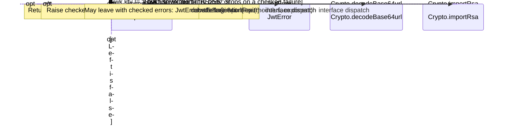

### signJwt

[Source](jose.aug#L31)

#### Sequence 1 of 2 (continued)

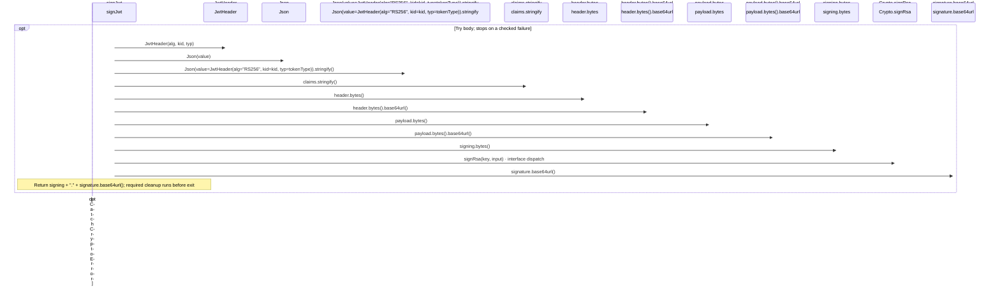

#### Sequence 2 of 2 (continued)

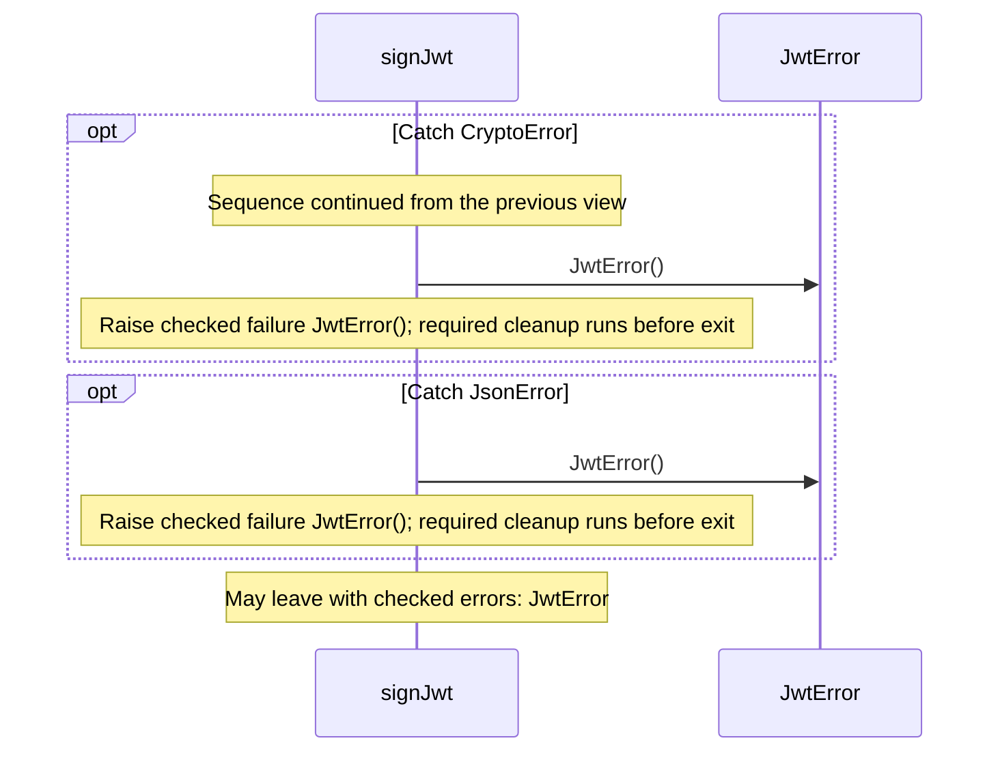

### verifyJwt

[Source](jose.aug#L44)

#### Sequence 1 of 2 (continued)

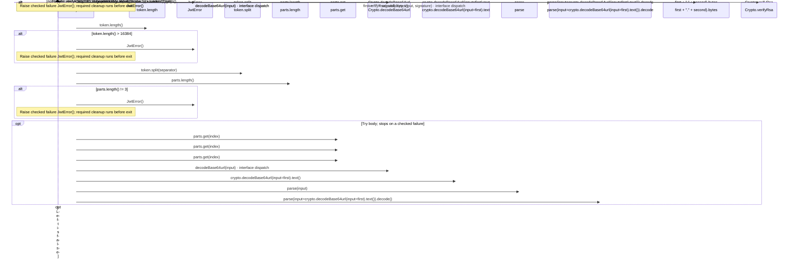

#### Sequence 2 of 2 (continued)

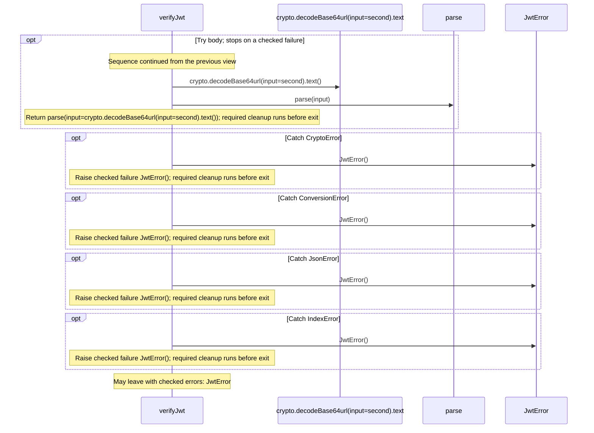

### verifyIdentityToken

[Source](jose.aug#L73)

#### Sequence 1 of 4 (continued)

```mermaid
sequenceDiagram
    participant p0 as verifyIdentityToken
    participant p1 as token.utf16Length
    participant p2 as JwtError
    participant p3 as token.split
    participant p4 as parts.length
    participant p5 as parts.get
    participant p6 as Crypto.decodeBase64url
    participant p7 as crypto.decodeBase64url(input=first).text
    participant p8 as parse
    participant p9 as header.require
    participant p10 as header.require(name=#34;alg#34;).string
    participant p11 as header.require(name=#34;typ#34;).string
    p0->>p1: token.utf16Length()
    opt Left is false
    p0->>p1: token.utf16Length()
    end
    opt Left is false
    end
    opt Left is false
    end
    opt Left is false
    end
    alt token.utf16Length() == 0 or token.utf16Length() #62; 4096 or now #60; 0 or maximumAge #60; 1 or maximumAge #62; 3600
    p0->>p2: JwtError()
    Note over p0: Raise checked failure JwtError()#59; required cleanup runs before exit
    end
    p0->>p3: token.split(separator)
    p0->>p4: parts.length()
    alt parts.length() != 3
    p0->>p2: JwtError()
    Note over p0: Raise checked failure JwtError()#59; required cleanup runs before exit
    end
    opt Try body#59; stops on a checked failure
    p0->>p5: parts.get(index)
    p0->>p5: parts.get(index)
    p0->>p5: parts.get(index)
    p0->>p6: decodeBase64url(input) · interface dispatch
    p0->>p7: crypto.decodeBase64url(input=first).text()
    p0->>p8: parse(input)
    p0->>p9: header.require(name)
    p0->>p10: header.require(name=#34;alg#34;).string()
    opt Left is false
    p0->>p9: header.require(name)
    p0->>p11: header.require(name=#34;typ#34;).string()
    end
    opt Left is false
    end
    end
```

#### Sequence 2 of 4 (continued)

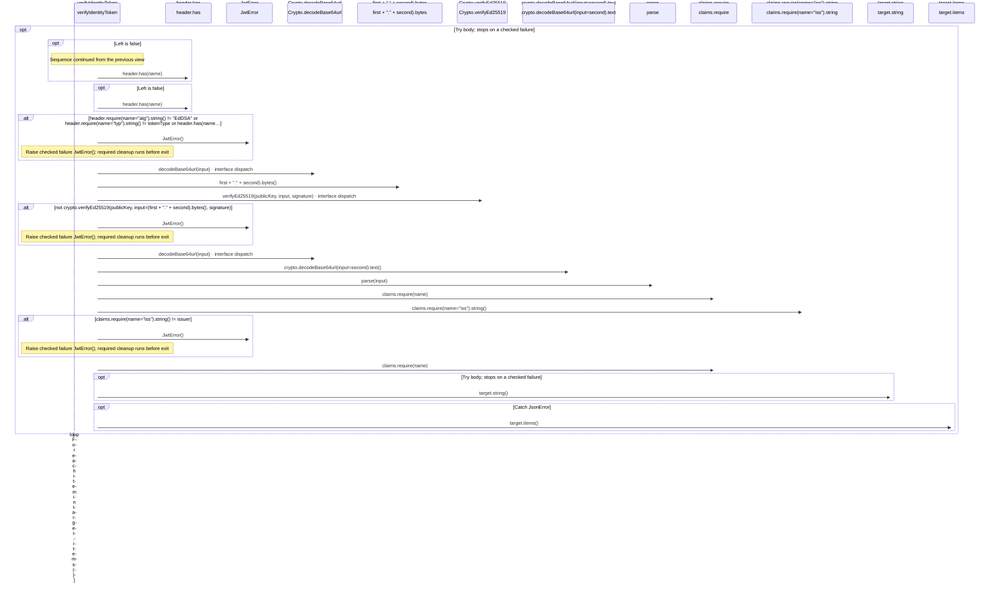

#### Sequence 3 of 4 (continued)

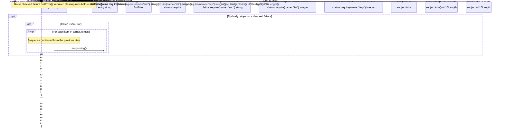

#### Sequence 4 of 4 (continued)

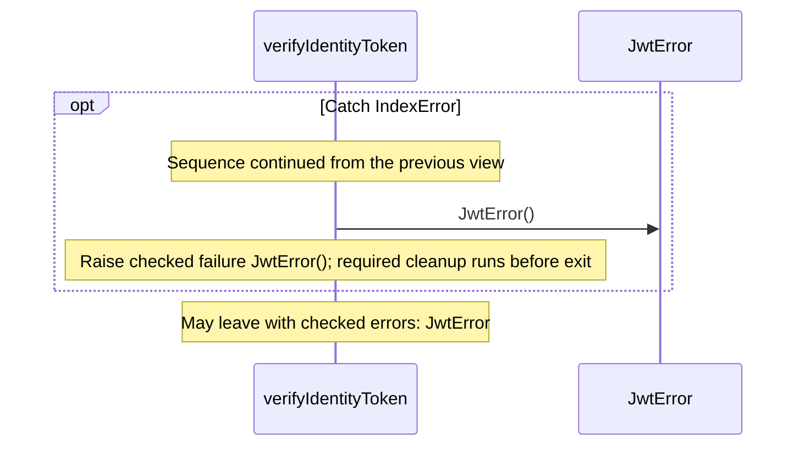

### IdentityVerifier.verify

[Source](jose.aug#L121)

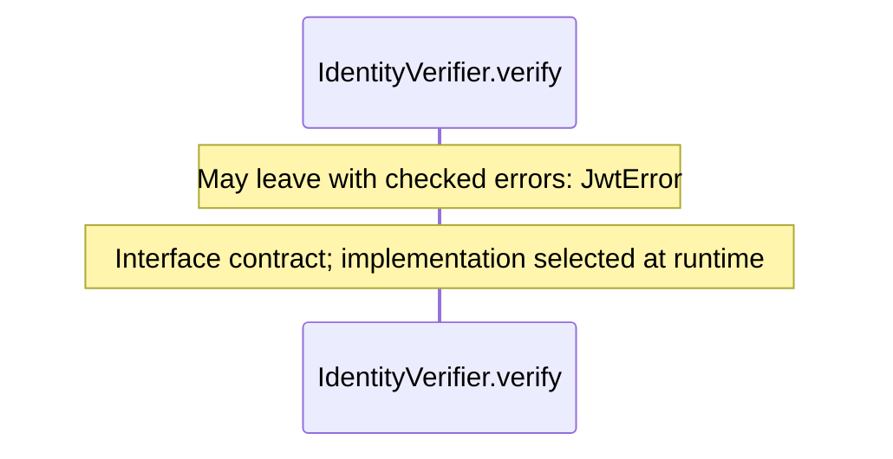

### Ed25519IdentityVerifier constructor

[Source](jose.aug#L123)

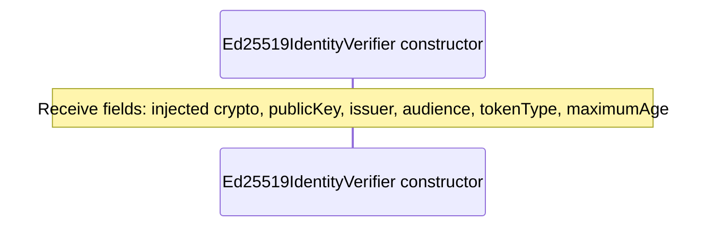

### Ed25519IdentityVerifier.verify

[Source](jose.aug#L124)

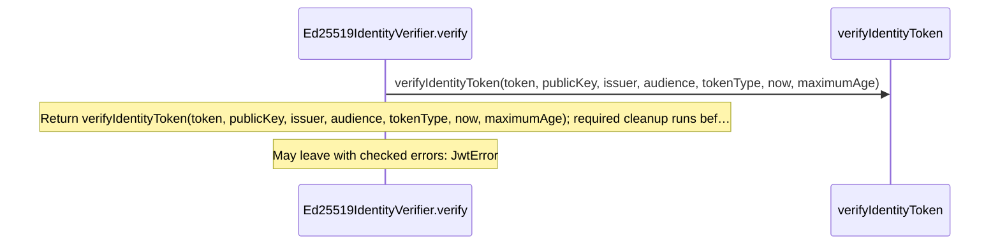

## Called contracts

- [parse](.aug-spec/packages/%40git/url_2d3c37c690c0fa115be1/0.0.0-git.a39fc582565d4fca40be4f75fa304d71adc69301/contracts.aug.diagrams.md#sequence-parse) — package/@git/url\_2d3c37c690c0fa115be1@0.0.0-git.a39fc582565d4fca40be4f75fa304d71adc69301/contracts.aug
- [Crypto](contracts.aug.diagrams.md) — contracts.aug
- [Crypto.decodeBase64url](contracts.aug.diagrams.md#sequence-Crypto.decodeBase64url) — contracts.aug
- [Crypto.exportRsa](contracts.aug.diagrams.md#sequence-Crypto.exportRsa) — contracts.aug
- [Crypto.importRsa](contracts.aug.diagrams.md#sequence-Crypto.importRsa) — contracts.aug
- [Crypto.signRsa](contracts.aug.diagrams.md#sequence-Crypto.signRsa) — contracts.aug
- [Crypto.verifyEd25519](contracts.aug.diagrams.md#sequence-Crypto.verifyEd25519) — contracts.aug
- [Crypto.verifyRsa](contracts.aug.diagrams.md#sequence-Crypto.verifyRsa) — contracts.aug
- [IdentityVerifier](jose.aug.diagrams.md) — jose.aug
- [JwtError](jose.aug.diagrams.md#sequence-JwtError-20-constructor) — jose.aug
- [JwtHeader](jose.aug.diagrams.md#sequence-JwtHeader-20-constructor) — jose.aug
- [RsaJwk](jose.aug.diagrams.md#sequence-RsaJwk-20-constructor) — jose.aug
- [verifyIdentityToken](jose.aug.diagrams.md#sequence-verifyIdentityToken) — jose.aug
