<!-- Generated by aug spec. Edit the August source, then regenerate. -->

# jose.aug diagrams

[Project overview](.aug-spec/diagrams/index.md) · [Compiled explanation](jose.aug.md)

## Class interactions

### Ed25519IdentityVerifier

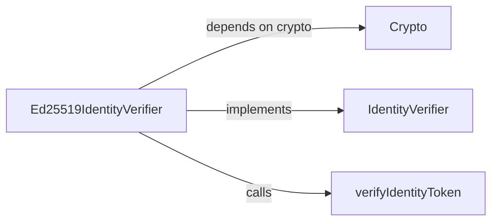

### importJwk

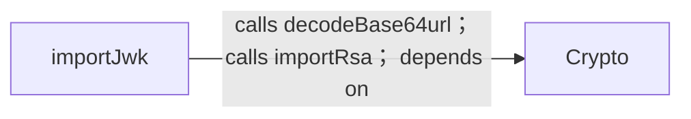

### rsaJwk

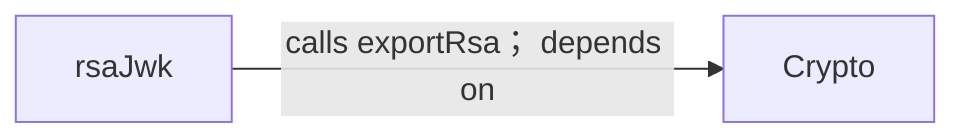

### signJwt

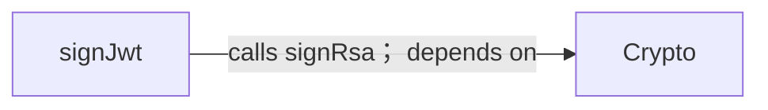

### verifyIdentityToken

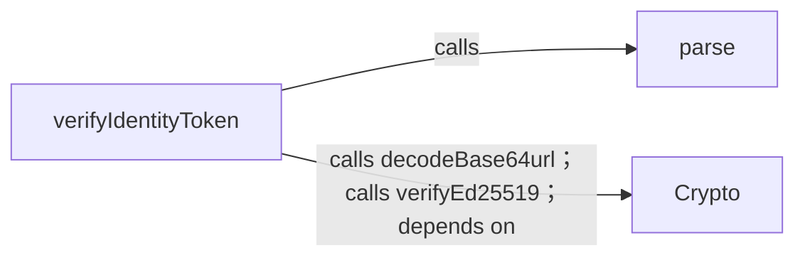

### verifyJwt

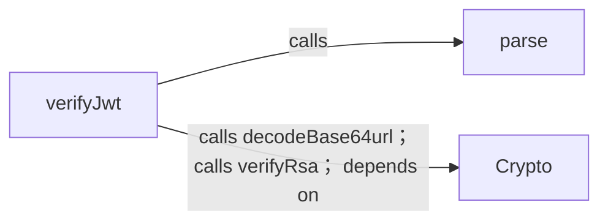

## Sequences

Call arrows identify checked targets; loop and branch frames determine when they run. Open that target’s module to follow its implementation. Branches describe alternatives; loops describe repeated work. Native calls and interface dispatch stop at their declared contracts. Exit notes end that path; enclosing recovery and cleanup remain visible.

### JwtError constructor

[Source](jose.aug#L6)

A failed JOSE validation reveals no unverified claims. It implements `Error`.

[Explanation](jose.aug.md).

### JwtHeader constructor

[Source](jose.aug#L9)

This profile accepts only RS256, a configured key id, and an explicit token type.

It takes `alg`, `kid`, and `typ` as strings, kept read-only.

Receive fields: alg, kid, typ. [Explanation](jose.aug.md).

### RsaJwk constructor

[Source](jose.aug#L11)

Public signing-key metadata in RFC 7517 / RFC 7518 form.

It takes `kty`, `kid`, `alg`, `use`, `n`, and `e` as strings, kept read-only.

Receive fields: kty, kid, alg, use, n, e. [Explanation](jose.aug.md).

### RsaJwks constructor

[Source](jose.aug#L12)

It takes `keys` as `List<RsaJwk>`, kept read-only.

Receive fields: keys. [Explanation](jose.aug.md).

### rsaJwk

[Source](jose.aug#L15)

Export public parameters. Private key material never enters the JSON document.

It takes `publicKey` as `RsaPublicKey` and `kid` as a string. It gets `crypto` ([`Crypto`](contracts.aug.md#symbol-Crypto)) from dependency injection.

It can call [`Crypto.exportRsa`](contracts.aug.md#symbol-Crypto.exportRsa). Failures can raise `CryptoError`.

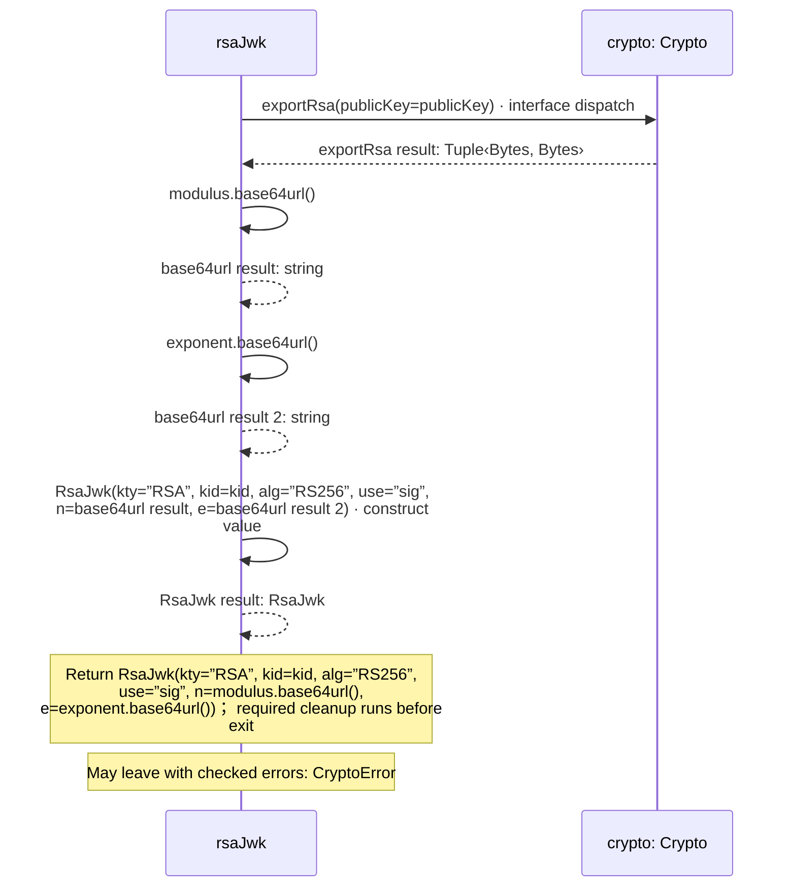

### importJwk

[Source](jose.aug#L20)

Import only an RSA signing key for RS256. The transport caller selects the trusted JWKS URL.

It takes `jwk` as [`RsaJwk`](jose.aug.md#symbol-RsaJwk). It gets `crypto` ([`Crypto`](contracts.aug.md#symbol-Crypto)) from dependency injection.

It can call [`Crypto.decodeBase64url`](contracts.aug.md#symbol-Crypto.decodeBase64url) and [`Crypto.importRsa`](contracts.aug.md#symbol-Crypto.importRsa). Failures can raise [`JwtError`](jose.aug.md#symbol-JwtError).

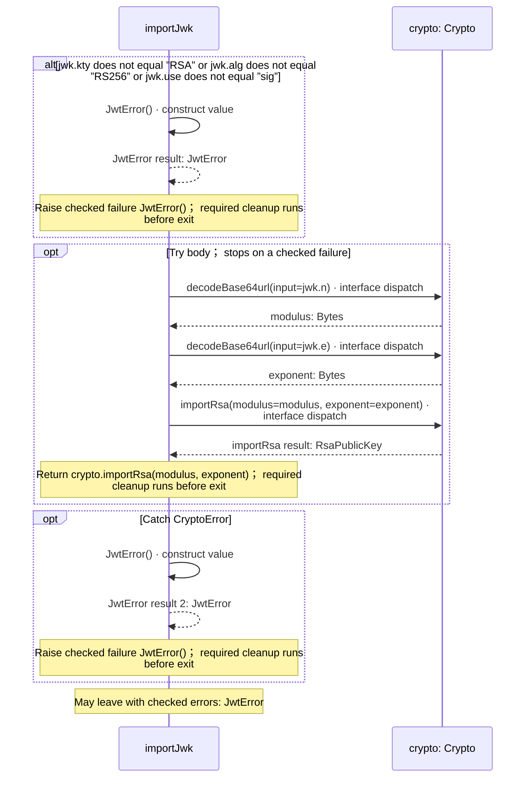

### signJwt

[Source](jose.aug#L31)

Sign immutable JSON with an explicit key id and token type. Claims are validated by the protocol that consumes the token.

It takes `key` as `RsaPrivateKey`, `claims` as `Json`, and `kid` and `tokenType` as strings. It gets `crypto` ([`Crypto`](contracts.aug.md#symbol-Crypto)) from dependency injection.

It can call [`Crypto.signRsa`](contracts.aug.md#symbol-Crypto.signRsa). Failures can raise [`JwtError`](jose.aug.md#symbol-JwtError).

#### Sequence 1 of 2

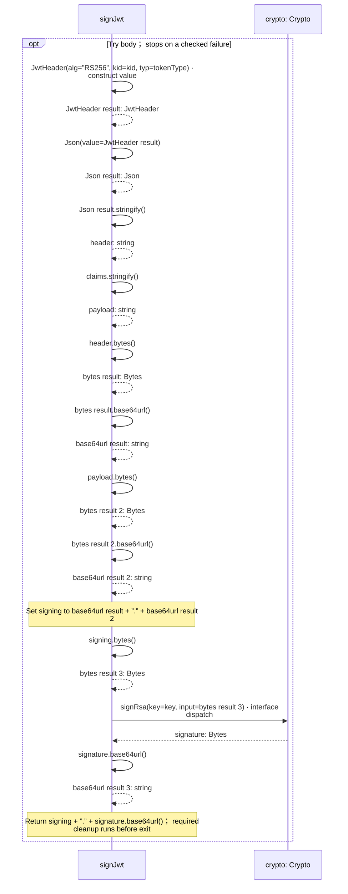

#### Sequence 2 of 2 (continued)

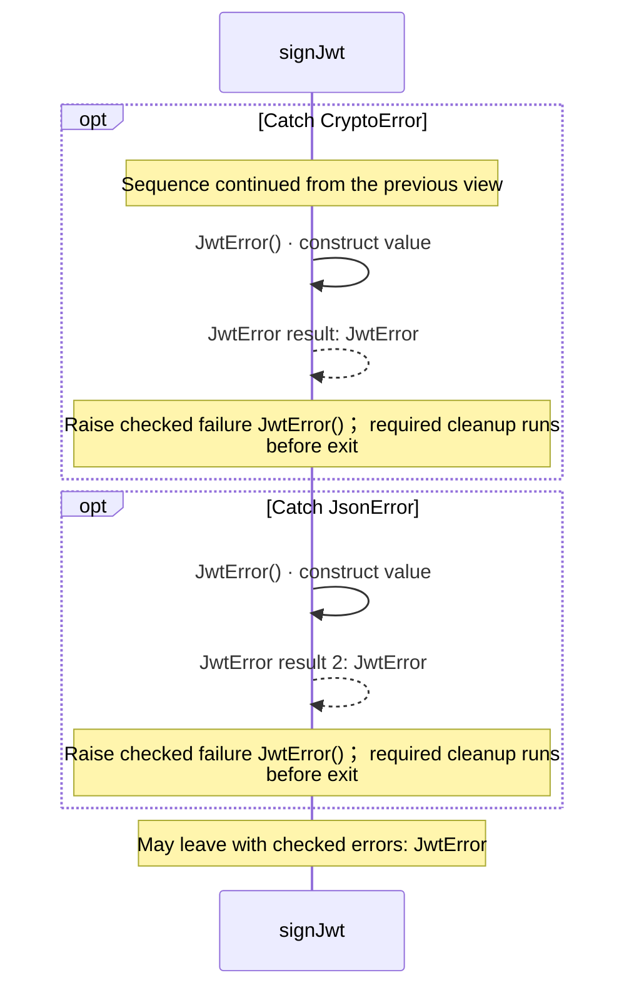

### verifyJwt

[Source](jose.aug#L44)

Verify the signature and configured algorithm, key id, and type before exposing the JSON payload. Never follows token-supplied URLs.

It takes `token` as a string, `publicKey` as `RsaPublicKey`, and `kid` and `tokenType` as strings. It gets `crypto` ([`Crypto`](contracts.aug.md#symbol-Crypto)) from dependency injection.

It can call [`Crypto.decodeBase64url`](contracts.aug.md#symbol-Crypto.decodeBase64url) and [`Crypto.verifyRsa`](contracts.aug.md#symbol-Crypto.verifyRsa). Failures can raise [`JwtError`](jose.aug.md#symbol-JwtError).

#### Sequence 1 of 3

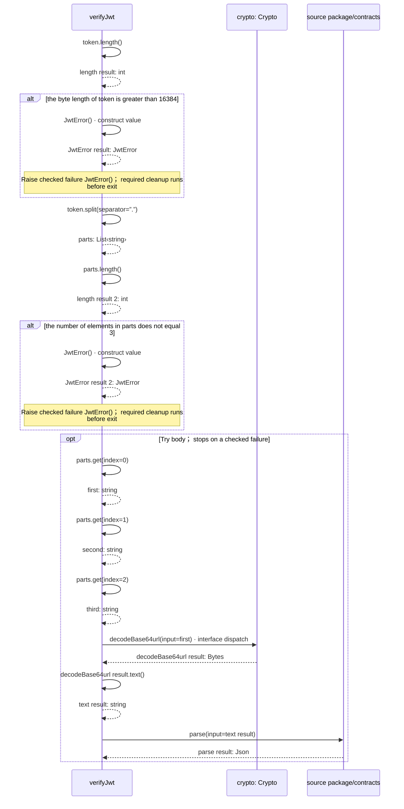

#### Sequence 2 of 3 (continued)

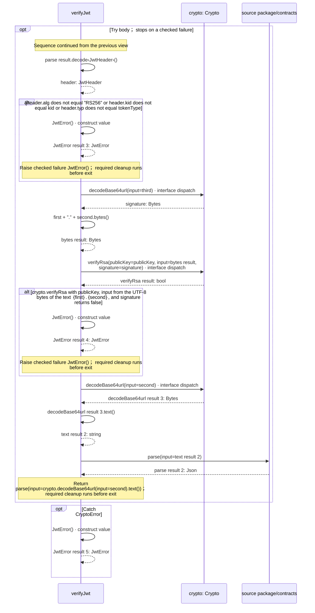

#### Sequence 3 of 3 (continued)

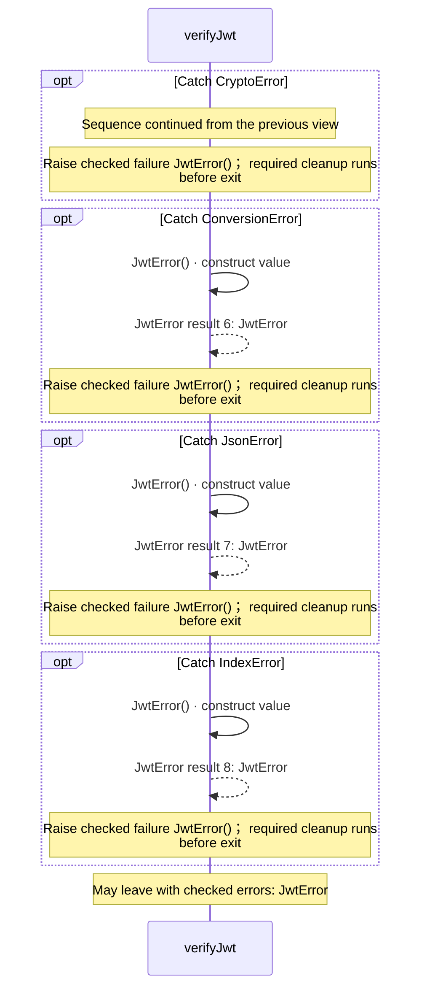

### verifyIdentityToken

[Source](jose.aug#L73)

Verify an Ed25519 JWT before exposing its claims. The caller supplies trusted
issuer, audience, token type, current epoch seconds, and the maximum lifetime.
sub, iat and exp are required. No token-supplied key location is followed.

It takes `token`, `publicKey`, `issuer`, `audience`, and `tokenType` as strings and `now` and `maximumAge` as integers. It gets `crypto` ([`Crypto`](contracts.aug.md#symbol-Crypto)) from dependency injection.

It can call [`Crypto.decodeBase64url`](contracts.aug.md#symbol-Crypto.decodeBase64url) and [`Crypto.verifyEd25519`](contracts.aug.md#symbol-Crypto.verifyEd25519). Failures can raise [`JwtError`](jose.aug.md#symbol-JwtError).

#### Sequence 1 of 6

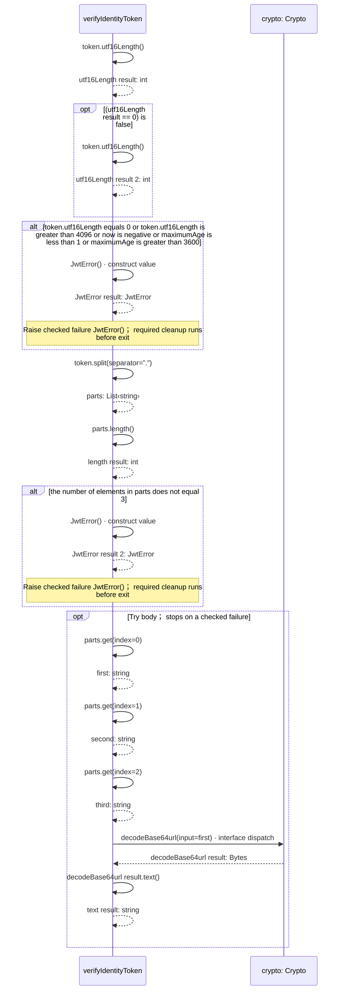

#### Sequence 2 of 6 (continued)

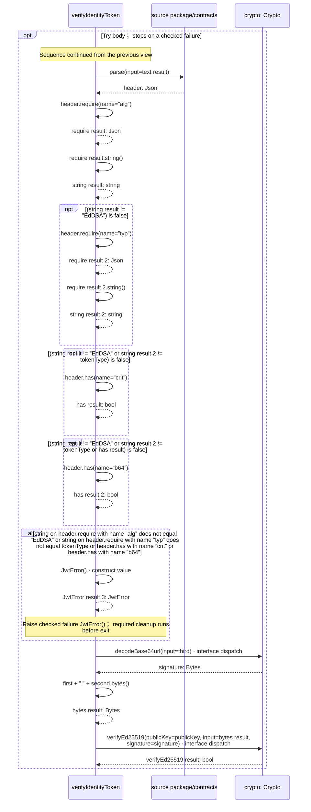

#### Sequence 3 of 6 (continued)

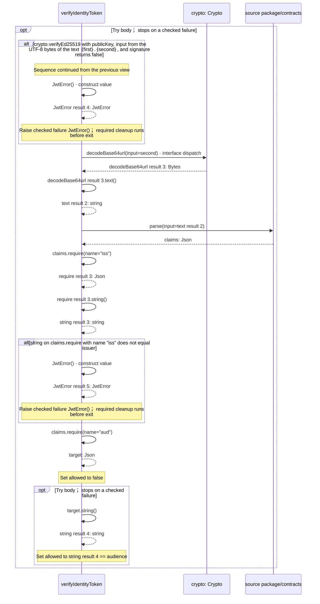

#### Sequence 4 of 6 (continued)

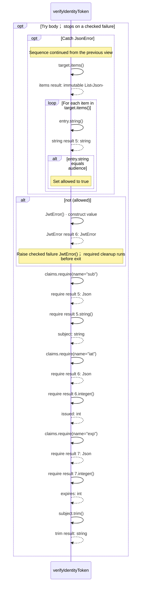

#### Sequence 5 of 6 (continued)

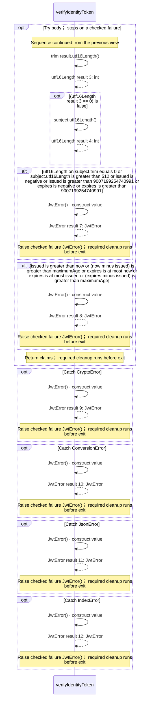

#### Sequence 6 of 6 (continued)

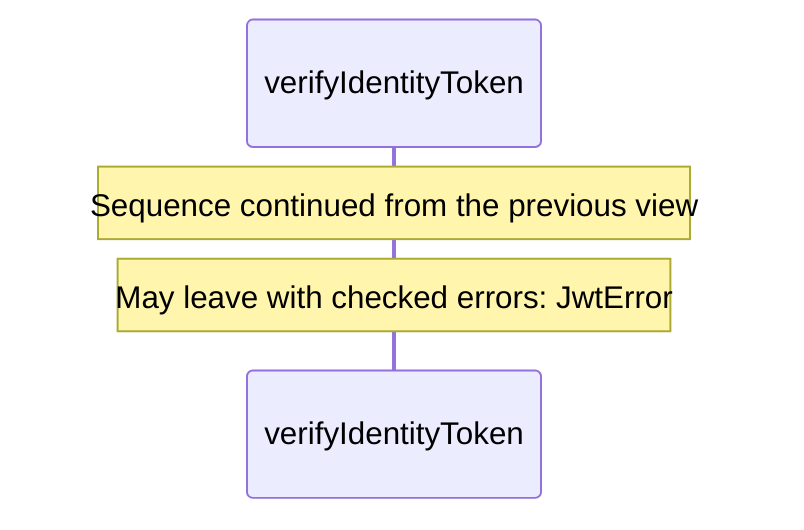

### IdentityVerifier.verify

[Source](jose.aug#L121)

It takes `token` as a string and `now` as an integer.

It returns `Json`. It can call [`Crypto.decodeBase64url`](contracts.aug.md#symbol-Crypto.decodeBase64url) and [`Crypto.verifyEd25519`](contracts.aug.md#symbol-Crypto.verifyEd25519). Failures can raise [`JwtError`](jose.aug.md#symbol-JwtError).

May leave with checked errors: JwtError. Interface contract; implementation selected at runtime. [Explanation](jose.aug.md).

### Ed25519IdentityVerifier constructor

[Source](jose.aug#L123)

Bind trusted key and identity settings once. The caller supplies the current epoch seconds for each verification. It implements [`IdentityVerifier`](jose.aug.md#symbol-IdentityVerifier).

It takes `publicKey`, `issuer`, `audience`, and `tokenType` as strings, kept read-only and `maximumAge` as an integer, kept read-only. It gets `crypto` ([`Crypto`](contracts.aug.md#symbol-Crypto)), kept read-only from dependency injection.

Receive fields: injected crypto, publicKey, issuer, audience, tokenType, maximumAge. [Explanation](jose.aug.md).

### Ed25519IdentityVerifier.verify

[Source](jose.aug#L124)

It takes `token` as a string and `now` as an integer.

It can call [`Crypto.decodeBase64url`](contracts.aug.md#symbol-Crypto.decodeBase64url) and [`Crypto.verifyEd25519`](contracts.aug.md#symbol-Crypto.verifyEd25519). Failures can raise [`JwtError`](jose.aug.md#symbol-JwtError).

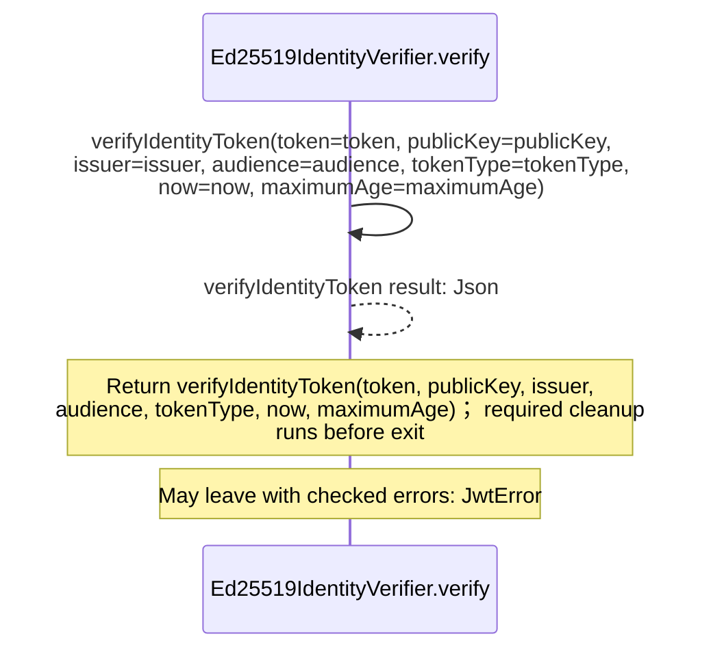

## Called contracts

- [parse](.aug-spec/packages/%40git/url_2d3c37c690c0fa115be1/0.0.0-git.a39fc582565d4fca40be4f75fa304d71adc69301/contracts.aug.diagrams.md#sequence-parse) — package/@git/url\_2d3c37c690c0fa115be1@0.0.0-git.a39fc582565d4fca40be4f75fa304d71adc69301/contracts.aug
- [Crypto](contracts.aug.diagrams.md) — contracts.aug
- [Crypto.decodeBase64url](contracts.aug.diagrams.md#sequence-Crypto.decodeBase64url) — contracts.aug
- [Crypto.exportRsa](contracts.aug.diagrams.md#sequence-Crypto.exportRsa) — contracts.aug
- [Crypto.importRsa](contracts.aug.diagrams.md#sequence-Crypto.importRsa) — contracts.aug
- [Crypto.signRsa](contracts.aug.diagrams.md#sequence-Crypto.signRsa) — contracts.aug
- [Crypto.verifyEd25519](contracts.aug.diagrams.md#sequence-Crypto.verifyEd25519) — contracts.aug
- [Crypto.verifyRsa](contracts.aug.diagrams.md#sequence-Crypto.verifyRsa) — contracts.aug
- [IdentityVerifier](jose.aug.diagrams.md) — jose.aug
- [JwtError](jose.aug.diagrams.md#sequence-JwtError-20-constructor) — jose.aug
- [JwtHeader](jose.aug.diagrams.md#sequence-JwtHeader-20-constructor) — jose.aug
- [RsaJwk](jose.aug.diagrams.md#sequence-RsaJwk-20-constructor) — jose.aug
- [verifyIdentityToken](jose.aug.diagrams.md#sequence-verifyIdentityToken) — jose.aug
