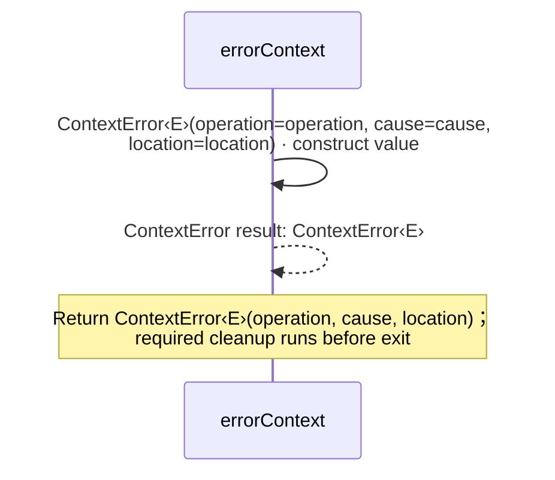

<!-- Generated by aug spec. Edit the August source, then regenerate. -->

# august/errors/context.aug diagrams

[Project overview](.aug-spec/diagrams/index.md) · [Compiled explanation](context.aug.md)

## Sequences

Call arrows identify checked targets; loop and branch frames determine when they run. Open that target’s module to follow its implementation. Branches describe alternatives; loops describe repeated work. Native calls and interface dispatch stop at their declared contracts. Exit notes end that path; enclosing recovery and cleanup remain visible.

### ContextError constructor

[Source](context.aug#L8)

Keep the original typed error with an operation name and an authored source location.
Concrete catches check the stored cause identity, including nested contexts. It implements `Error`. The type parameters are `E` which must satisfy `Error`.

It takes `operation` as a string, kept read-only (Describe the failed application operation; do not include secrets), `cause` as `E`, kept read-only (Original checked error; its identity and public fields are retained), and `location` as `Tuple<string,int,int>`, kept read-only (Source identity, one-based line and column captured with sourceLocation()).

Receive fields: operation, cause, location. [Explanation](context.aug.md).

### errorContext

[Source](context.aug#L15)

Add context deliberately. Constructing context does not throw or log; the caller chooses to throw the result.

It takes `cause` as `E`, `operation` as a string, and `location` as `Tuple<string,int,int>`.

## Called contracts

- [ContextError](context.aug.diagrams.md#sequence-ContextError-20-constructor) — august/errors/context.aug
