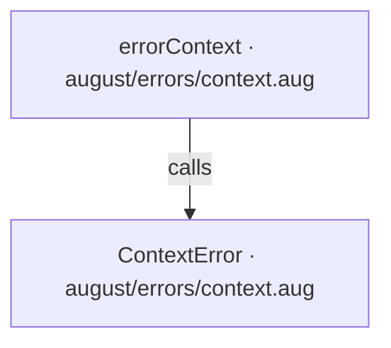
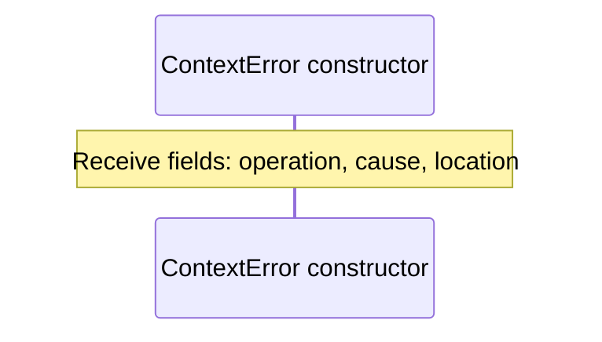
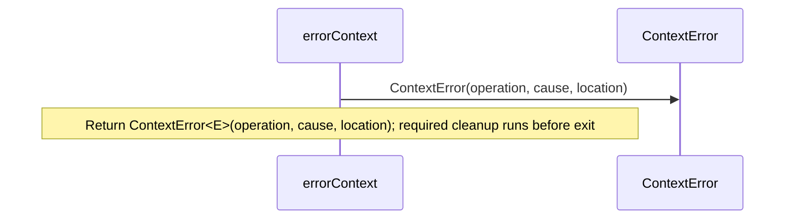

<!-- Generated by aug spec. Edit the August source, then regenerate. -->

# august/errors/context.aug diagrams

[Project overview](.aug-spec/diagrams/index.md) · [Compiled explanation](context.aug.md)

## Class interactions

## API calls

## Sequences

Call arrows identify checked targets; loop and branch frames determine when they run. Open that target’s module to follow its implementation. Branches describe alternatives; loops describe repeated work. Native calls and interface dispatch stop at their declared contracts. Exit notes end that path; enclosing recovery and cleanup remain visible.

### ContextError constructor

[Source](context.aug#L8)

### errorContext

[Source](context.aug#L15)

## Called contracts

- [ContextError](context.aug.diagrams.md#sequence-ContextError-20-constructor) — august/errors/context.aug
