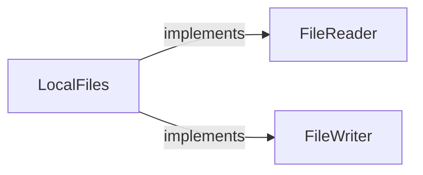
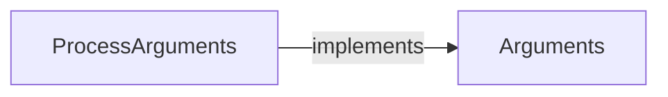
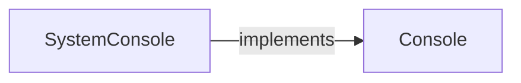
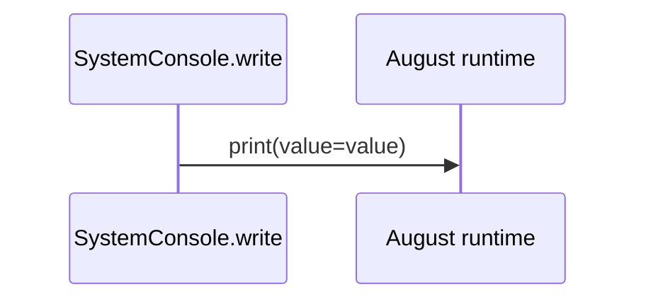
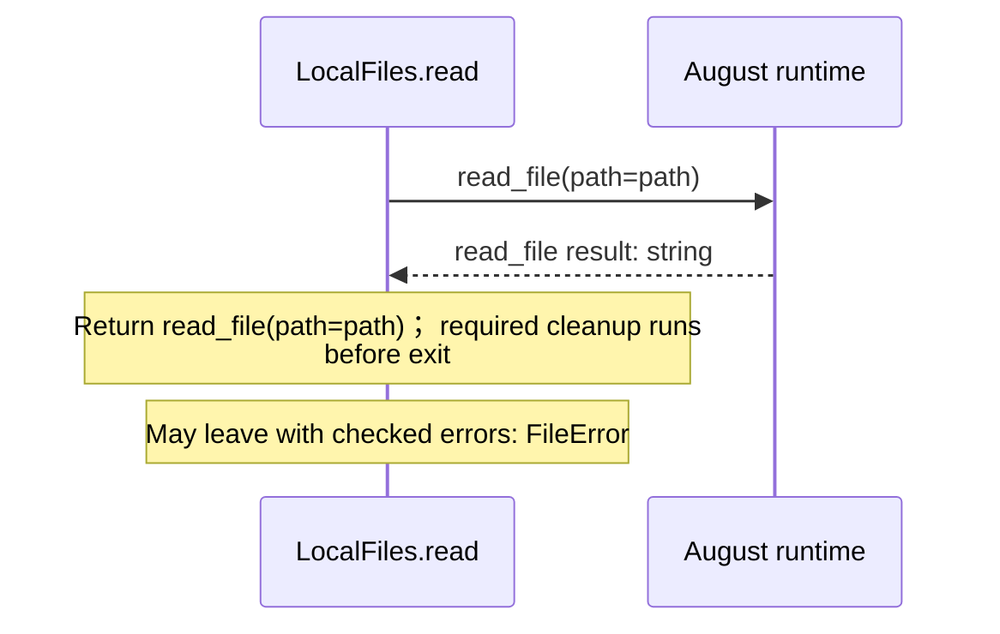
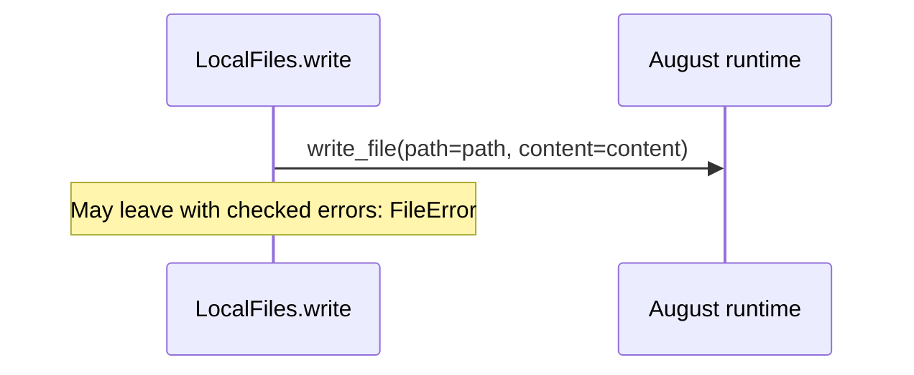
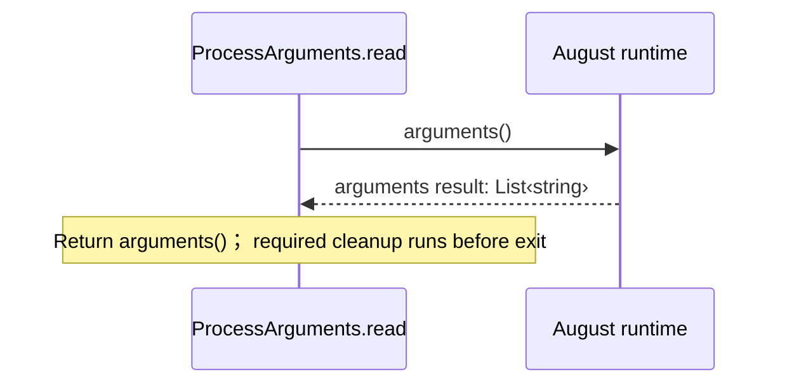

<!-- Generated by aug spec. Edit the August source, then regenerate. -->

# august/io/contracts.aug diagrams

[Project overview](.aug-spec/diagrams/index.md) · [Compiled explanation](contracts.aug.md)

## Class interactions

### LocalFiles

### ProcessArguments

### SystemConsole

## Sequences

Call arrows identify checked targets; loop and branch frames determine when they run. Open that target’s module to follow its implementation. Branches describe alternatives; loops describe repeated work. Native calls and interface dispatch stop at their declared contracts. Exit notes end that path; enclosing recovery and cleanup remain visible.

### Console.write

[Source](contracts.aug#L5)

Write one line of text.

The type parameters are `T`.

It takes `value` as `T` (Text to display).

It can call [`Console.write`](contracts.aug.md#symbol-Console.write).

Interface contract; implementation selected at runtime. [Explanation](contracts.aug.md).

### SystemConsole constructor

[Source](contracts.aug#L8)

The native standard-output adapter. Construction performs no output. It implements [`Console`](contracts.aug.md#symbol-Console).

[Explanation](contracts.aug.md).

### SystemConsole.write

[Source](contracts.aug#L9)

Write one line of text.

It takes `value` as `T`.

It can call [`Console.write`](contracts.aug.md#symbol-Console.write).

### FileReader.read

[Source](contracts.aug#L15)

Read text.

It takes `path` as a string (File path).

It returns `string`. It can call [`FileReader.read`](contracts.aug.md#symbol-FileReader.read). Failures can raise `FileError` (The file could not be read).

May leave with checked errors: FileError. Interface contract; implementation selected at runtime. [Explanation](contracts.aug.md).

### FileWriter.write

[Source](contracts.aug#L20)

Write text.

It takes `path` as a string (File path) and `content` as a string (Text).

It can call [`FileWriter.write`](contracts.aug.md#symbol-FileWriter.write). Failures can raise `FileError` (Writing failed).

May leave with checked errors: FileError. Interface contract; implementation selected at runtime. [Explanation](contracts.aug.md).

### LocalFiles constructor

[Source](contracts.aug#L23)

Native filesystem adapter. Construction opens no files. It implements [`FileReader`](contracts.aug.md#symbol-FileReader) and [`FileWriter`](contracts.aug.md#symbol-FileWriter).

[Explanation](contracts.aug.md).

### LocalFiles.read

[Source](contracts.aug#L24)

Read text.

It takes `path` as a string.

It can call [`FileReader.read`](contracts.aug.md#symbol-FileReader.read). Failures can raise `FileError` (The file could not be read).

### LocalFiles.write

[Source](contracts.aug#L26)

Write text.

It takes `path` and `content` as strings.

It can call [`FileWriter.write`](contracts.aug.md#symbol-FileWriter.write). Failures can raise `FileError` (Writing failed).

### Arguments.read

[Source](contracts.aug#L31)

It returns `List<string>`. It can call [`Arguments.read`](contracts.aug.md#symbol-Arguments.read).

Interface contract; implementation selected at runtime. [Explanation](contracts.aug.md).

### ProcessArguments constructor

[Source](contracts.aug#L34)

Native command-line arguments. It implements [`Arguments`](contracts.aug.md#symbol-Arguments).

[Explanation](contracts.aug.md).

### ProcessArguments.read

[Source](contracts.aug#L35)

It can call [`Arguments.read`](contracts.aug.md#symbol-Arguments.read).

## Called contracts

- [Arguments](contracts.aug.diagrams.md) — august/io/contracts.aug
- [Console](contracts.aug.diagrams.md) — august/io/contracts.aug
- [FileReader](contracts.aug.diagrams.md) — august/io/contracts.aug
- [FileWriter](contracts.aug.diagrams.md) — august/io/contracts.aug
