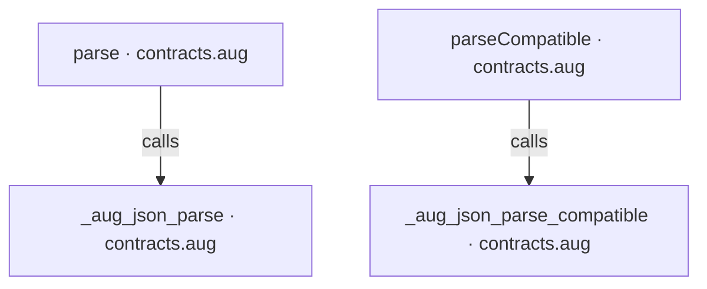
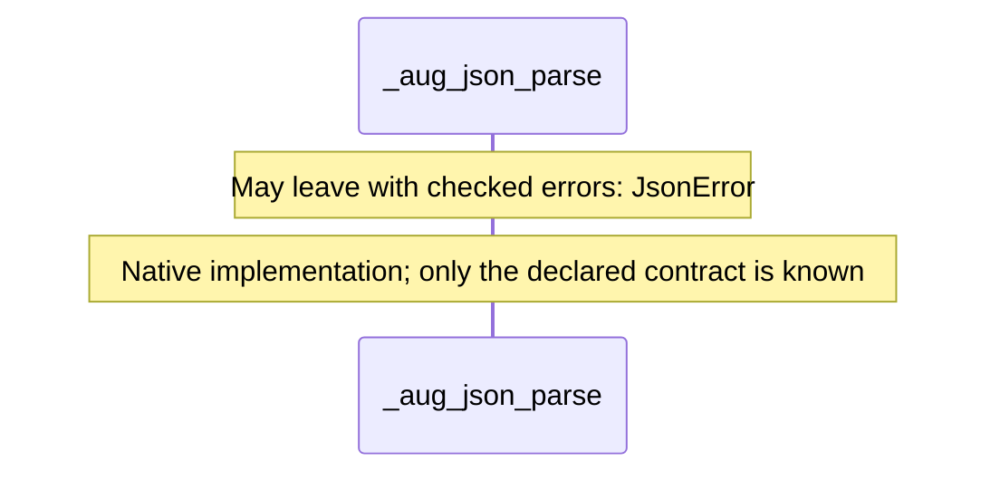
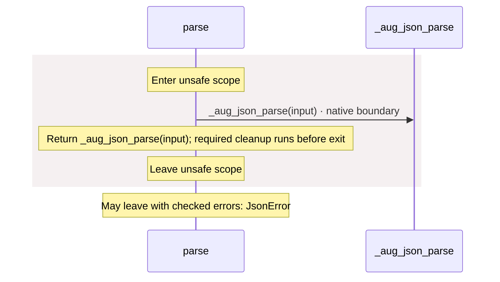
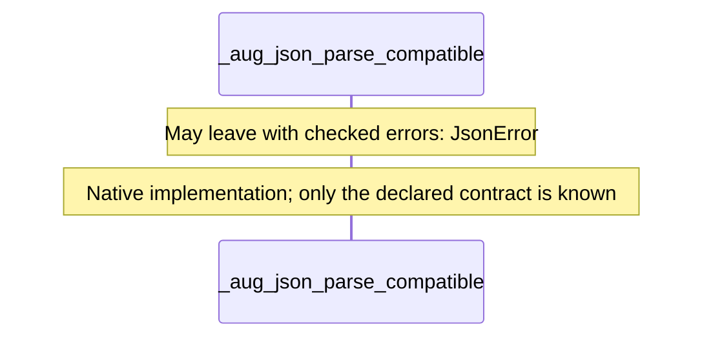
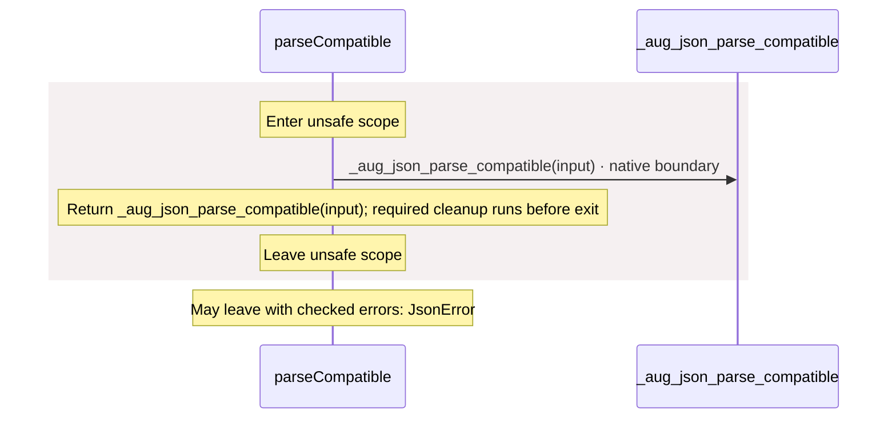

<!-- Generated by aug spec. Edit the August source, then regenerate. -->

# contracts.aug diagrams

[Project overview](.aug-spec/diagrams/index.md) · [Compiled explanation](contracts.aug.md)

## Class interactions

No relationships at this level.

## API calls

## Sequences

Call arrows identify checked targets; loop and branch frames determine when they run. Open that target’s module to follow its implementation. Branches describe alternatives; loops describe repeated work. Native calls and interface dispatch stop at their declared contracts. Exit notes end that path; enclosing recovery and cleanup remain visible.

### \_aug\_json\_parse

[Source](contracts.aug#L2)

### parse

[Source](contracts.aug#L4)

### \_aug\_json\_parse\_compatible

[Source](contracts.aug#L8)

### parseCompatible

[Source](contracts.aug#L13)

## Called contracts

- [\_aug\_json\_parse](contracts.aug.diagrams.md#sequence-_aug_json_parse) — contracts.aug
- [\_aug\_json\_parse\_compatible](contracts.aug.diagrams.md#sequence-_aug_json_parse_compatible) — contracts.aug
