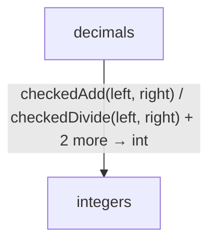

<!-- Generated by aug spec. Edit the August source, then regenerate. -->

# Project diagrams

Start here to see what moves between the application’s folders. Each arrow names an operation’s inputs and the result it returns to its caller. Open a folder for the next level of detail. Expand the contract list for complete types and dependency links.

## Data flow

Data crossing these boundaries (4 contracts)

| From | To | Operation and inputs | Result |
| --- | --- | --- | --- |
| decimals | integers | [checkedAdd](../../integers.aug.md#symbol-checkedAdd) · left: int, right: int | int |
| decimals | integers | [checkedDivide](../../integers.aug.md#symbol-checkedDivide) · left: int, right: int | int |
| decimals | integers | [checkedMultiply](../../integers.aug.md#symbol-checkedMultiply) · left: int, right: int | int |
| decimals | integers | [checkedSubtract](../../integers.aug.md#symbol-checkedSubtract) · left: int, right: int | int |

## Open a module

| Module | Read |
| --- | --- |
| august/math/decimals.aug | [Flow and sequences](../../decimals.aug.diagrams.md) · [Explanation](../../decimals.aug.md) |
| august/math/export.aug | [Flow and sequences](../../export.aug.diagrams.md) · [Explanation](../../export.aug.md) |
| august/math/integers.aug | [Flow and sequences](../../integers.aug.diagrams.md) · [Explanation](../../integers.aug.md) |

These are static call boundaries, not a request trace. Interface implementations and foreign internals stop at their checked contracts. Dotted arrows defer a callback or browser action. Imports alone do not imply a call.
