<!-- Generated by aug spec. Edit the August source, then regenerate. -->

# august/math/decimals.aug diagrams

[Project overview](.aug-spec/diagrams/index.md) · [Compiled explanation](decimals.aug.md)

## Class interactions

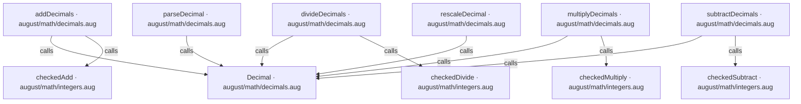

## API calls

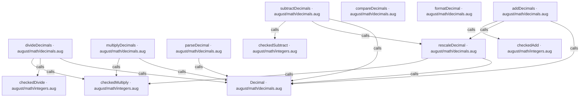

## Sequences

Call arrows identify checked targets; loop and branch frames determine when they run. Open that target’s module to follow its implementation. Branches describe alternatives; loops describe repeated work. Native calls and interface dispatch stop at their declared contracts. Exit notes end that path; enclosing recovery and cleanup remain visible.

### Decimal constructor

[Source](decimals.aug#L9)

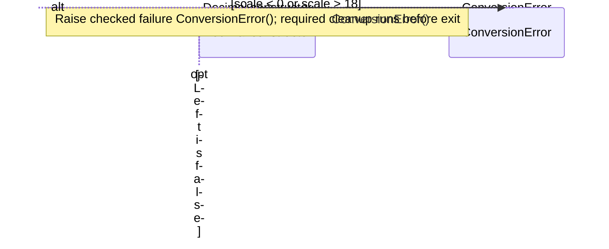

### parseDecimal

[Source](decimals.aug#L18)

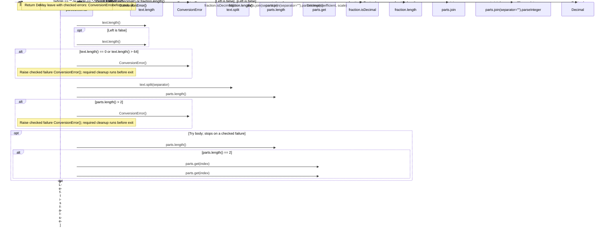

### formatDecimal

[Source](decimals.aug#L38)

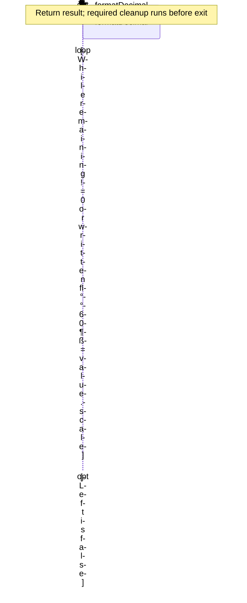

### rescaleDecimal

[Source](decimals.aug#L59)

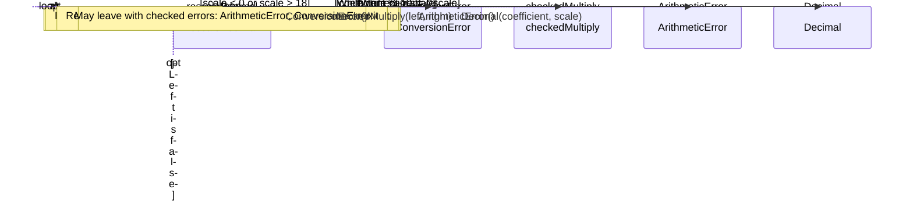

### addDecimals

[Source](decimals.aug#L75)

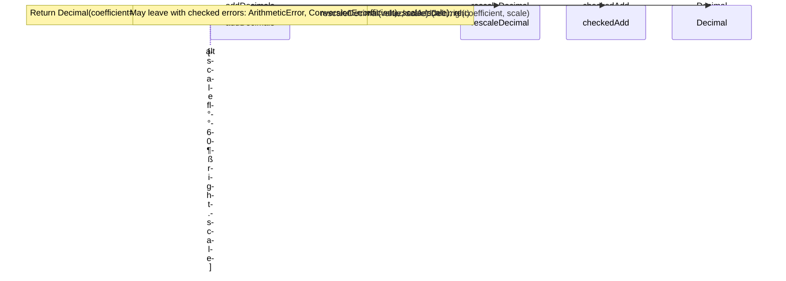

### subtractDecimals

[Source](decimals.aug#L84)

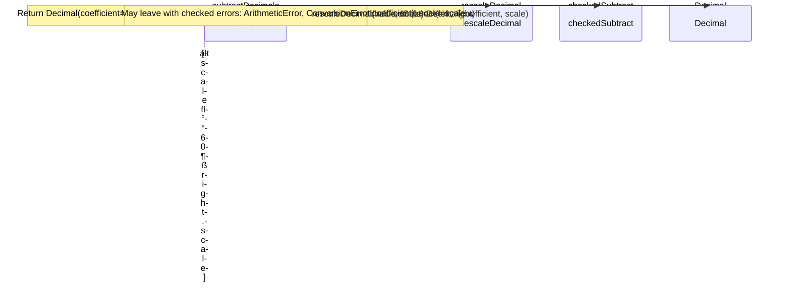

### multiplyDecimals

[Source](decimals.aug#L93)

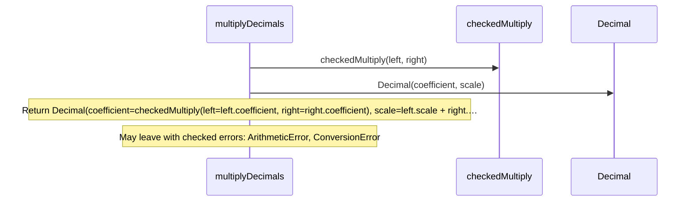

### divideDecimals

[Source](decimals.aug#L100)

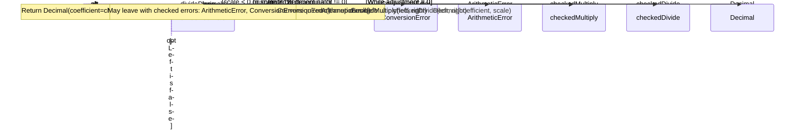

### compareDecimals

[Source](decimals.aug#L121)

```mermaid
sequenceDiagram
    participant p0 as compareDecimals
    participant p1 as $#34;#123;left.coefficient#125;#34;.split
    participant p2 as $#34;#123;left.coefficient#125;#34;.split(separator=#34;-#34;).join
    participant p3 as $#34;#123;right.coefficient#125;#34;.split
    participant p4 as $#34;#123;right.coefficient#125;#34;.split(separator=#34;-#34;).join
    participant p5 as leftDigits.compareDecimal
    opt Left is true
    end
    alt left.coefficient #60; 0 and right.coefficient #62;= 0
    Note over p0: Return -1#59; required cleanup runs before exit
    end
    opt Left is true
    end
    alt left.coefficient #62;= 0 and right.coefficient #60; 0
    Note over p0: Return 1#59; required cleanup runs before exit
    end
    p0->>p1: $#34;#123;left.coefficient#125;#34;.split(separator)
    p0->>p2: $#34;#123;left.coefficient#125;#34;.split(separator=#34;-#34;).join(separator)
    p0->>p3: $#34;#123;right.coefficient#125;#34;.split(separator)
    p0->>p4: $#34;#123;right.coefficient#125;#34;.split(separator=#34;-#34;).join(separator)
    loop While leftScale #60; rightScale
    end
    loop While rightScale #60; leftScale
    end
    p0->>p5: leftDigits.compareDecimal(other)
    alt left.coefficient #60; 0
    Note over p0: Return -result#59; required cleanup runs before exit
    end
    Note over p0: Return result#59; required cleanup runs before exit
    Note over p0: May leave with checked errors: ConversionError
```

## Called contracts

- [Decimal](decimals.aug.diagrams.md#sequence-Decimal-20-constructor) — august/math/decimals.aug
- [rescaleDecimal](decimals.aug.diagrams.md#sequence-rescaleDecimal) — august/math/decimals.aug
- [checkedAdd](integers.aug.diagrams.md#sequence-checkedAdd) — august/math/integers.aug
- [checkedDivide](integers.aug.diagrams.md#sequence-checkedDivide) — august/math/integers.aug
- [checkedMultiply](integers.aug.diagrams.md#sequence-checkedMultiply) — august/math/integers.aug
- [checkedSubtract](integers.aug.diagrams.md#sequence-checkedSubtract) — august/math/integers.aug
