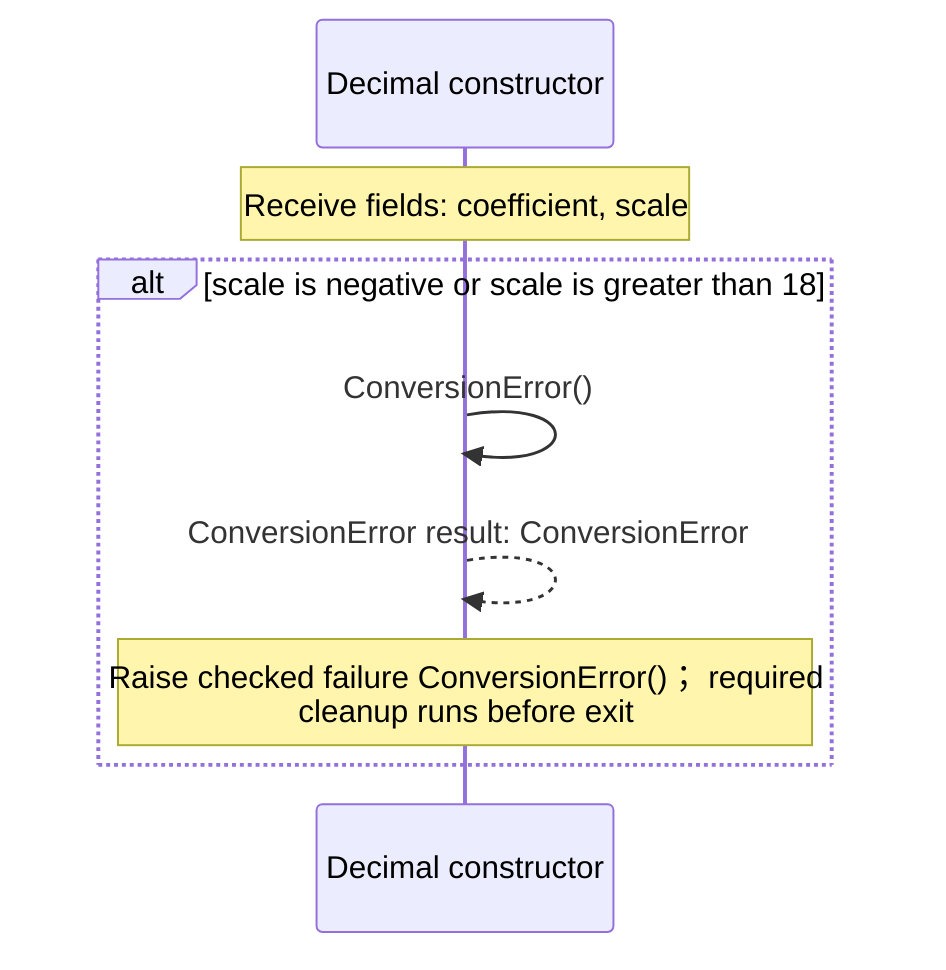
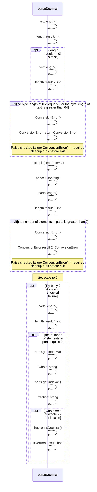
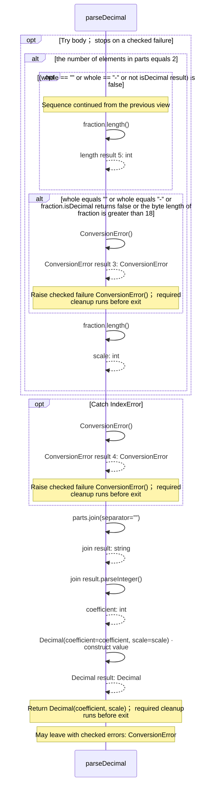
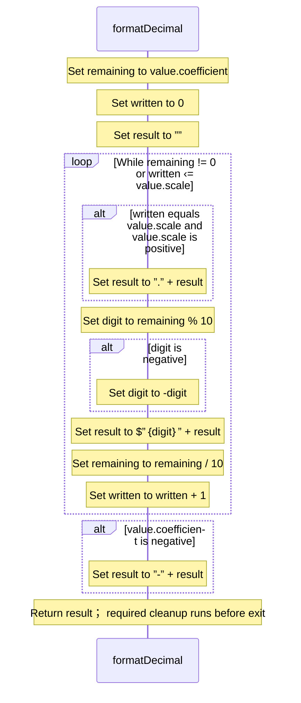
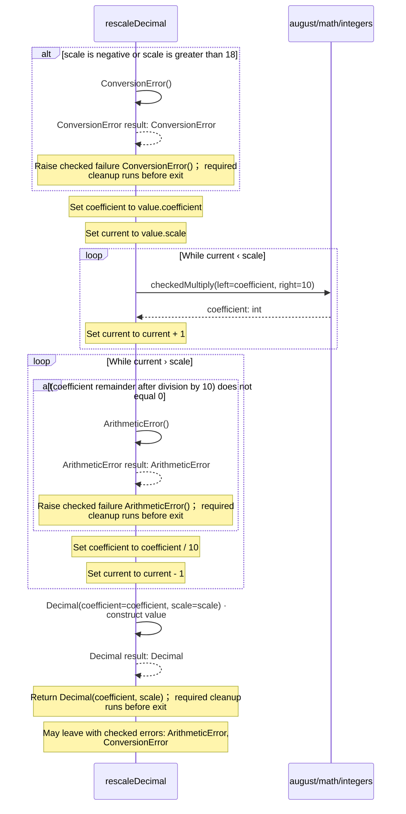
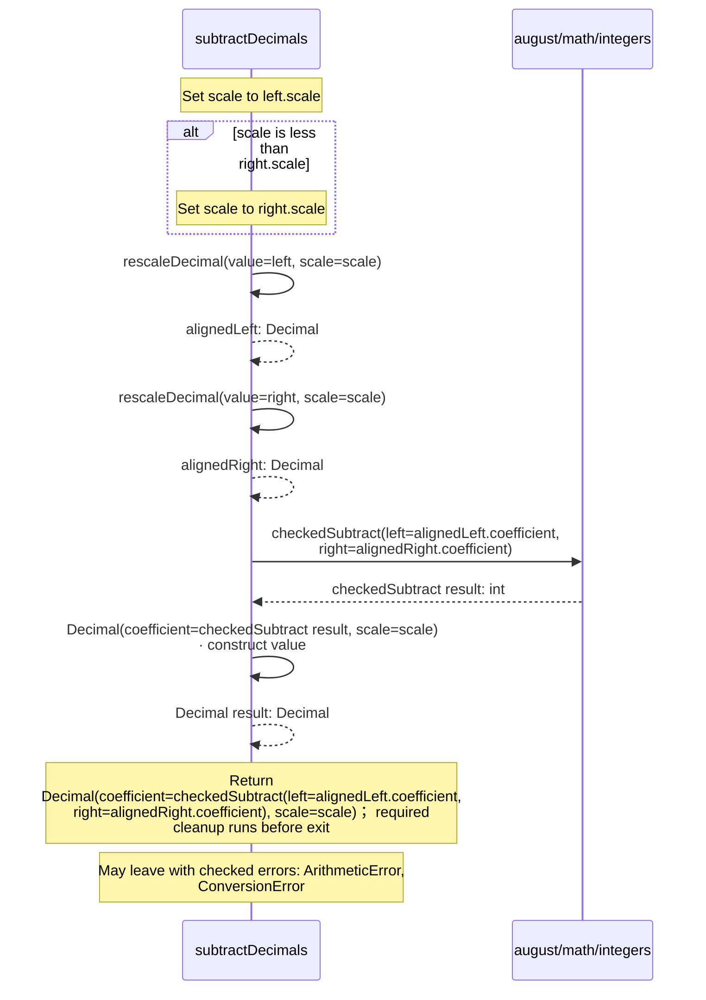
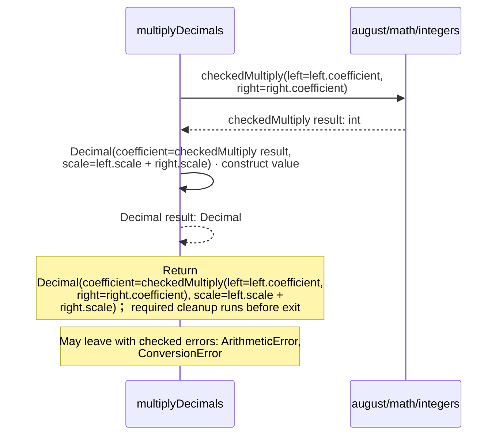
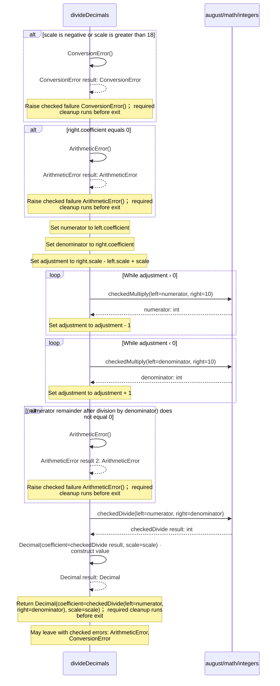
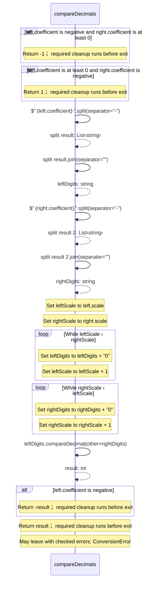

<!-- Generated by aug spec. Edit the August source, then regenerate. -->

# august/math/decimals.aug diagrams

[Project overview](.aug-spec/diagrams/index.md) · [Compiled explanation](decimals.aug.md)

## Sequences

Call arrows identify checked targets; loop and branch frames determine when they run. Open that target’s module to follow its implementation. Branches describe alternatives; loops describe repeated work. Native calls and interface dispatch stop at their declared contracts. Exit notes end that path; enclosing recovery and cleanup remain visible.

### Decimal constructor

[Source](decimals.aug#L9)

Exact decimal data: coefficient times 10 to the negative scale.

It takes `coefficient` as an integer, kept read-only (Signed int64 digits; no floating-point conversion occurs) and `scale` as an integer, kept read-only (Fractional digits from 0 to 18. Scale remains part of record equality).

Construction can fail with `ConversionError`.

### parseDecimal

[Source](decimals.aug#L18)

Parse up to 64 ASCII characters: optional minus, integer digits, and an optional dot with 1 to 18 fractional digits.
Leading zeroes are accepted. Plus, whitespace, exponent notation and non-ASCII digits are rejected.

It takes `text` as a string.

Failures can raise `ConversionError` (Invalid text, scale, or int64 coefficient. Negative zero loses its sign).

#### Sequence 1 of 2

#### Sequence 2 of 2 (continued)

### formatDecimal

[Source](decimals.aug#L38)

Format invariant ASCII text with the recorded scale, including trailing fractional zeroes.

It takes `value` as [`Decimal`](decimals.aug.md#symbol-Decimal).

### rescaleDecimal

[Source](decimals.aug#L59)

Change fractional scale exactly, adding or removing trailing zeroes without rounding.

It takes `value` as [`Decimal`](decimals.aug.md#symbol-Decimal) and `scale` as an integer.

Failures can raise `ArithmeticError` (Precision would be discarded or an intermediate coefficient would overflow) and `ConversionError` (Invalid target scale).

### addDecimals

[Source](decimals.aug#L75)

Add at the greater operand scale. Alignment and the sum must each fit int64.

It takes `left` and `right` as [`Decimal`](decimals.aug.md#symbol-Decimal).

Failures can raise `ArithmeticError` and `ConversionError`.

### subtractDecimals

[Source](decimals.aug#L84)

Subtract at the greater operand scale. Alignment and the difference must each fit int64.

It takes `left` and `right` as [`Decimal`](decimals.aug.md#symbol-Decimal).

Failures can raise `ArithmeticError` and `ConversionError`.

### multiplyDecimals

[Source](decimals.aug#L93)

Multiply coefficients and add scales. Reject a scale above 18 or an int64 product overflow.

It takes `left` and `right` as [`Decimal`](decimals.aug.md#symbol-Decimal).

Failures can raise `ArithmeticError` and `ConversionError`.

### divideDecimals

[Source](decimals.aug#L100)

Divide at an explicit scale, requiring an exact result. No rounding mode is chosen implicitly.

It takes `left` and `right` as [`Decimal`](decimals.aug.md#symbol-Decimal) and `scale` as an integer.

Failures can raise `ArithmeticError` (Zero divisor, inexact result, or an intermediate int64 overflow) and `ConversionError` (Target scale is outside 0 to 18).

### compareDecimals

[Source](decimals.aug#L121)

Compare numeric decimal values; return -1, 0, or 1. Equal values can have different recorded scales.
Digit comparison avoids coefficient-alignment overflow. No floating-point conversion occurs.

It takes `left` and `right` as [`Decimal`](decimals.aug.md#symbol-Decimal).

Failures can raise `ConversionError`.

## Called contracts

- [Decimal](decimals.aug.diagrams.md#sequence-Decimal-20-constructor) — august/math/decimals.aug
- [rescaleDecimal](decimals.aug.diagrams.md#sequence-rescaleDecimal) — august/math/decimals.aug
- [checkedAdd](integers.aug.diagrams.md#sequence-checkedAdd) — august/math/integers.aug
- [checkedDivide](integers.aug.diagrams.md#sequence-checkedDivide) — august/math/integers.aug
- [checkedMultiply](integers.aug.diagrams.md#sequence-checkedMultiply) — august/math/integers.aug
- [checkedSubtract](integers.aug.diagrams.md#sequence-checkedSubtract) — august/math/integers.aug
