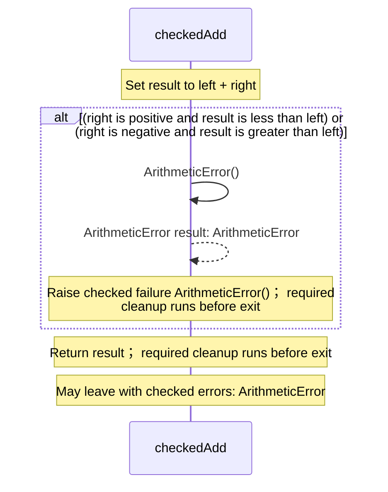
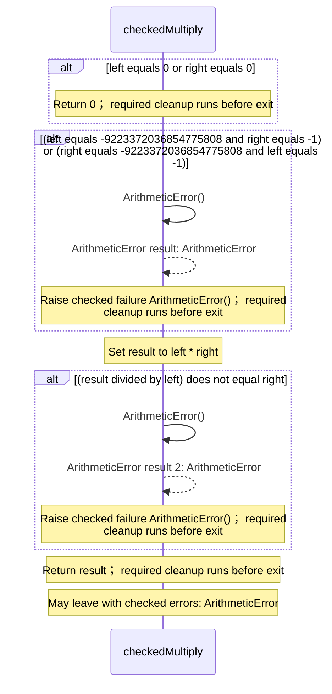
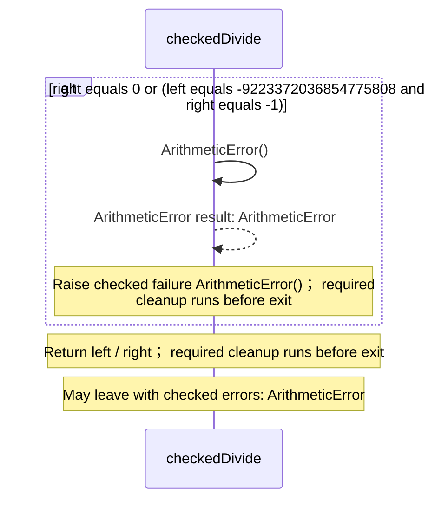
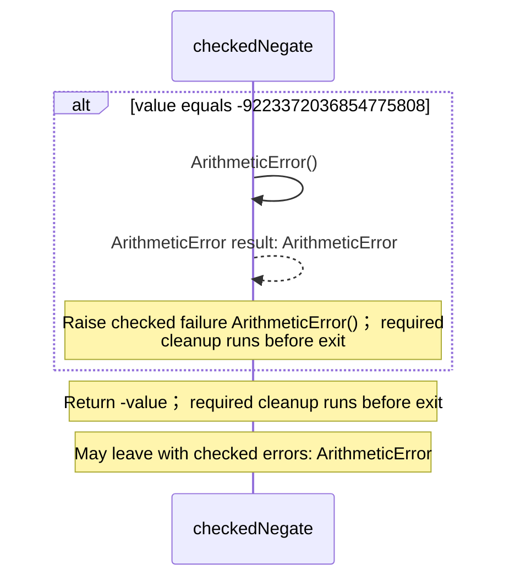
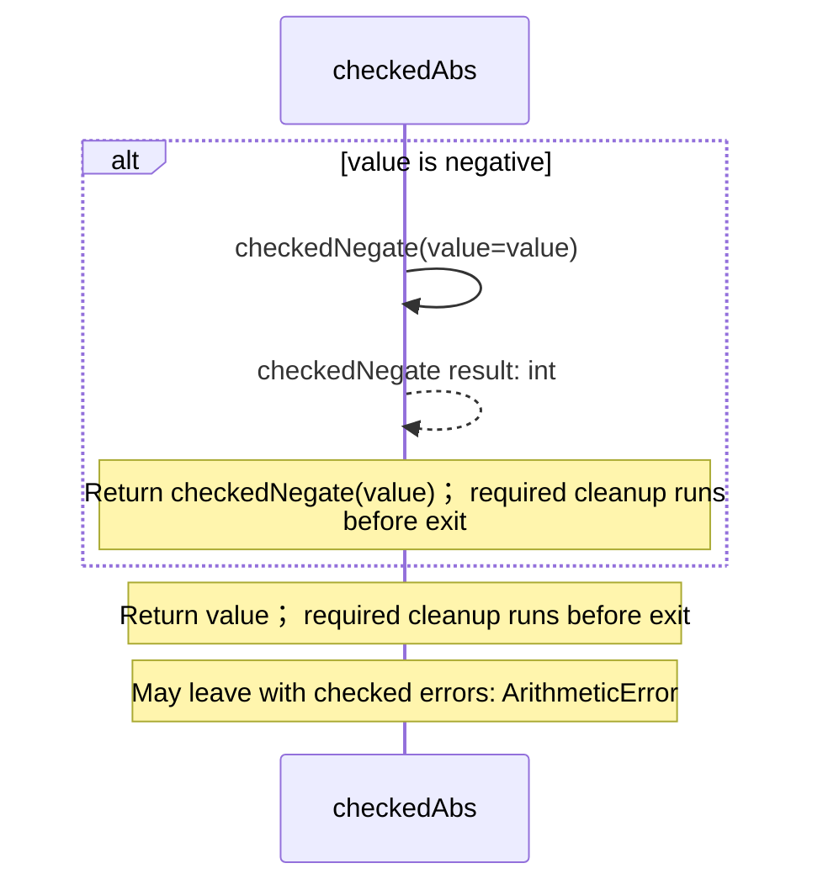
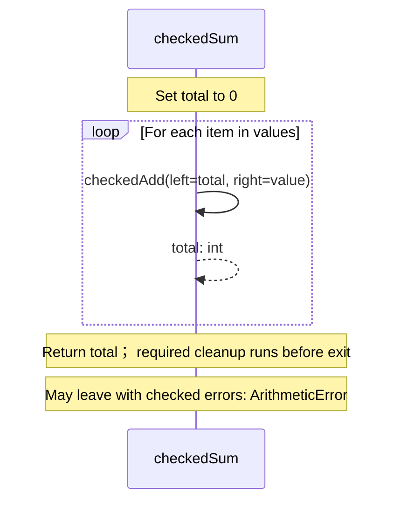

<!-- Generated by aug spec. Edit the August source, then regenerate. -->

# august/math/integers.aug diagrams

[Project overview](.aug-spec/diagrams/index.md) · [Compiled explanation](integers.aug.md)

## Sequences

Call arrows identify checked targets; loop and branch frames determine when they run. Open that target’s module to follow its implementation. Branches describe alternatives; loops describe repeated work. Native calls and interface dispatch stop at their declared contracts. Exit notes end that path; enclosing recovery and cleanup remain visible.

### checkedAdd

[Source](integers.aug#L3)

Add signed int64 values; raise ArithmeticError instead of wrapping on overflow.

It takes `left` and `right` as integers.

Failures can raise `ArithmeticError`.

### checkedSubtract

[Source](integers.aug#L10)

Subtract signed int64 values; raise ArithmeticError instead of wrapping on overflow.

It takes `left` and `right` as integers.

Failures can raise `ArithmeticError`.

### checkedMultiply

[Source](integers.aug#L17)

Multiply signed int64 values; raise ArithmeticError if the product cannot fit.

It takes `left` and `right` as integers.

Failures can raise `ArithmeticError`.

### checkedDivide

[Source](integers.aug#L28)

Divide toward zero; reject a zero divisor and the unrepresentable MIN / -1 result.

It takes `left` and `right` as integers.

Failures can raise `ArithmeticError`.

### checkedNegate

[Source](integers.aug#L34)

Negate a signed int64 value; MIN cannot be negated and raises ArithmeticError.

It takes `value` as an integer.

Failures can raise `ArithmeticError`.

### checkedAbs

[Source](integers.aug#L40)

Return the absolute value; MIN has no representable absolute value.

It takes `value` as an integer.

Failures can raise `ArithmeticError`.

### checkedSum

[Source](integers.aug#L46)

Sum values in list order; reject overflow at any intermediate addition. An empty list returns zero.

It takes `values` as `List<int>`.

Failures can raise `ArithmeticError`.

## Called contracts

- [checkedAdd](integers.aug.diagrams.md#sequence-checkedAdd) — august/math/integers.aug
- [checkedNegate](integers.aug.diagrams.md#sequence-checkedNegate) — august/math/integers.aug
