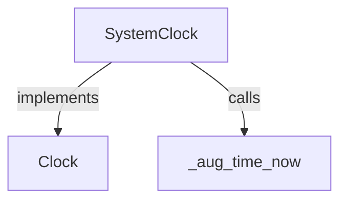
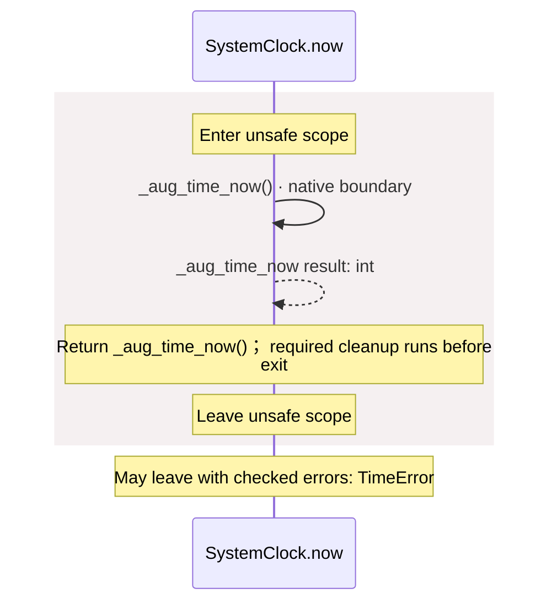

<!-- Generated by aug spec. Edit the August source, then regenerate. -->

# contracts.aug diagrams

[Project overview](.aug-spec/diagrams/index.md) · [Compiled explanation](contracts.aug.md)

## Class interactions

## Sequences

Call arrows identify checked targets; loop and branch frames determine when they run. Open that target’s module to follow its implementation. Branches describe alternatives; loops describe repeated work. Native calls and interface dispatch stop at their declared contracts. Exit notes end that path; enclosing recovery and cleanup remain visible.

### Clock.now

[Source](contracts.aug#L5)

Read whole Unix seconds in UTC.

It returns `int`. It can call [`Clock.now`](contracts.aug.md#symbol-Clock.now). Failures can raise `TimeError`.

May leave with checked errors: TimeError. Interface contract; implementation selected at runtime. [Explanation](contracts.aug.md).

### \_aug\_time\_now

[Source](contracts.aug#L6)

It is private to its defining scope.

It returns `int`. It can call [`Clock.now`](contracts.aug.md#symbol-Clock.now). Failures can raise `TimeError`.

Native C implementation; only its declared contract is visible here.

May leave with checked errors: TimeError. Native implementation; only the declared contract is known. [Explanation](contracts.aug.md).

### SystemClock constructor

[Source](contracts.aug#L8)

Operating-system wall clock. It implements [`Clock`](contracts.aug.md#symbol-Clock).

[Explanation](contracts.aug.md).

### SystemClock.now

[Source](contracts.aug#L9)

Read whole Unix seconds in UTC.

It can call [`Clock.now`](contracts.aug.md#symbol-Clock.now). Failures can raise `TimeError`.

## Called contracts

- [Clock](contracts.aug.diagrams.md) — contracts.aug
- [\_aug\_time\_now](contracts.aug.diagrams.md#sequence-_aug_time_now) — contracts.aug
