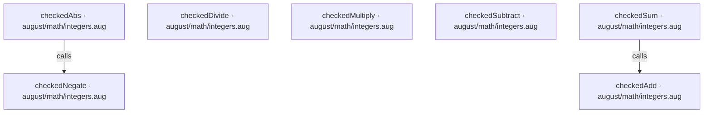
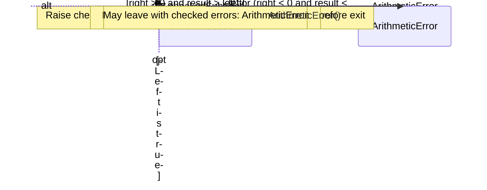
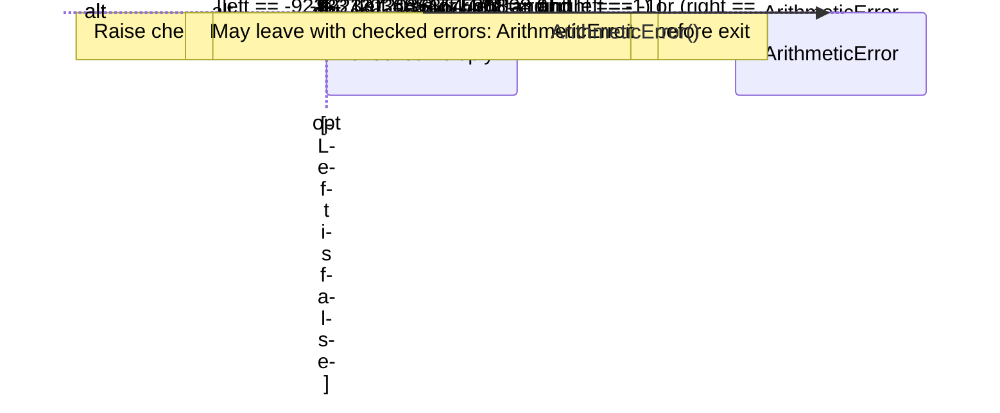
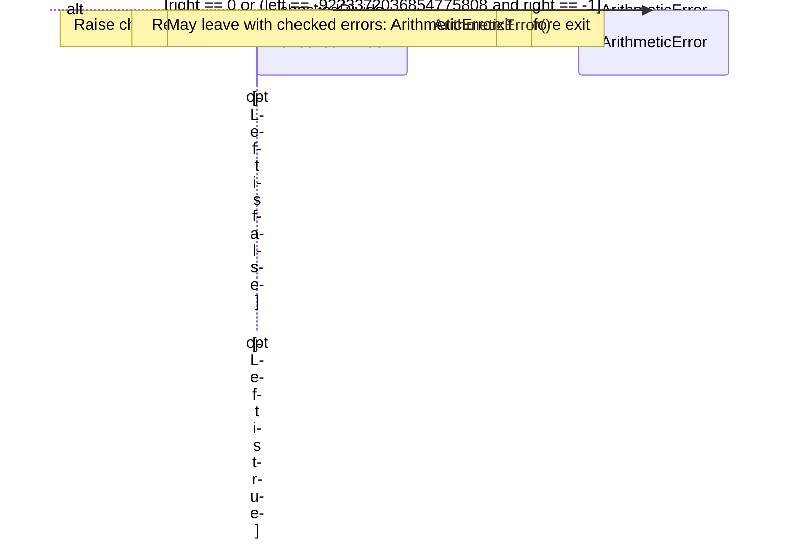
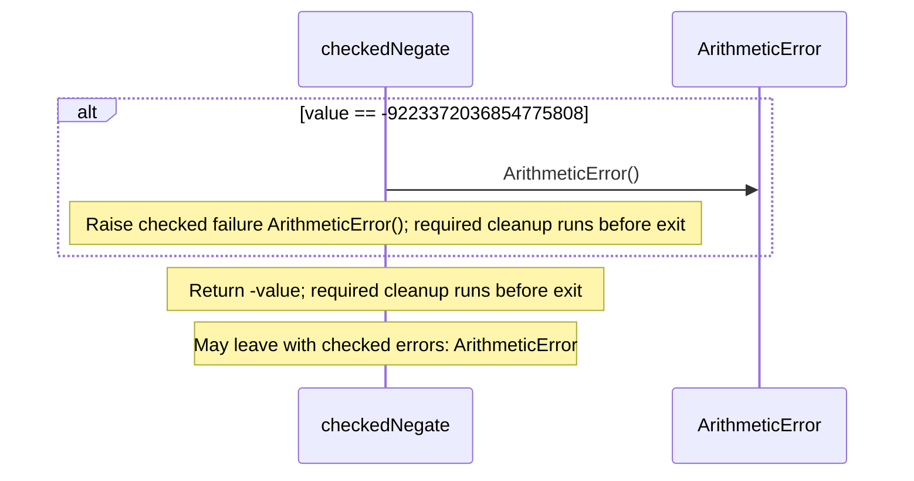
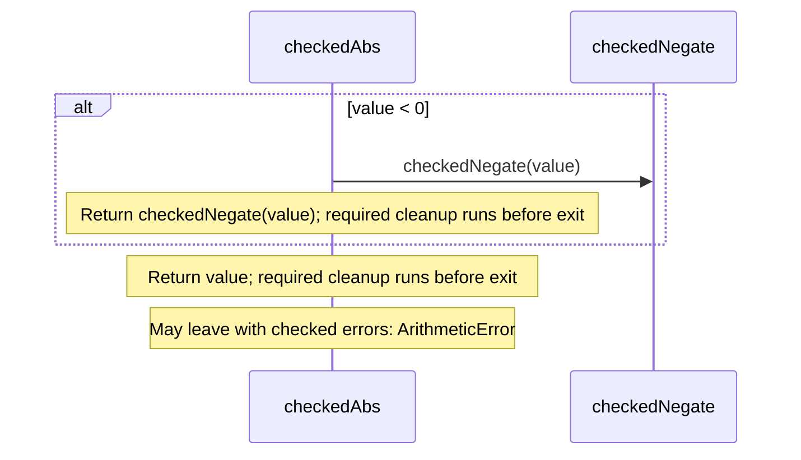
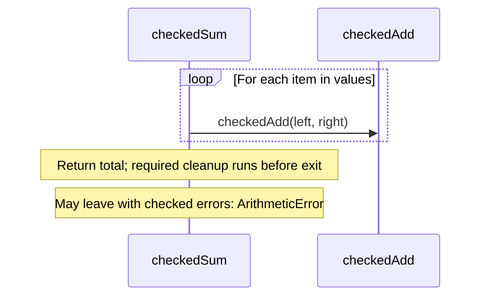

<!-- Generated by aug spec. Edit the August source, then regenerate. -->

# august/math/integers.aug diagrams

[Project overview](../../../diagrams/index.md) · [Compiled explanation](integers.aug.md)

## Class interactions

No relationships at this level.

## API calls

## Sequences

Call arrows identify checked targets; loop and branch frames determine when they run. Open that target’s module to follow its implementation. Branches describe alternatives; loops describe repeated work. Native calls and interface dispatch stop at their declared contracts. Exit notes end that path; enclosing recovery and cleanup remain visible.

### checkedAdd

[Source](integers.aug#L4)

### checkedSubtract

[Source](integers.aug#L11)

### checkedMultiply

[Source](integers.aug#L18)

### checkedDivide

[Source](integers.aug#L29)

### checkedNegate

[Source](integers.aug#L35)

### checkedAbs

[Source](integers.aug#L41)

### checkedSum

[Source](integers.aug#L47)

## Called contracts

- [checkedAdd](integers.aug.diagrams.md#sequence-checkedAdd) — august/math/integers.aug
- [checkedNegate](integers.aug.diagrams.md#sequence-checkedNegate) — august/math/integers.aug
