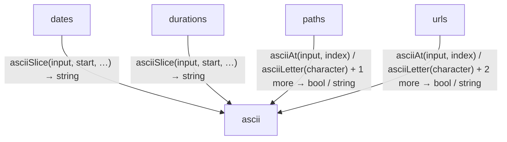
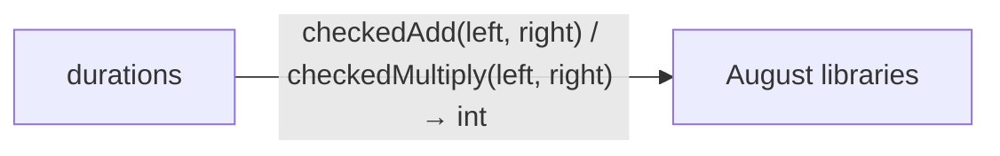

<!-- Generated by aug spec. Edit the August source, then regenerate. -->

# Project diagrams

Start here to see what moves between the application’s folders. Each arrow names an operation’s inputs and the result it returns to its caller. Open a folder for the next level of detail. Expand the contract list for complete types and dependency links.

## Data flow

### Package boundaries

durations package calls

Data crossing these boundaries (11 contracts)

| From | To | Operation and inputs | Result |
| --- | --- | --- | --- |
| dates | ascii | [asciiSlice](../../ascii.aug.md) · input: Bytes, start: int, end: int | string |
| durations | August libraries | [checkedAdd](../august/0.23.0/math/integers.aug.md) · left: int, right: int | int |
| durations | August libraries | [checkedMultiply](../august/0.23.0/math/integers.aug.md) · left: int, right: int | int |
| durations | ascii | [asciiSlice](../../ascii.aug.md) · input: Bytes, start: int, end: int | string |
| paths | ascii | [asciiAt](../../ascii.aug.md) · input: Bytes, index: int | string |
| paths | ascii | [asciiLetter](../../ascii.aug.md) · character: string | bool |
| paths | ascii | [asciiLower](../../ascii.aug.md) · text: string | string |
| urls | ascii | [asciiAt](../../ascii.aug.md) · input: Bytes, index: int | string |
| urls | ascii | [asciiLetter](../../ascii.aug.md) · character: string | bool |
| urls | ascii | [asciiLower](../../ascii.aug.md) · text: string | string |
| urls | ascii | [asciiSlice](../../ascii.aug.md) · input: Bytes, start: int, end: int | string |

## Open a module

| Module | Read |
| --- | --- |
| august/values/ascii.aug | [Flow and sequences](../../ascii.aug.diagrams.md) · [Explanation](../../ascii.aug.md) |
| august/values/dates.aug | [Flow and sequences](../../dates.aug.diagrams.md) · [Explanation](../../dates.aug.md) |
| august/values/durations.aug | [Flow and sequences](../../durations.aug.diagrams.md) · [Explanation](../../durations.aug.md) |
| august/values/export.aug | [Flow and sequences](../../export.aug.diagrams.md) · [Explanation](../../export.aug.md) |
| august/values/paths.aug | [Flow and sequences](../../paths.aug.diagrams.md) · [Explanation](../../paths.aug.md) |
| august/values/retries.aug | [Flow and sequences](../../retries.aug.diagrams.md) · [Explanation](../../retries.aug.md) |
| august/values/text.aug | [Flow and sequences](../../text.aug.diagrams.md) · [Explanation](../../text.aug.md) |
| august/values/urls.aug | [Flow and sequences](../../urls.aug.diagrams.md) · [Explanation](../../urls.aug.md) |

These are static call boundaries, not a request trace. Interface implementations and foreign internals stop at their checked contracts. Dotted arrows defer a callback or browser action. Imports alone do not imply a call.
