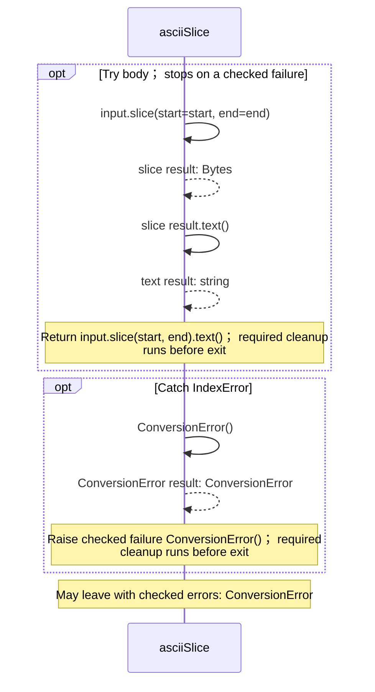
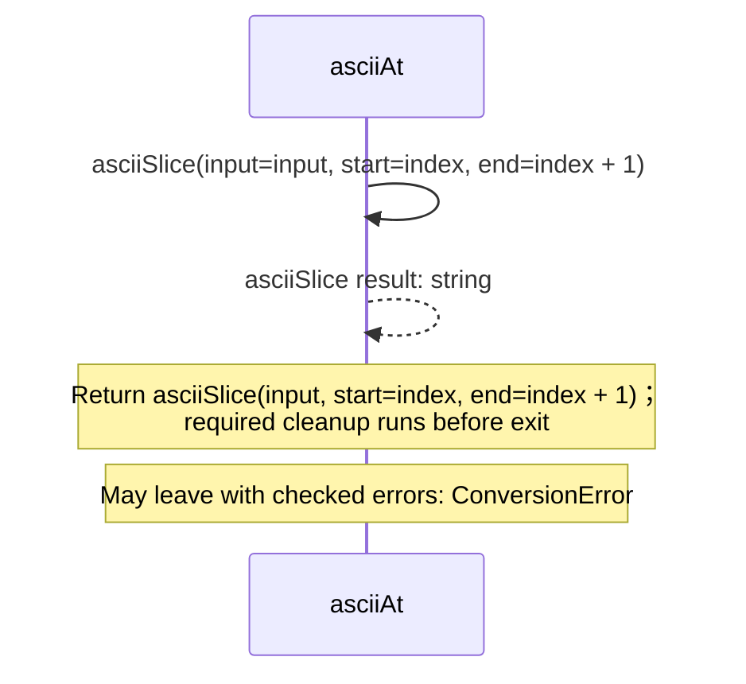
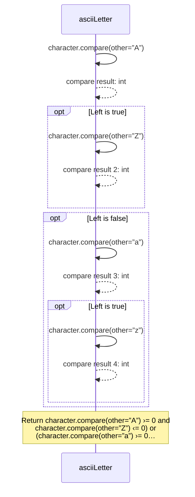
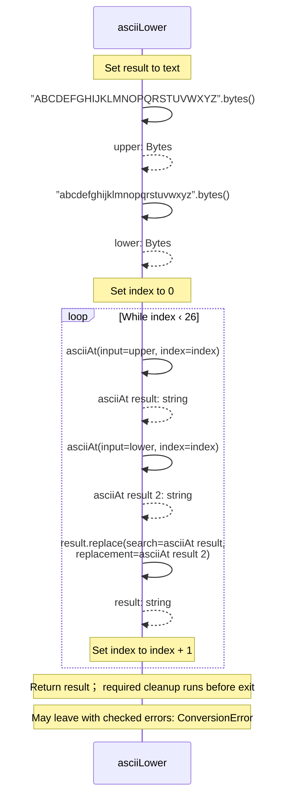

<!-- Generated by aug spec. Edit the August source, then regenerate. -->

# august/values/ascii.aug diagrams

[Project overview](.aug-spec/diagrams/index.md) · [Compiled explanation](ascii.aug.md)

## Sequences

Call arrows identify checked targets; loop and branch frames determine when they run. Open that target’s module to follow its implementation. Branches describe alternatives; loops describe repeated work. Native calls and interface dispatch stop at their declared contracts. Exit notes end that path; enclosing recovery and cleanup remain visible.

### asciiSlice

[Source](ascii.aug#L3)

### asciiAt

[Source](ascii.aug#L10)

### asciiLetter

[Source](ascii.aug#L14)

### asciiLower

[Source](ascii.aug#L21)

## Called contracts

- [asciiAt](ascii.aug.diagrams.md#sequence-asciiAt) — august/values/ascii.aug
- [asciiSlice](ascii.aug.diagrams.md#sequence-asciiSlice) — august/values/ascii.aug
