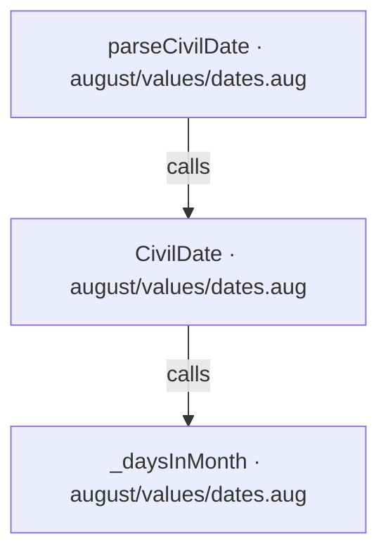
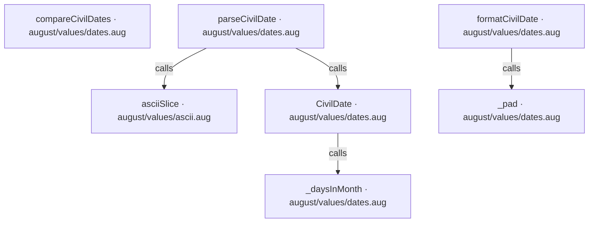
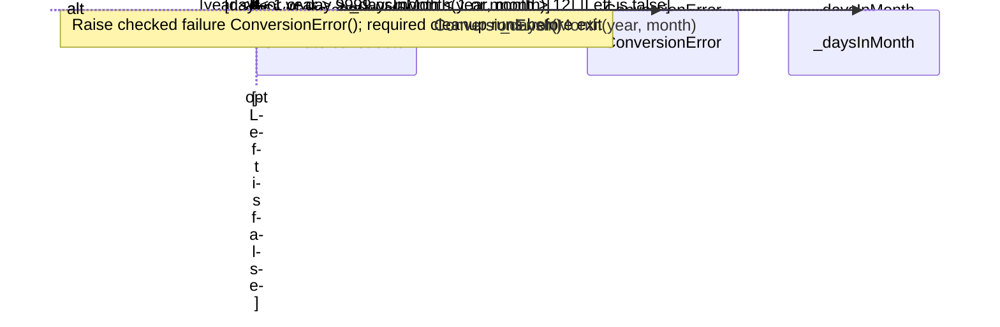
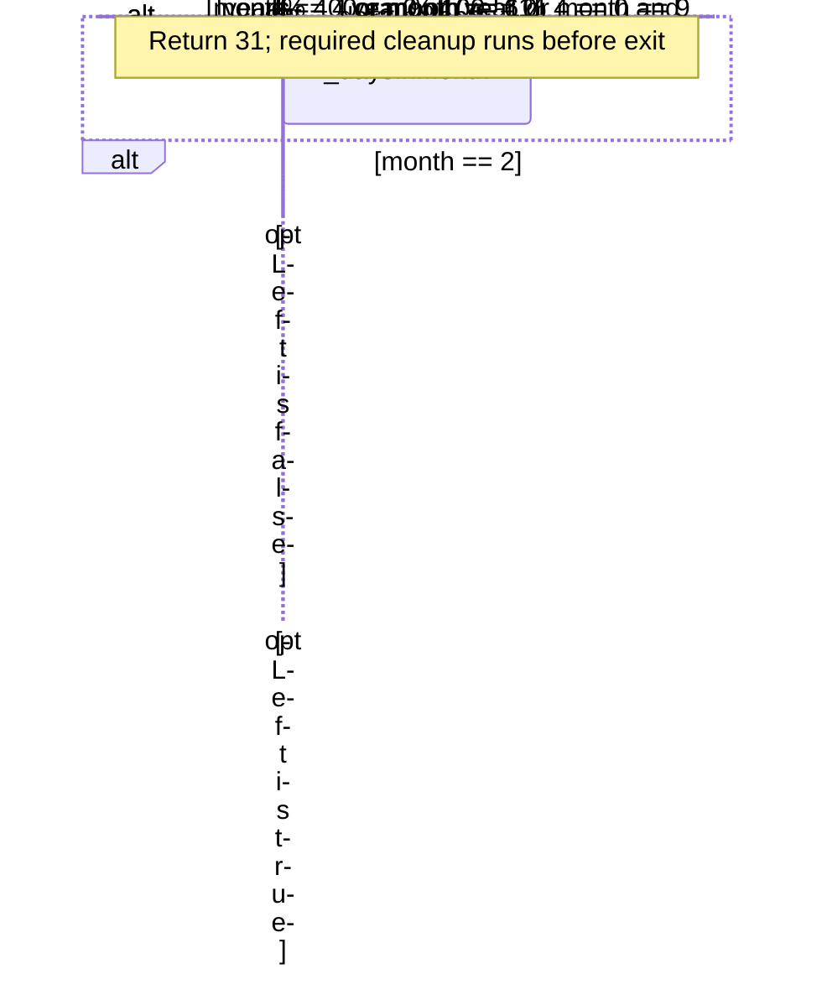
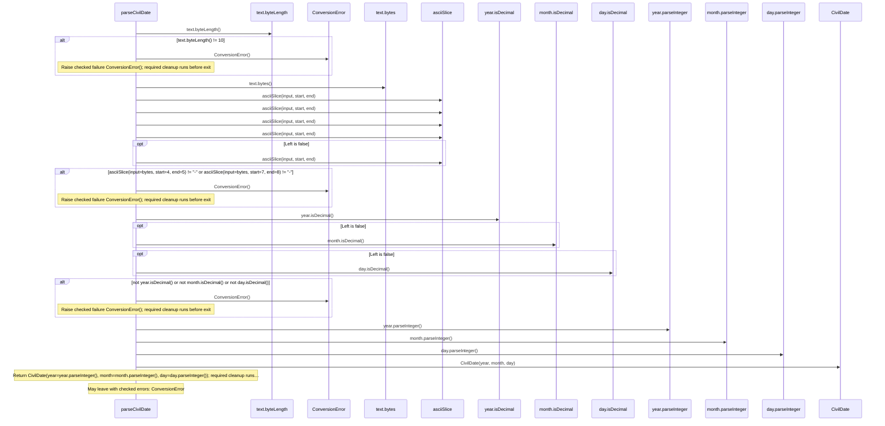
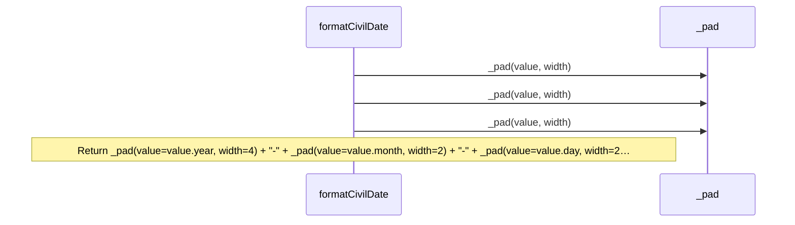
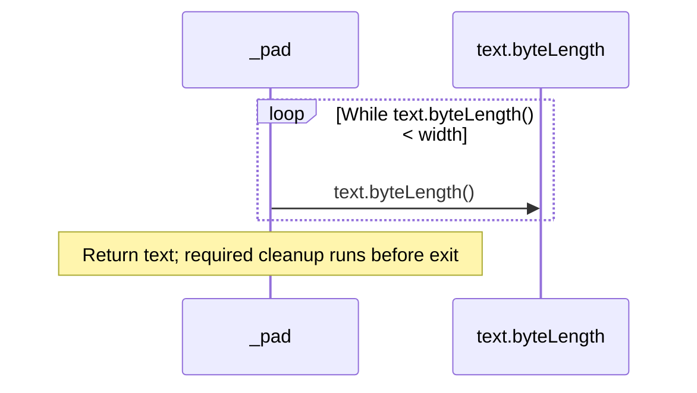
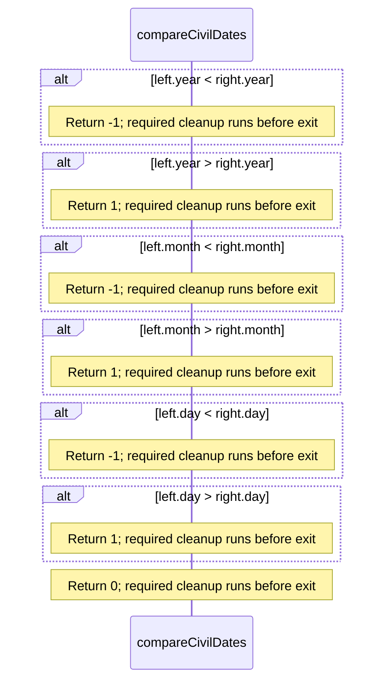

<!-- Generated by aug spec. Edit the August source, then regenerate. -->

# august/values/dates.aug diagrams

[Project overview](.aug-spec/diagrams/index.md) · [Compiled explanation](dates.aug.md)

## Class interactions

## API calls

## Sequences

Call arrows identify checked targets; loop and branch frames determine when they run. Open that target’s module to follow its implementation. Branches describe alternatives; loops describe repeated work. Native calls and interface dispatch stop at their declared contracts. Exit notes end that path; enclosing recovery and cleanup remain visible.

### CivilDate constructor

[Source](dates.aug#L10)

### \_daysInMonth

[Source](dates.aug#L17)

### parseCivilDate

[Source](dates.aug#L29)

### formatCivilDate

[Source](dates.aug#L43)

### \_pad

[Source](dates.aug#L46)

### compareCivilDates

[Source](dates.aug#L53)

## Called contracts

- [asciiSlice](ascii.aug.diagrams.md#sequence-asciiSlice) — august/values/ascii.aug
- [CivilDate](dates.aug.diagrams.md#sequence-CivilDate-20-constructor) — august/values/dates.aug
- [\_daysInMonth](dates.aug.diagrams.md#sequence-_daysInMonth) — august/values/dates.aug
- [\_pad](dates.aug.diagrams.md#sequence-_pad) — august/values/dates.aug
