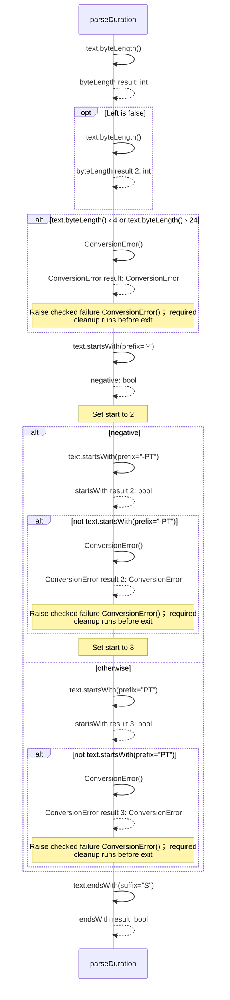
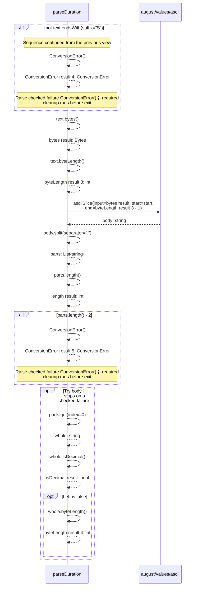
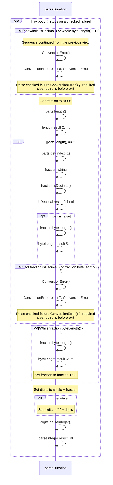
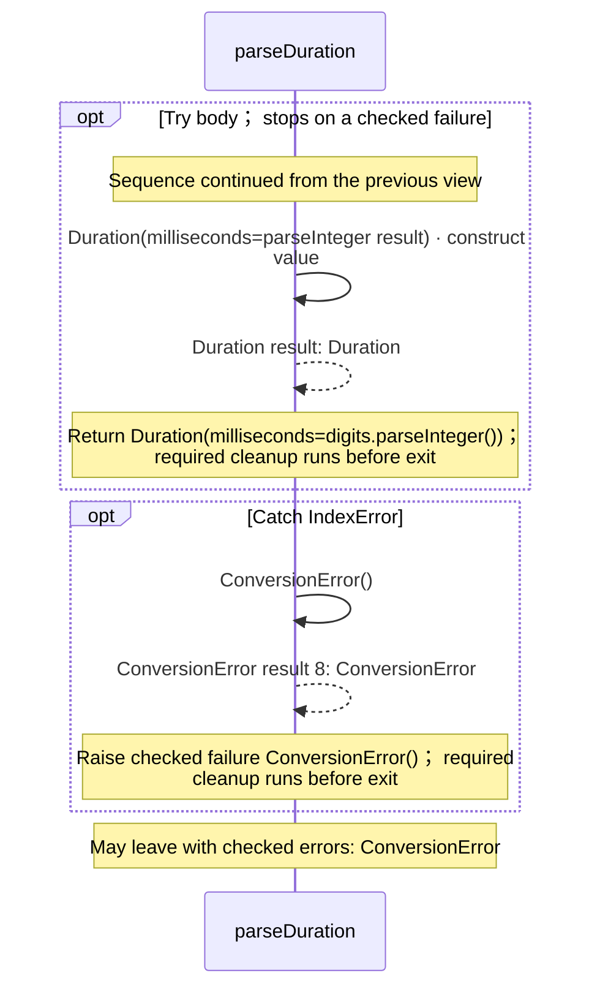
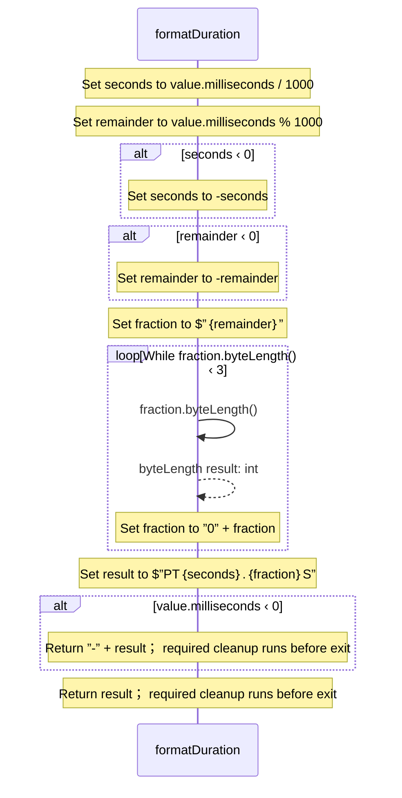
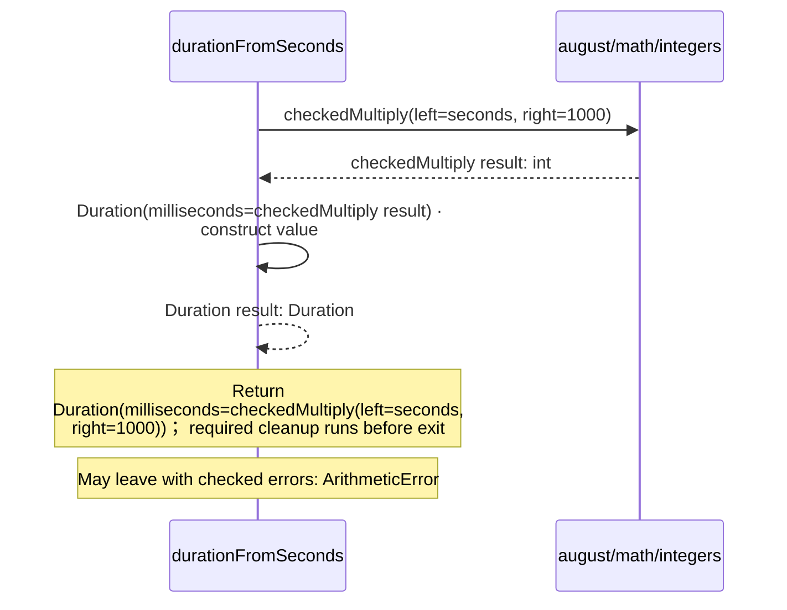
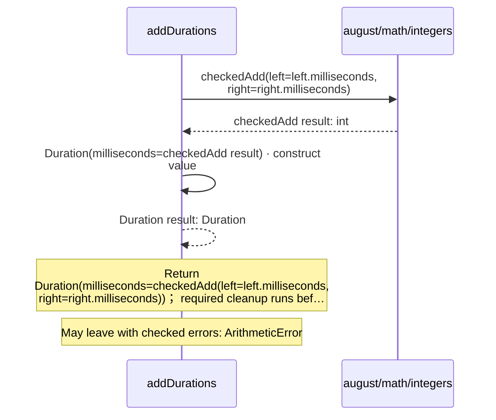
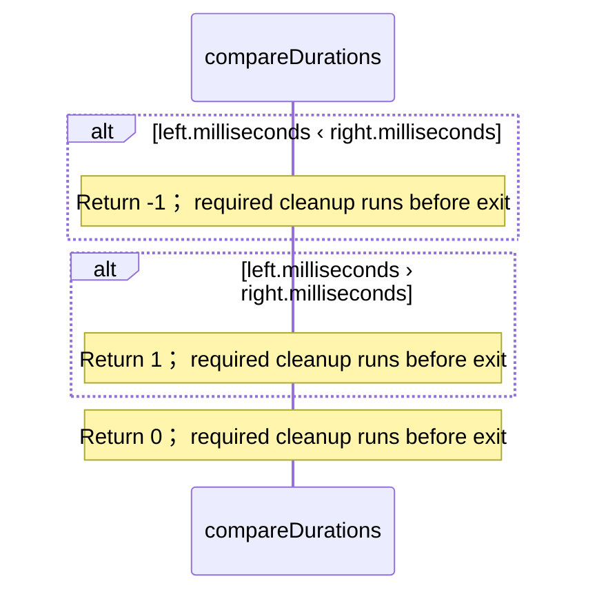

<!-- Generated by aug spec. Edit the August source, then regenerate. -->

# august/values/durations.aug diagrams

[Project overview](.aug-spec/diagrams/index.md) · [Compiled explanation](durations.aug.md)

## Sequences

Call arrows identify checked targets; loop and branch frames determine when they run. Open that target’s module to follow its implementation. Branches describe alternatives; loops describe repeated work. Native calls and interface dispatch stop at their declared contracts. Exit notes end that path; enclosing recovery and cleanup remain visible.

### Duration constructor

[Source](durations.aug#L6)

Receive fields: milliseconds. [Explanation](durations.aug.md).

### parseDuration

[Source](durations.aug#L13)

#### Sequence 1 of 4

#### Sequence 2 of 4 (continued)

#### Sequence 3 of 4 (continued)

#### Sequence 4 of 4 (continued)

### formatDuration

[Source](durations.aug#L52)

### durationFromSeconds

[Source](durations.aug#L70)

### addDurations

[Source](durations.aug#L76)

### compareDurations

[Source](durations.aug#L80)

## Called contracts

- [checkedAdd](.aug-spec/august/1.0.0/math/integers.aug.diagrams.md#sequence-checkedAdd) — august/math/integers.aug
- [checkedMultiply](.aug-spec/august/1.0.0/math/integers.aug.diagrams.md#sequence-checkedMultiply) — august/math/integers.aug
- [asciiSlice](ascii.aug.diagrams.md#sequence-asciiSlice) — august/values/ascii.aug
- [Duration](durations.aug.diagrams.md#sequence-Duration-20-constructor) — august/values/durations.aug
