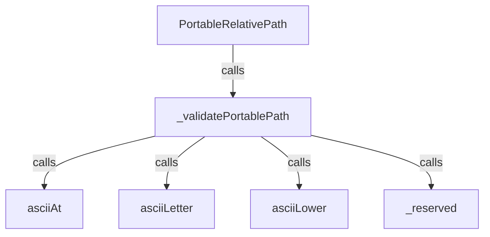
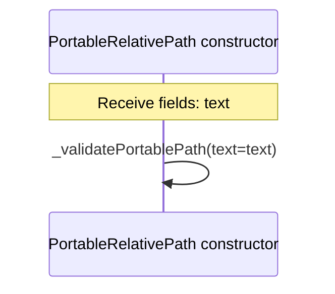
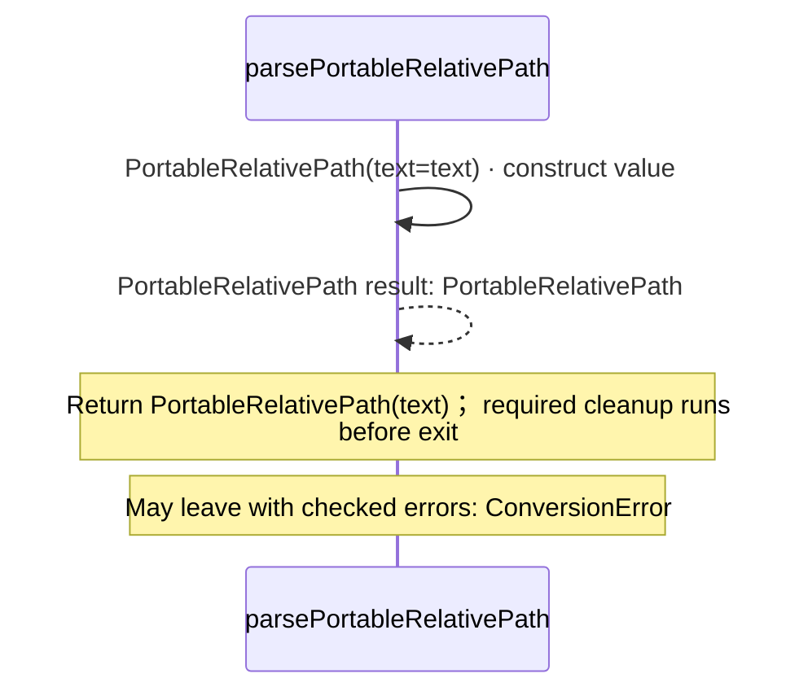
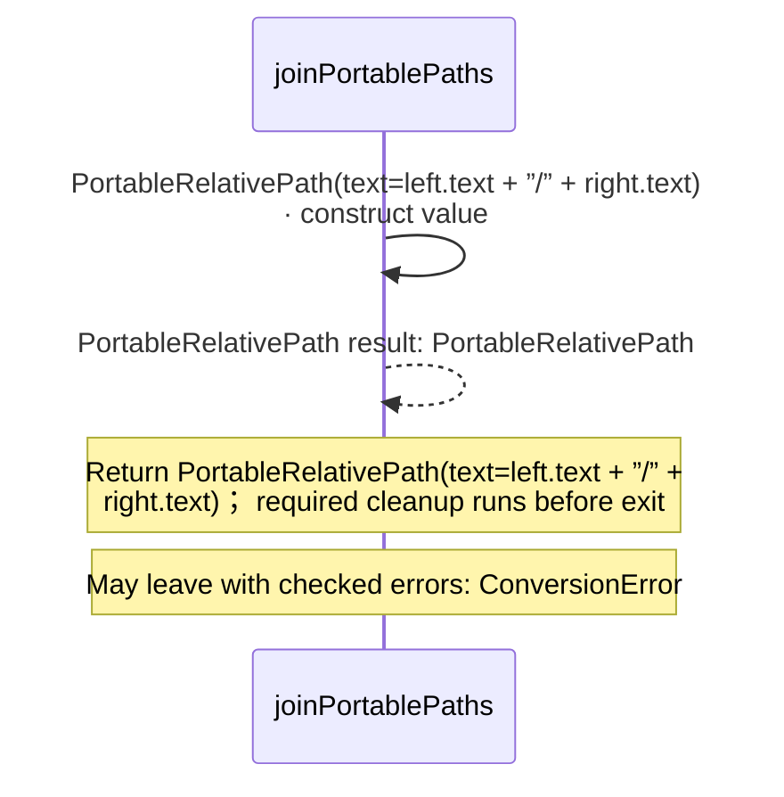
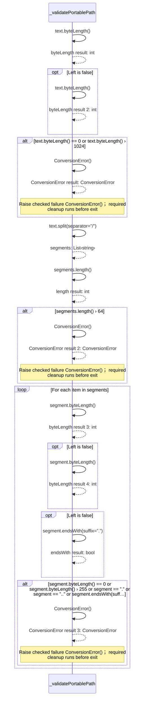
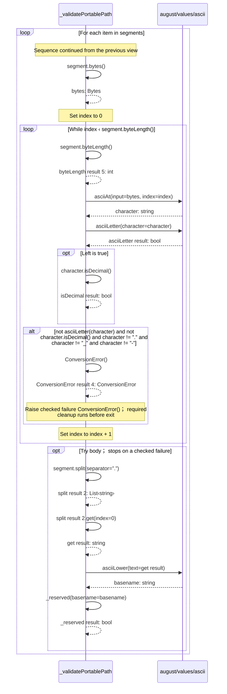
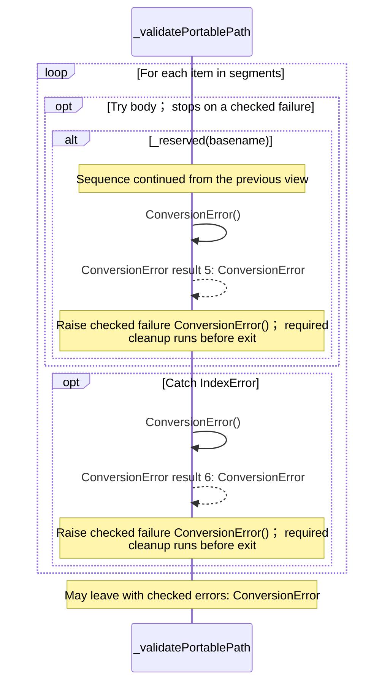

<!-- Generated by aug spec. Edit the August source, then regenerate. -->

# august/values/paths.aug diagrams

[Project overview](.aug-spec/diagrams/index.md) · [Compiled explanation](paths.aug.md)

## Class interactions

## Sequences

Call arrows identify checked targets; loop and branch frames determine when they run. Open that target’s module to follow its implementation. Branches describe alternatives; loops describe repeated work. Native calls and interface dispatch stop at their declared contracts. Exit notes end that path; enclosing recovery and cleanup remain visible.

### PortableRelativePath constructor

[Source](paths.aug#L10)

### parsePortableRelativePath

[Source](paths.aug#L17)

### formatPortableRelativePath

[Source](paths.aug#L21)

Return value.text; required cleanup runs before exit. [Explanation](paths.aug.md).

### joinPortablePaths

[Source](paths.aug#L27)

### \_validatePortablePath

[Source](paths.aug#L30)

#### Sequence 1 of 3

#### Sequence 2 of 3 (continued)

#### Sequence 3 of 3 (continued)

### \_reserved

[Source](paths.aug#L53)

Return basename == "con" or basename == "prn" or basename == "aux" or basename == "nul" or basename == "com1" or basename == "com2" or basename == "com3" or basename == "com4" or basename == "com5" or basename == "com6" or basename == "com7" or basename == "com8" or basename == "com9" or basename == "lpt1" or basename == "lpt2" or basename == "lpt3" or basename == "lpt4" or basename == "lpt5" or basename == "lpt6" or basename == "lpt7" or basename == "lpt8" or basename == "lpt9"; required cleanup runs before exit. [Explanation](paths.aug.md).

## Called contracts

- [asciiAt](ascii.aug.diagrams.md#sequence-asciiAt) — august/values/ascii.aug
- [asciiLetter](ascii.aug.diagrams.md#sequence-asciiLetter) — august/values/ascii.aug
- [asciiLower](ascii.aug.diagrams.md#sequence-asciiLower) — august/values/ascii.aug
- [PortableRelativePath](paths.aug.diagrams.md#sequence-PortableRelativePath-20-constructor) — august/values/paths.aug
- [\_reserved](paths.aug.diagrams.md#sequence-_reserved) — august/values/paths.aug
- [\_validatePortablePath](paths.aug.diagrams.md#sequence-_validatePortablePath) — august/values/paths.aug
