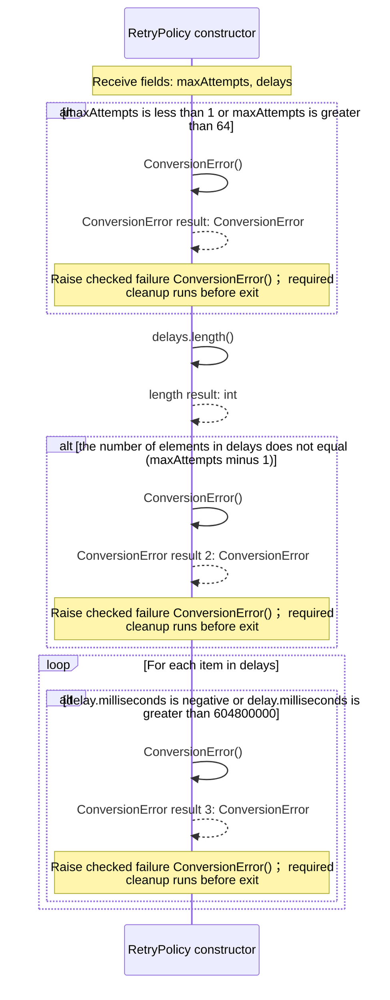
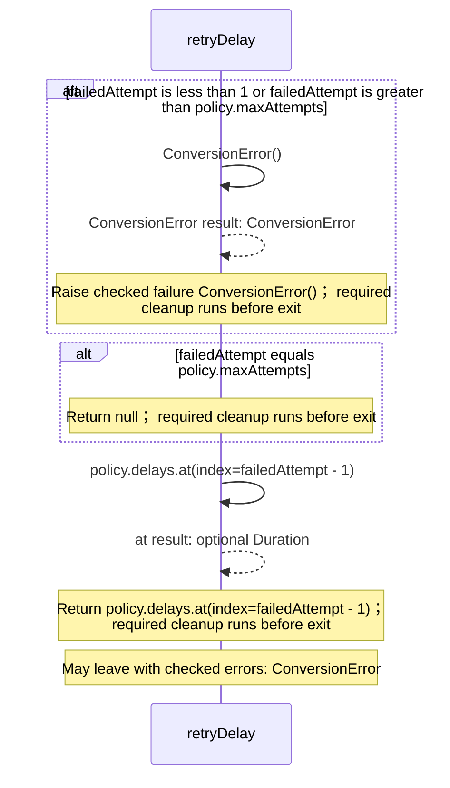

<!-- Generated by aug spec. Edit the August source, then regenerate. -->

# august/values/retries.aug diagrams

[Project overview](.aug-spec/diagrams/index.md) · [Compiled explanation](retries.aug.md)

## Sequences

Call arrows identify checked targets; loop and branch frames determine when they run. Open that target’s module to follow its implementation. Branches describe alternatives; loops describe repeated work. Native calls and interface dispatch stop at their declared contracts. Exit notes end that path; enclosing recovery and cleanup remain visible.

### RetryPolicy constructor

[Source](retries.aug#L11)

Caller-selected retry delays, stored as deeply immutable data.
Attempts are numbered from one; maxAttempts includes the initial attempt.

It takes `maxAttempts` as an integer, kept read-only (Total allowed attempts, from 1 to 64) and `delays` as `immutable List<Duration>`, kept read-only (Exactly maxAttempts - 1 durations, each from 0 to 604800000 milliseconds.
Order, duplicates and zero delays are preserved. Construction performs no operation or wait).

Construction can fail with `ConversionError`.

### retryDelay

[Source](retries.aug#L26)

Read the delay after a failed attempt, or null after the final allowed attempt.
This only reads policy data: it does not retry, sleep, classify an error or choose a recovery value.

It takes `policy` as [`RetryPolicy`](retries.aug.md#symbol-RetryPolicy) and `failedAttempt` as an integer.

Failures can raise `ConversionError` (The attempt number is outside the policy).

