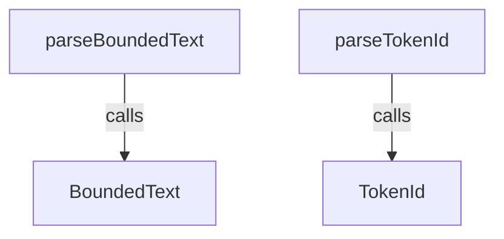
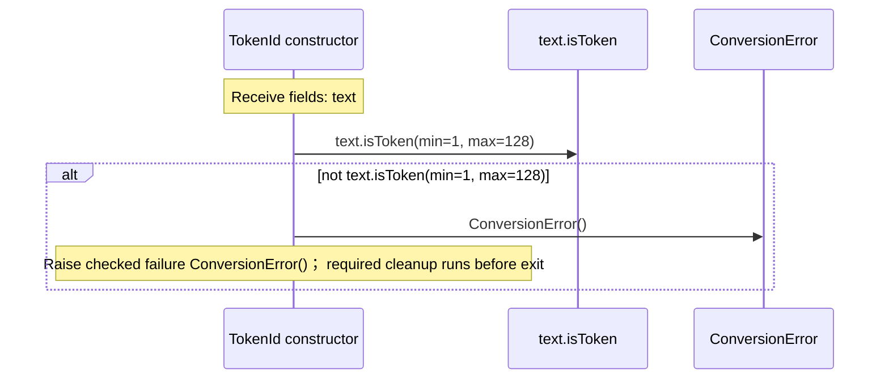
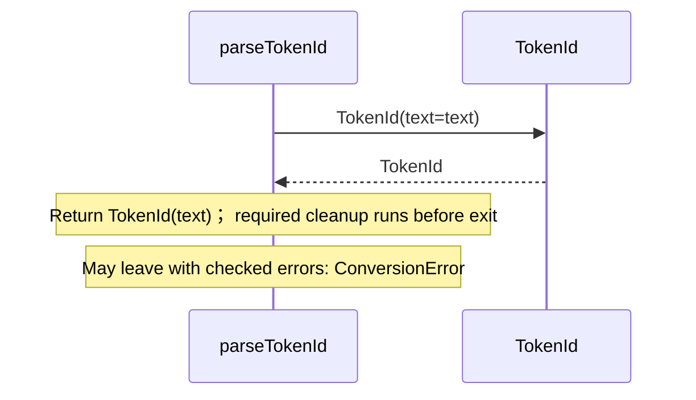
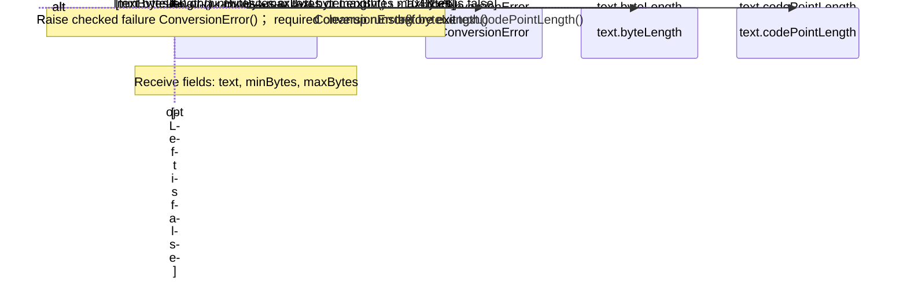
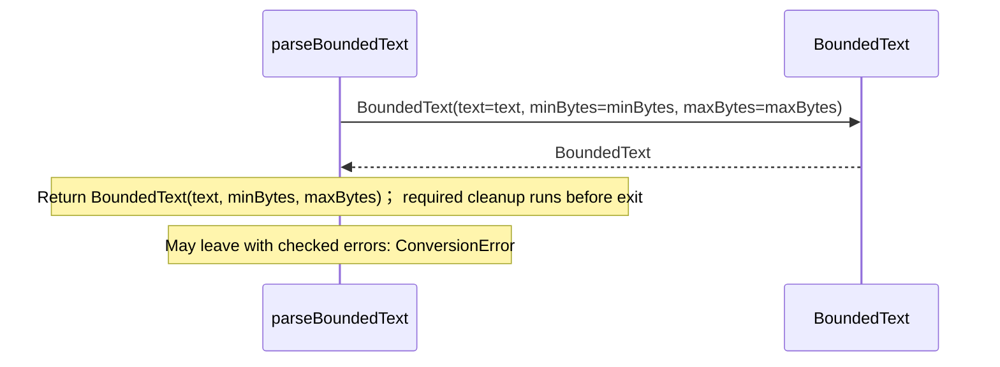

<!-- Generated by aug spec. Edit the August source, then regenerate. -->

# august/values/text.aug diagrams

[Project overview](.aug-spec/diagrams/index.md) · [Compiled explanation](text.aug.md)

Call relationships

## Sequences

Call arrows identify checked targets; loop and branch frames determine when they run. Open that target’s module to follow its implementation. Branches describe alternatives; loops describe repeated work. Native calls and interface dispatch stop at their declared contracts. Exit notes end that path; enclosing recovery and cleanup remain visible.

### TokenId constructor

[Source](text.aug#L6)

### parseTokenId

[Source](text.aug#L12)

### formatTokenId

[Source](text.aug#L16)

Return value.text; required cleanup runs before exit. [Explanation](text.aug.md).

### BoundedText constructor

[Source](text.aug#L24)

### parseBoundedText

[Source](text.aug#L35)

### formatBoundedText

[Source](text.aug#L39)

Return value.text; required cleanup runs before exit. [Explanation](text.aug.md).

## Called contracts

- [BoundedText](text.aug.diagrams.md#sequence-BoundedText-20-constructor) — august/values/text.aug
- [TokenId](text.aug.diagrams.md#sequence-TokenId-20-constructor) — august/values/text.aug
