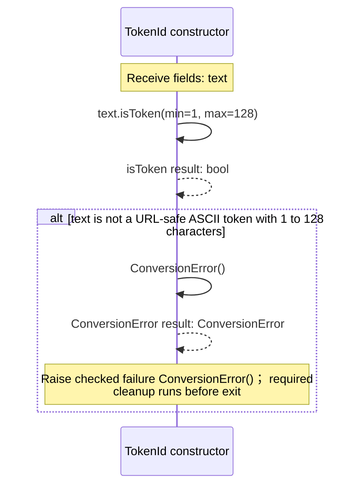
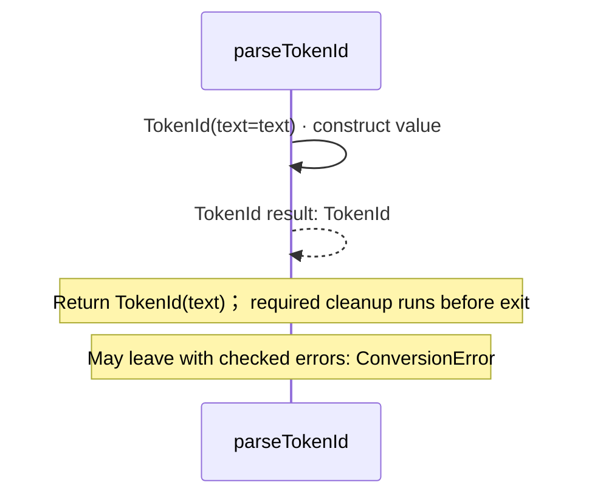
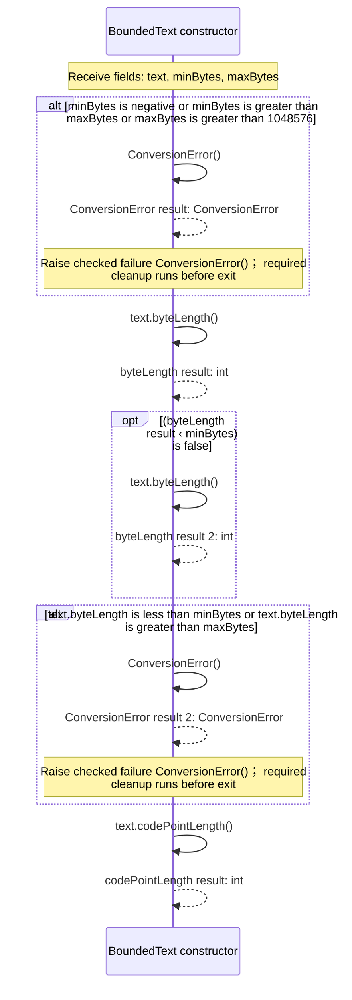
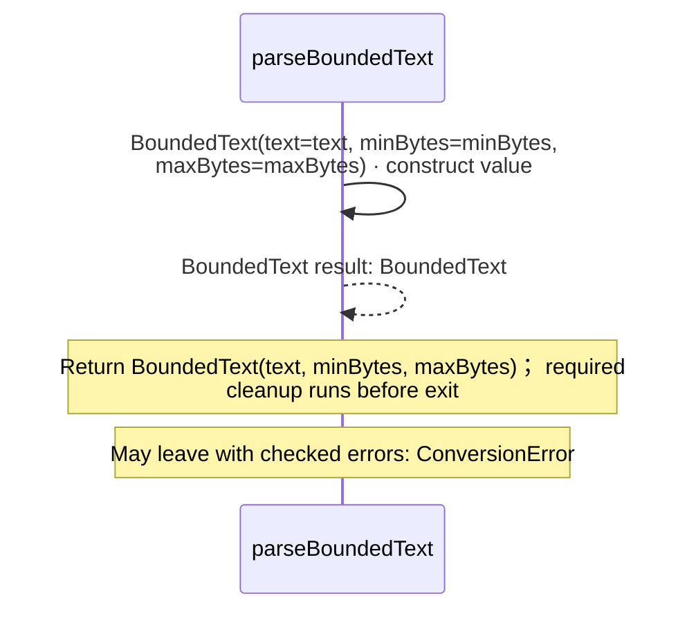

<!-- Generated by aug spec. Edit the August source, then regenerate. -->

# august/values/text.aug diagrams

[Project overview](.aug-spec/diagrams/index.md) · [Compiled explanation](text.aug.md)

## Sequences

Call arrows identify checked targets; loop and branch frames determine when they run. Open that target’s module to follow its implementation. Branches describe alternatives; loops describe repeated work. Native calls and interface dispatch stop at their declared contracts. Exit notes end that path; enclosing recovery and cleanup remain visible.

### TokenId constructor

[Source](text.aug#L6)

Case-sensitive application identifier: 1 to 128 ASCII letters, digits, hyphen, period, underscore or tilde.
This is the RFC 3986 unreserved character set. The original spelling is retained.

It takes `text` as a string, kept read-only.

Construction can fail with `ConversionError`.

### parseTokenId

[Source](text.aug#L12)

Validate an identifier without normalizing it. Raises ConversionError for the same inputs as TokenId.

It takes `text` as a string.

Failures can raise `ConversionError`.

### formatTokenId

[Source](text.aug#L16)

Return the original identifier text.

It takes `value` as [`TokenId`](text.aug.md#symbol-TokenId).

Return value.text; required cleanup runs before exit. [Explanation](text.aug.md).

### BoundedText constructor

[Source](text.aug#L24)

Valid UTF-8 text with inclusive byte bounds. Preserve combining sequences and embedded NUL.

It takes `text` as a string, kept read-only, `minBytes` as an integer, kept read-only (Minimum UTF-8 storage bytes, including zero), and `maxBytes` as an integer, kept read-only (Maximum storage bytes; require minBytes <= maxBytes <= 1048576).

Construction can fail with `ConversionError`.

### parseBoundedText

[Source](text.aug#L35)

Validate original UTF-8 text and inclusive byte bounds without normalization.

It takes `text` as a string and `minBytes` and `maxBytes` as integers.

Failures can raise `ConversionError` (Invalid bounds, length or UTF-8).

### formatBoundedText

[Source](text.aug#L39)

Return the original text, including embedded NUL and combining sequences.

It takes `value` as [`BoundedText`](text.aug.md#symbol-BoundedText).

Return value.text; required cleanup runs before exit. [Explanation](text.aug.md).

## Called contracts

- [BoundedText](text.aug.diagrams.md#sequence-BoundedText-20-constructor) — august/values/text.aug
- [TokenId](text.aug.diagrams.md#sequence-TokenId-20-constructor) — august/values/text.aug
