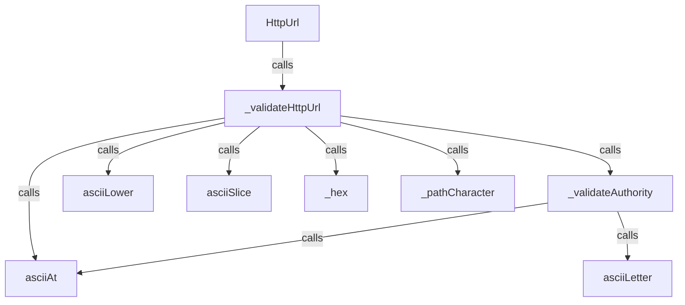
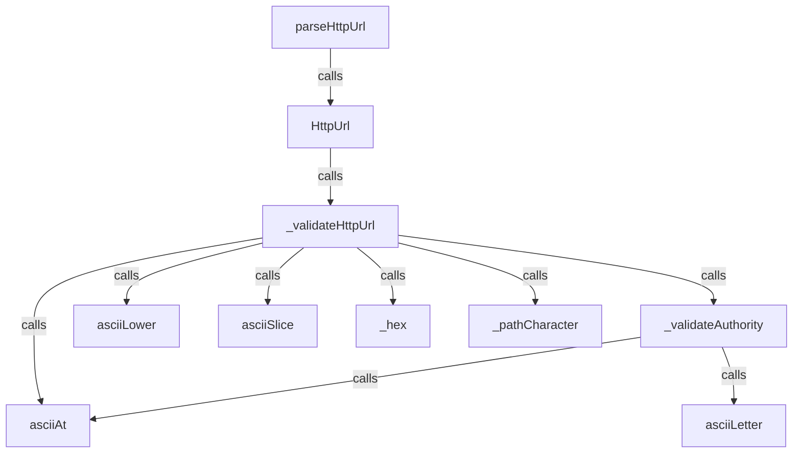
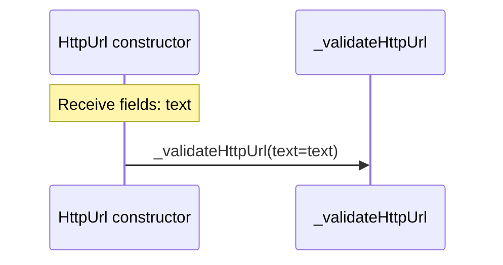
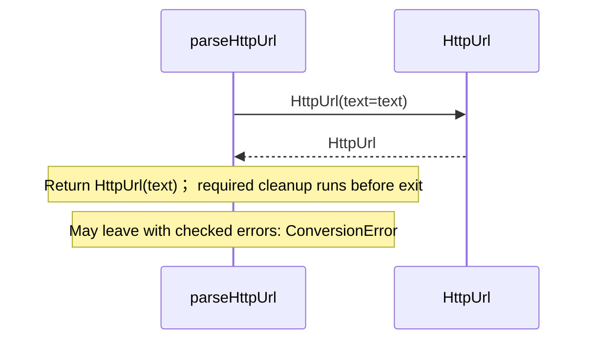
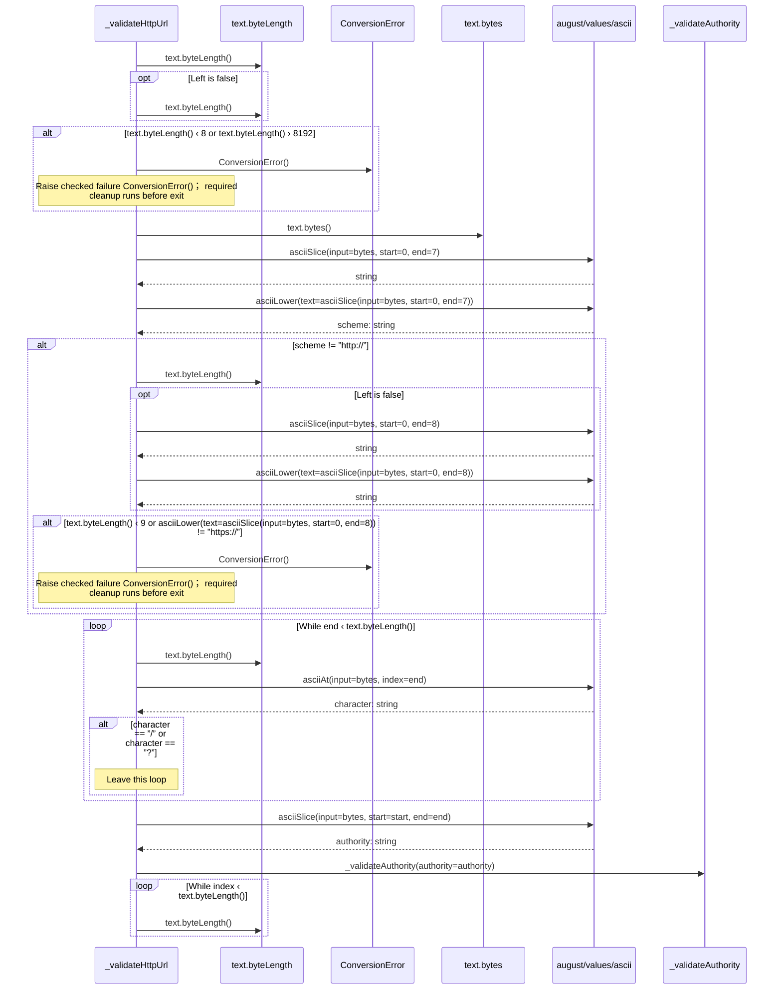
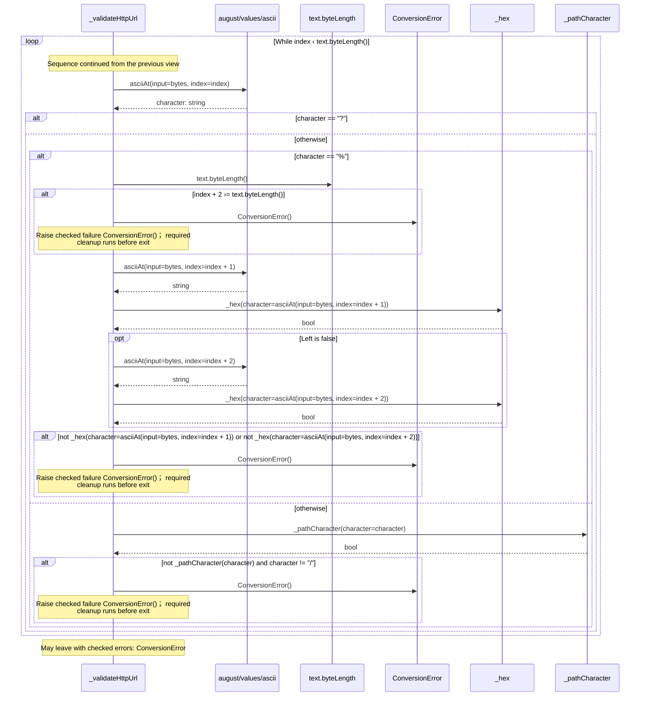
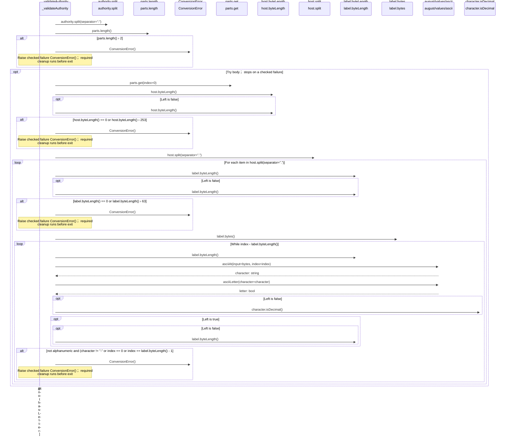
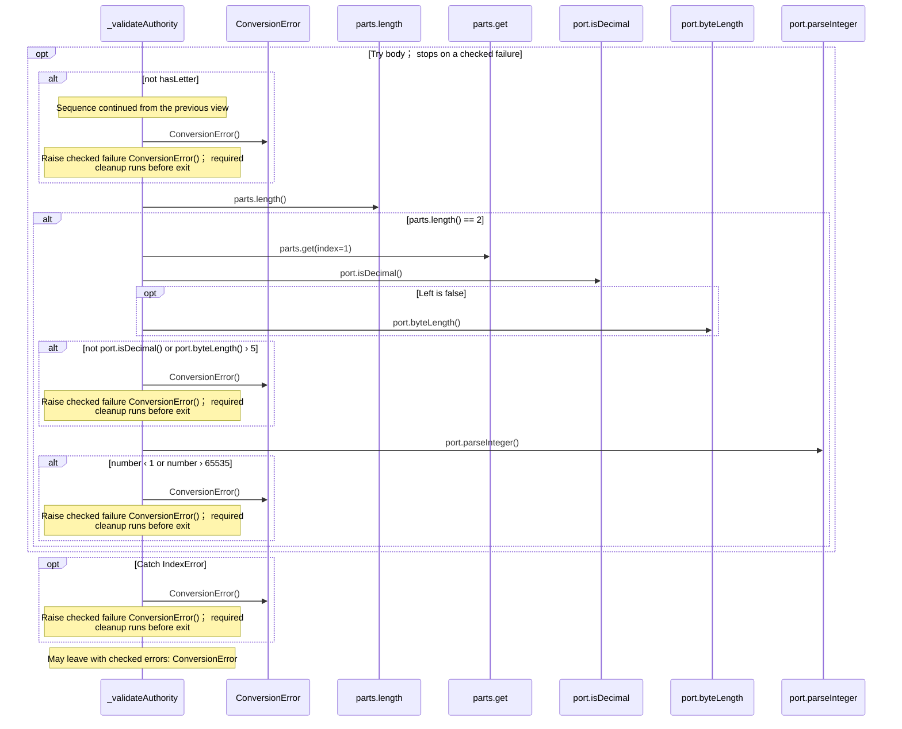
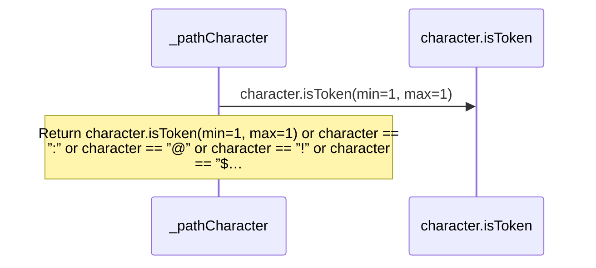
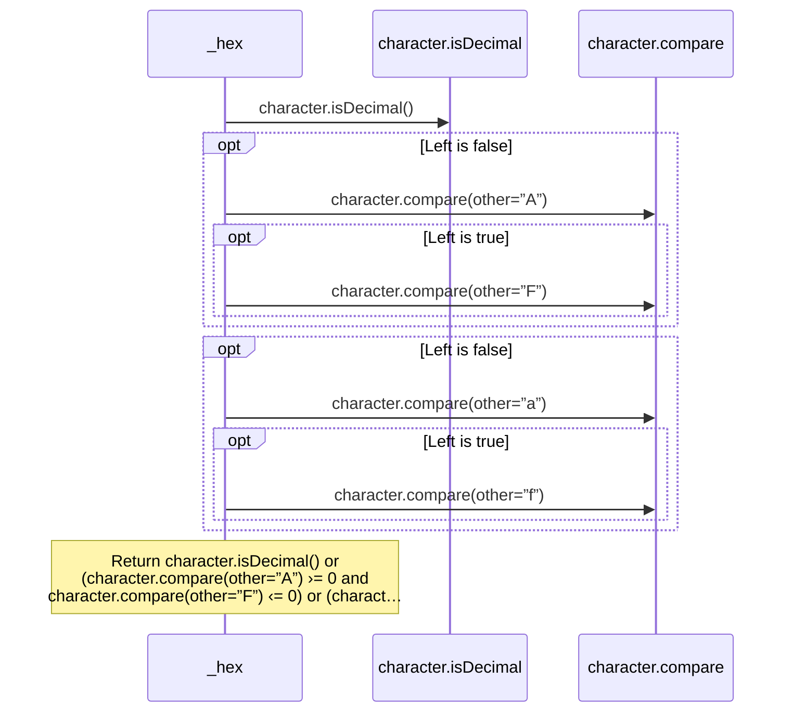

<!-- Generated by aug spec. Edit the August source, then regenerate. -->

# august/values/urls.aug diagrams

[Project overview](.aug-spec/diagrams/index.md) · [Compiled explanation](urls.aug.md)

## Class interactions

Call relationships

## Sequences

Call arrows identify checked targets; loop and branch frames determine when they run. Open that target’s module to follow its implementation. Branches describe alternatives; loops describe repeated work. Native calls and interface dispatch stop at their declared contracts. Exit notes end that path; enclosing recovery and cleanup remain visible.

### HttpUrl constructor

[Source](urls.aug#L10)

### parseHttpUrl

[Source](urls.aug#L17)

### formatHttpUrl

[Source](urls.aug#L21)

Return value.text; required cleanup runs before exit. [Explanation](urls.aug.md).

### \_validateHttpUrl

[Source](urls.aug#L24)

#### Sequence 1 of 2 (continued)

#### Sequence 2 of 2 (continued)

### \_validateAuthority

[Source](urls.aug#L59)

#### Sequence 1 of 2 (continued)

#### Sequence 2 of 2 (continued)

### \_pathCharacter

[Source](urls.aug#L93)

### \_hex

[Source](urls.aug#L111)

## Called contracts

- [asciiAt](ascii.aug.diagrams.md#sequence-asciiAt) — august/values/ascii.aug
- [asciiLetter](ascii.aug.diagrams.md#sequence-asciiLetter) — august/values/ascii.aug
- [asciiLower](ascii.aug.diagrams.md#sequence-asciiLower) — august/values/ascii.aug
- [asciiSlice](ascii.aug.diagrams.md#sequence-asciiSlice) — august/values/ascii.aug
- [HttpUrl](urls.aug.diagrams.md#sequence-HttpUrl-20-constructor) — august/values/urls.aug
- [\_hex](urls.aug.diagrams.md#sequence-_hex) — august/values/urls.aug
- [\_pathCharacter](urls.aug.diagrams.md#sequence-_pathCharacter) — august/values/urls.aug
- [\_validateAuthority](urls.aug.diagrams.md#sequence-_validateAuthority) — august/values/urls.aug
- [\_validateHttpUrl](urls.aug.diagrams.md#sequence-_validateHttpUrl) — august/values/urls.aug
