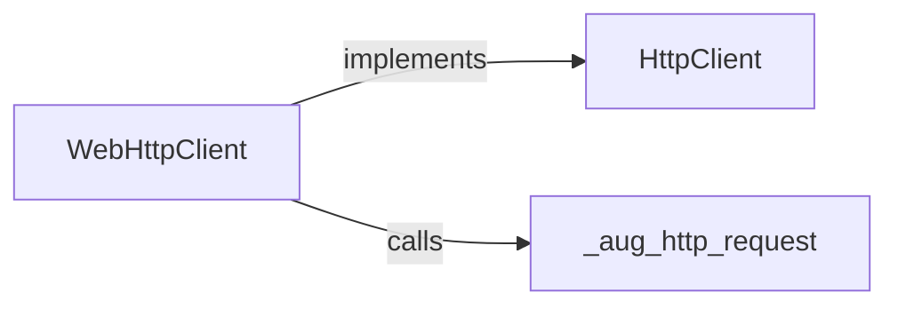
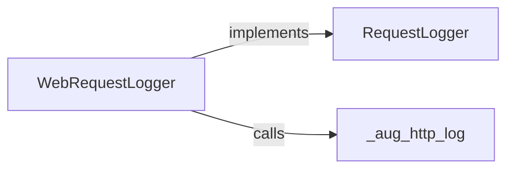
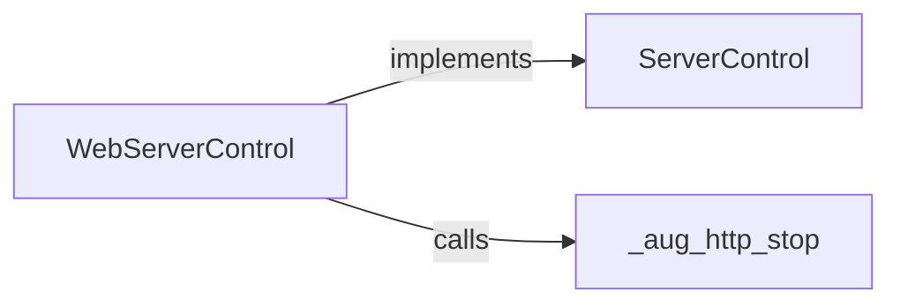
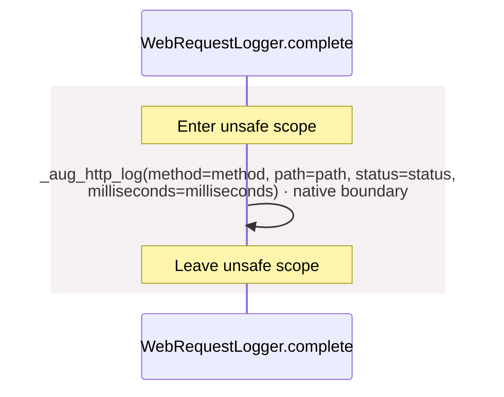
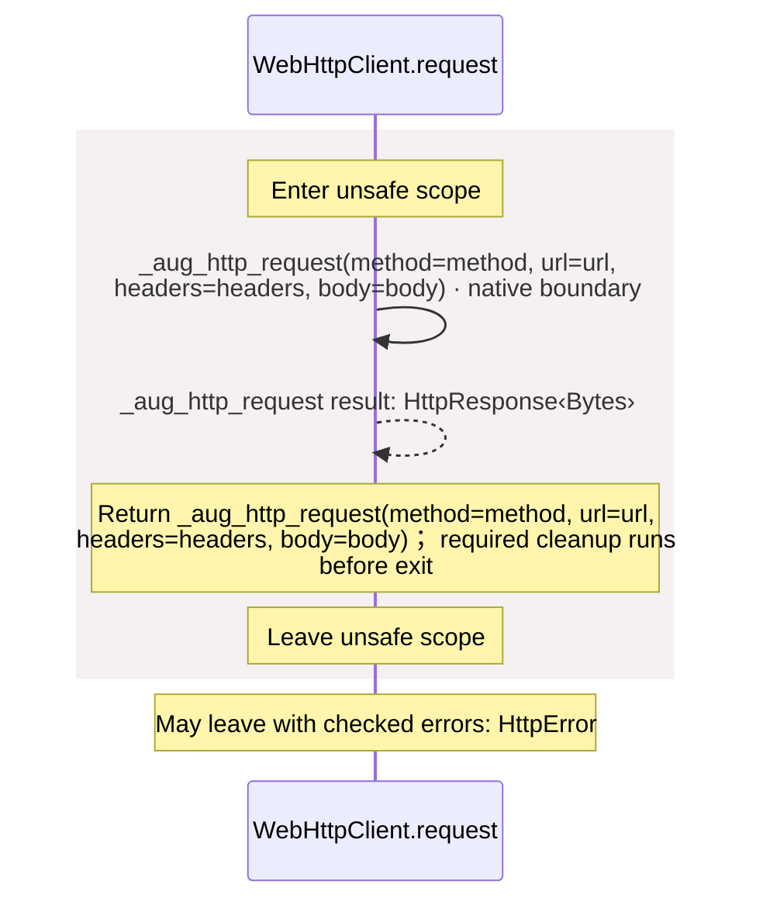
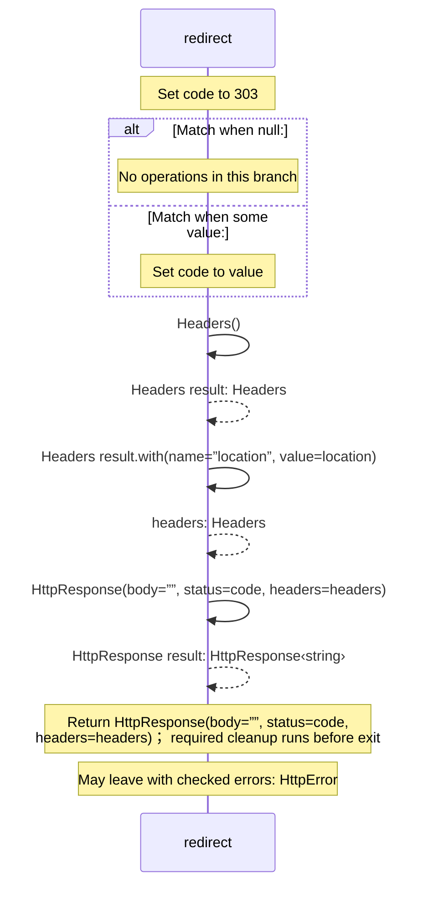
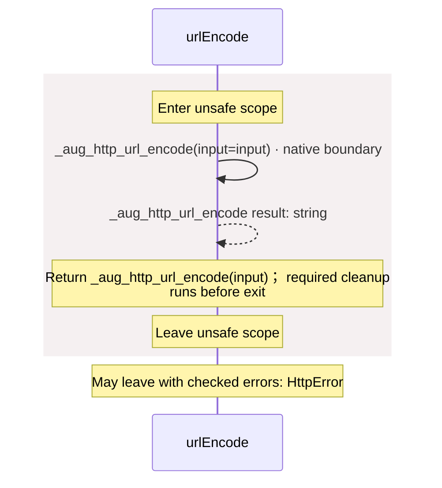
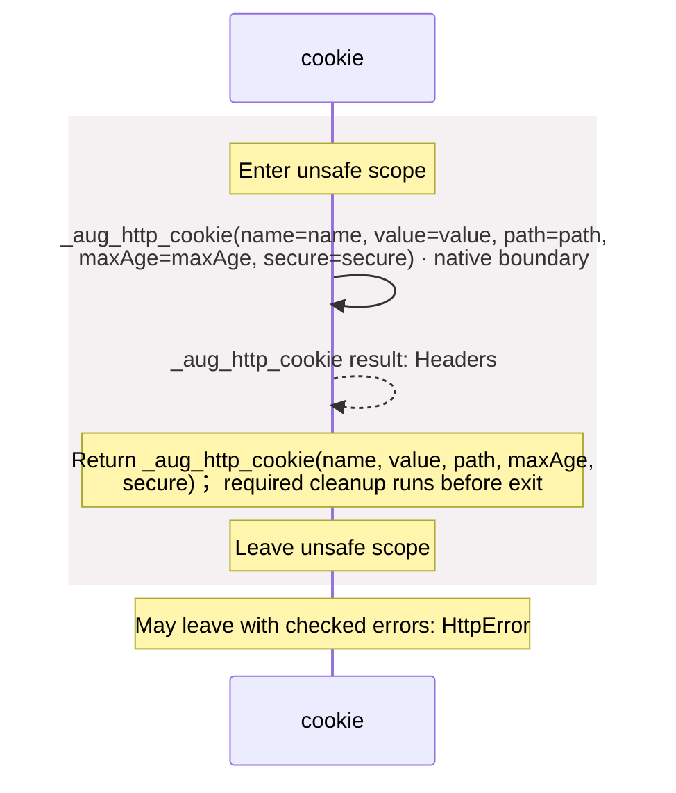
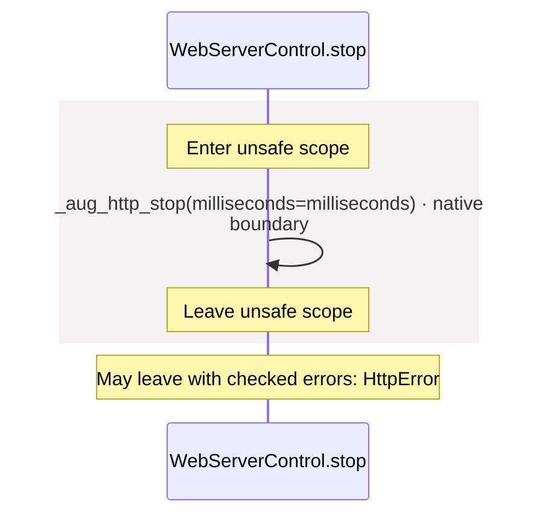

<!-- Generated by aug spec. Edit the August source, then regenerate. -->

# contracts.aug diagrams

[Project overview](.aug-spec/diagrams/index.md) · [Compiled explanation](contracts.aug.md)

## Class interactions

### WebHttpClient

### WebRequestLogger

### WebServerControl

## Sequences

Call arrows identify checked targets; loop and branch frames determine when they run. Open that target’s module to follow its implementation. Branches describe alternatives; loops describe repeated work. Native calls and interface dispatch stop at their declared contracts. Exit notes end that path; enclosing recovery and cleanup remain visible.

### Principal constructor

[Source](contracts.aug#L3)

Receive fields: subject, permissions. [Explanation](contracts.aug.md).

### Authentication.authenticate

[Source](contracts.aug#L7)

May leave with checked errors: HttpError. Interface contract; implementation selected at runtime. [Explanation](contracts.aug.md).

### Authorization.authorize

[Source](contracts.aug#L11)

May leave with checked errors: HttpError. Interface contract; implementation selected at runtime. [Explanation](contracts.aug.md).

### RequestLogger.complete

[Source](contracts.aug#L15)

Interface contract; implementation selected at runtime. [Explanation](contracts.aug.md).

### \_aug\_http\_log

[Source](contracts.aug#L17)

Native implementation; only the declared contract is known. [Explanation](contracts.aug.md).

### WebRequestLogger constructor

[Source](contracts.aug#L19)

[Explanation](contracts.aug.md).

### WebRequestLogger.complete

[Source](contracts.aug#L20)

### HttpClient.request

[Source](contracts.aug#L27)

May leave with checked errors: HttpError. Interface contract; implementation selected at runtime. [Explanation](contracts.aug.md).

### \_aug\_http\_request

[Source](contracts.aug#L29)

May leave with checked errors: HttpError. Native implementation; only the declared contract is known. [Explanation](contracts.aug.md).

### WebHttpClient constructor

[Source](contracts.aug#L32)

[Explanation](contracts.aug.md).

### WebHttpClient.request

[Source](contracts.aug#L33)

### redirect

[Source](contracts.aug#L38)

### \_aug\_http\_url\_encode

[Source](contracts.aug#L48)

May leave with checked errors: HttpError. Native implementation; only the declared contract is known. [Explanation](contracts.aug.md).

### urlEncode

[Source](contracts.aug#L50)

### \_aug\_http\_cookie

[Source](contracts.aug#L54)

May leave with checked errors: HttpError. Native implementation; only the declared contract is known. [Explanation](contracts.aug.md).

### cookie

[Source](contracts.aug#L56)

### ServerControl.stop

[Source](contracts.aug#L63)

May leave with checked errors: HttpError. Interface contract; implementation selected at runtime. [Explanation](contracts.aug.md).

### \_aug\_http\_stop

[Source](contracts.aug#L65)

May leave with checked errors: HttpError. Native implementation; only the declared contract is known. [Explanation](contracts.aug.md).

### WebServerControl constructor

[Source](contracts.aug#L67)

[Explanation](contracts.aug.md).

### WebServerControl.stop

[Source](contracts.aug#L68)

## Called contracts

- [HttpClient](contracts.aug.diagrams.md) — contracts.aug
- [RequestLogger](contracts.aug.diagrams.md) — contracts.aug
- [ServerControl](contracts.aug.diagrams.md) — contracts.aug
- [\_aug\_http\_cookie](contracts.aug.diagrams.md#sequence-_aug_http_cookie) — contracts.aug
- [\_aug\_http\_log](contracts.aug.diagrams.md#sequence-_aug_http_log) — contracts.aug
- [\_aug\_http\_request](contracts.aug.diagrams.md#sequence-_aug_http_request) — contracts.aug
- [\_aug\_http\_stop](contracts.aug.diagrams.md#sequence-_aug_http_stop) — contracts.aug
- [\_aug\_http\_url\_encode](contracts.aug.diagrams.md#sequence-_aug_http_url_encode) — contracts.aug
