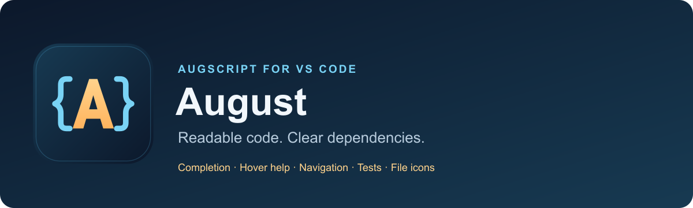
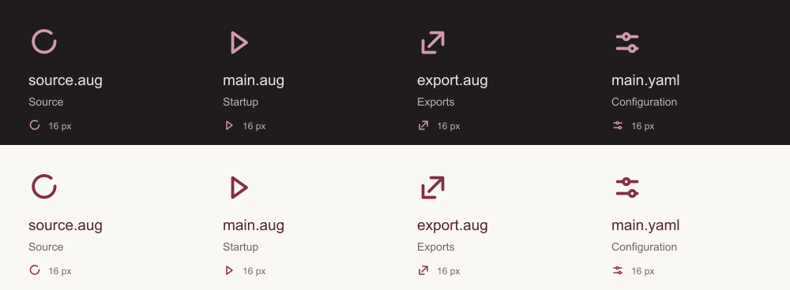

# AugScript for VS Code

**The world runs on language.**

The extension bundles the current compiler, runtime, native bootstrap, language wiki, generated library API guides, and deterministic source specifications with linked Mermaid diagrams.

## Editing

- Braced and colon-led blocks, tabs or spaces, optional semicolons, and canonical formatting.
- Syntax and semantic colors for declarations, capabilities, records, effects, generics, interceptors, tests, and collection literals.
- Persistent language server with versioned unsaved edits, cached import closures, and local checks while main composition is unfinished.
- Completion and signature help for public input labels, header dependencies, members, mappings, and built-ins.
- Hover help for language keywords/operators/punctuation, resolved contracts, Javadoc, errors, layer order, and main.yaml.
- Ctrl-click (Cmd-click on macOS) declarations, tags, mapping labels, from, and each dotted module path segment.
- Compiler diagnostics and fixes: imports, obsolete syntax, borrow/unsafe wrappers, error propagation/recovery, lifted DI dependencies, and named-import expansion.
- Endpoint routes, wire sources, literal policy options, streams, typed actions, scoped tasks and same-file endpoint cases appear in colors, help and context reports.

Ordinary callables are pure; mutation declares changes, and I/O receives capabilities with uses contracts. Public fields and managed references grant reading. DI lifetimes, scoped escape, generic constraints/variance, and checked runtime errors are validated by the bundled compiler.

## Commands

Open a .aug file, then use the Command Palette:

| Command | Action |
| --- | --- |
| AugScript: Open Welcome | Open the illustrated local overview, icons, and bundled guides. |
| AugScript: Enable File Icons | Select the August file icon theme for the current workspace. |
| AugScript: Build Project | Compile the complete project through LLVM to a native executable. |
| AugScript: Generate Specifications | Generate Markdown explanations, data-flow and interaction diagrams, API sequences, and offline dependency docs. |
| AugScript: Open Compiled Specification | Generate and preview the current source file's specification. |
| AugScript: Migrate Project Syntax | Convert rejected legacy spellings after sources are saved. |
| AugScript: Run Project | Build and execute startup. |
| AugScript: Test Project | Run every test in a task terminal. |
| AugScript: Refresh Tests | Refresh class/function suites and parameter rows. |
| AugScript: Explain Current File | Show contracts, dependency provenance, effects, layers, and tests as JSON. |
| AugScript: Gather Context for Current File | Show bounded related source and checked contracts as JSON. |
| AugScript: Debug in LLDB Terminal | Build with source locations and launch lldb. |
| AugScript: Open Language Guide | Open the bundled reference. |
| AugScript: Open Testing Guide | Open testing and coverage documentation. |
| AugScript: Open Diagnostics Guide | Explain compiler errors and available fixes. |
| AugScript: Open Web and Crypto Guide | Open service examples, policies, endpoint testing and the login proof. |
| Format Document | Apply main.yaml block/indentation/assignment preferences. |

Formatting checks that the result parses to the same program before returning an edit. Configure format-on-save in ordinary VS Code settings if desired.

## Tests and debugging

Test Explorer groups same-file class, function and endpoint suites by project and when group. Endpoint cases use HttpTestClient through the native request pipeline. Each parameter row runs in a separate native process. Choose Native coverage for merged statement-line coverage on VS Code versions supporting its coverage API. Saving refreshes discovery.

The AugScript debugger builds the project, then uses LLVM lldb-dap. Install that adapter on PATH or configure augscript.lldbDapPath. An ordinary lldb terminal is also supported. Source breakpoints and native stacks are available; variables currently expose the tagged C runtime representation.

## Documentation and icons

Place /** Javadoc */ before a declaration. Parameter labels, return tags, and effective error tags are checked. Documentation follows imports and interface implementations. Supported tags include @param, @return, @throws, @see, and @deprecated.

Run **AugScript: Enable File Icons**, or choose **Preferences: File Icon Theme → AugScript Icons**. Source files use August’s burgundy open-circle mark. `main.aug` has a play symbol, `export.aug` an outward arrow, and `main.yaml` a pair of sliders. Light and dark variants keep the thin strokes readable. Common source files and folders use the same line style.

The extension also supplies light and dark default `.aug` language icons for themes that support language defaults. The bundled theme gives `main.aug` and `export.aug` their distinct marks.

**AugScript: Open Welcome** displays the same artwork from the installed extension, including when offline. The Extensions details README uses hosted images from the repository.

## Requirements and settings

Node.js 24+ is required. Configure `augscript.nodePath` if Node is not on VS Code’s PATH, or `augscript.compilerPath` for a custom CLI. The extension otherwise uses its bundled compiler.

Ordinary build, run and test commands download verified LLVM/runtime packs and native package artifacts on macOS 14+ ARM64 and GNU/Linux x86-64 or ARM64 with glibc 2.36+. No separate C compiler, LLVM installation or SDK is required on those hosts. The first build needs network access and a writable artifact cache. Use `--offline` after the required downloads are cached; unsupported platforms and missing artifacts produce diagnostics. C reference builds and native package authoring require maintainer tools. `augscript.nativeHome` configures that separate source-build cache.

Use the guide commands to read the bundled documentation. Core I/O ships with the CLI; web, crypto, JSON, time and memory are ordinary source packages. A library needs an `export.aug` file and can be imported from a public Git URL. Package navigation and Javadoc help follow those imports. Executable bodies show inferred contracts in hover and inline hints. Cooperative tasks share their scheduler; `start worker` runs copied values on multiple cores with a private heap per worker. Channels and inbound streaming remain unimplemented. Read the [compatibility contract](https://greenpandastudios.github.io/augscript/compatibility), [performance measurements](https://greenpandastudios.github.io/augscript/performance), and [library limits](https://greenpandastudios.github.io/augscript/web-library-gaps) when choosing a deployment.

## Inferred contract hints

Executable bodies infer omitted returns, changes, uses and unless clauses. The extension displays the inferred contracts as non-editable hints beside their headers, using the same checked metadata as hover and compiled specs. Set `augscript.inferredContractHints` to false to hide them. Saving or formatting never writes the hints into your source. Explicit clauses remain checked assertions; ownership and DI choices stay explicit.

## Completion and fixes

Choose a function or constructor to insert labeled arguments, then press Tab through their values. Injected inputs are omitted. Public declarations from neighboring modules and installed packages can add their imports. Templates cover declarations, endpoint methods, tests, tasks, locks, and comments; completions follow the project's block style.

The lightbulb offers name and argument-label corrections, missing method scaffolds, imports, bounded borrow/unsafe edits, and source-package installation. Review suggested edits and run your tests. Read [the editor guide](https://greenpandastudios.github.io/augscript/editor) for the complete workflow.
